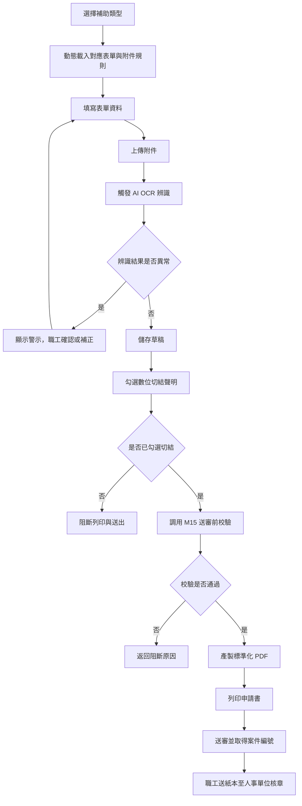
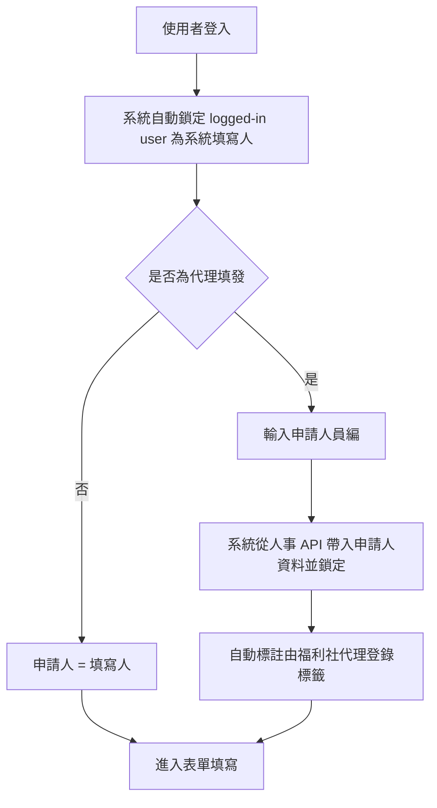
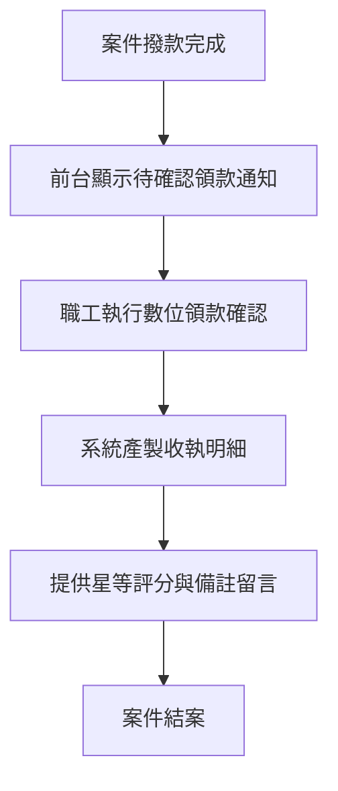
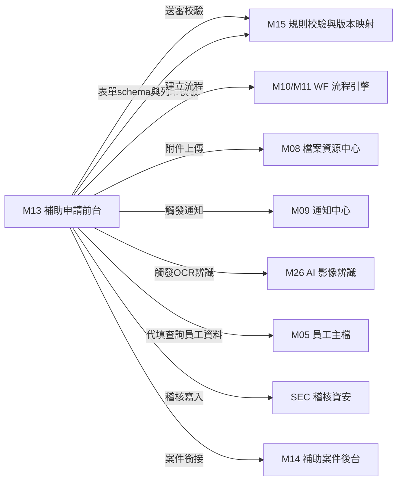
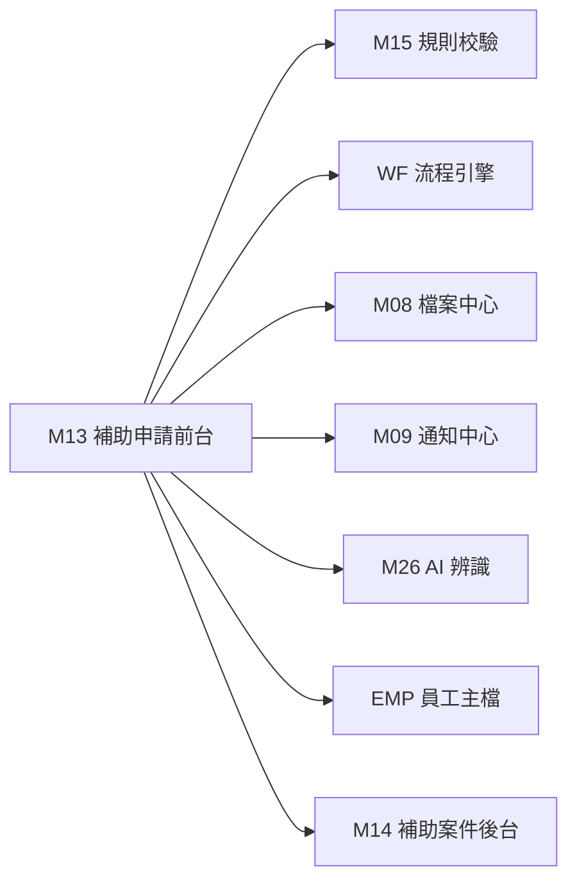
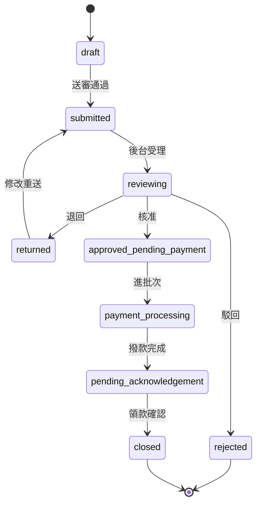
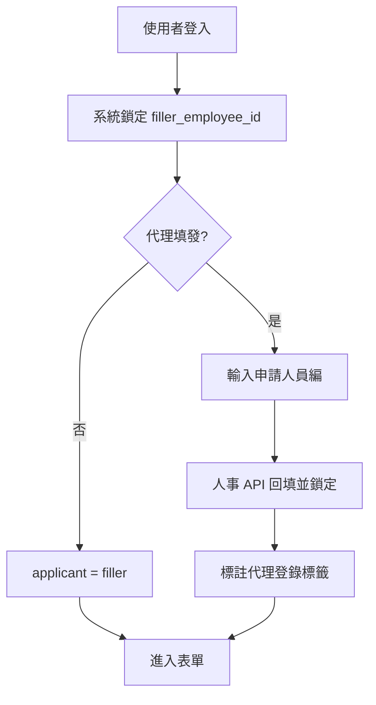

> 來源註記：本文件保留既有模塊拆分方式。凡文中未被客戶原始 PRD 明文定義的欄位、狀態碼、流程抽象或工程命名，均視為內部設計建議，不作為客戶權威需求表述。
>
> 對齊口徑：本文件已按主 PRD `v1.1` 與 `sql/tra_welfare_platform.sql` `v3.0-full` 收斂；前台主鏈以代理填發、數位切結、PDF 產製與紙本核章檢核為準，流程實例採橋接方式承接。

# M13《BEN－補助申請前台》子 PRD

## 1. 模塊名稱

BEN－補助申請前台

## 2. 模塊類型

業務支撐模塊（前台 Portal）

## 3. 模塊定位

本模塊是整套平台中職工最直接、最高頻使用的功能入口，負責讓職工（或由福利社代理）在前台完成補助申請的全生命週期操作：從選擇補助類型、填寫表單、上傳附件、觸發 AI 辨識、數位切結、產製 PDF 列印、送審，到結案後的領款確認與服務回饋。

如果 M14 解決的是「後台怎麼看案、審案、追蹤」，M15 解決的是「規則怎麼判、版本怎麼對」，那 M13 解決的就是：

- 職工怎麼發起一筆補助申請
- 系統如何依補助類型動態載入表單與附件規則
- 填寫者與申請人的雙重身分如何追蹤
- 附件上傳後如何觸發 AI OCR 辨識輔助
- 送審前如何完成數位切結與規則校驗
- 如何產製標準化 PDF 並銜接實體核章斷點
- 結案後如何完成領款確認與收執明細產製

原始需求在第七章將本模塊定位為「數位登錄為前導、實體紙本為憑證的混合式工作流」，這意味著 M13 不是一個純線上閉環，而是必須在數位送審與實體核章之間建立明確的斷點與銜接機制。

## 4. 設計目標

本模塊設計目標如下：

1. 建立職工前台補助申請的統一入口，支援「個人福利補助」（結婚、育兒、公傷等）與「社團發展業務」（成立、活動、賽事）兩大業務別共 6 大項 13 種津貼的線上填報。這是原始需求對補助業務申請頁面的核心定位。
2. 實現填寫者與申請人的雙重身分追蹤機制，支援福利社代理填發場景，解決基層單位數位落差問題。原始需求已明確系統須自動鎖定系統填寫人並允許彈性輸入申請人。
3. 實現動態表單切換能力，依選擇的補助類型動態載入對應的表單欄位、必填附件集合與校驗規則，避免一張表單塞所有欄位。
4. 串接 AI 影像辨識能力（M26），在附件上傳後觸發 OCR 辨識，輔助自動填入關鍵欄位並執行影像品質過濾、重複申請攔截與學年進度合理性比對。
5. 建立數位切結與送審阻斷機制，確保職工在送審前勾選無重複請領與虛報冒領之切結聲明，未勾選時阻斷列印與送出。
6. 建立標準化 PDF 產製與列印能力，讓職工取得符合正式申請書版次的紙本，無縫接軌實體核章流程。
7. 支撐結案後的數位領款確認、收執明細產製與服務滿意度回饋，完成申請端的完整閉環。

## 5. 業務場景

### 場景 A：職工本人線上申請婚嫁補助

王先生登入前台 Portal 後，進入「補助申請」，選擇「個人福利補助 → 結婚補助」。系統依類型載入婚嫁專屬表單欄位與必填附件清單（戶口名簿）。王先生填寫資料、上傳戶口名簿影像後，系統觸發 AI OCR 辨識並自動回填結婚日期等關鍵欄位。確認無誤後先儲存草稿；王先生勾選數位切結聲明後點擊送審，系統調用 M15 執行資格、附件與年度上限校驗，全部通過後產製 PDF 並允許列印。王先生印出申請書送至人事單位核章。這條鏈路直接對應原始需求第七章的補助業務申請流程。

### 場景 B：福利社行政人員代理填發教育補助

張小姐為某福利社承辦人，接到偏遠站段職工李先生的委託代為申請子女教育補助。張小姐登入系統後選擇「代理填發」，輸入李先生員編，系統自動從人事 API 帶入李先生的姓名、站段、職稱並鎖定不可編輯。張小姐替李先生填寫表單、上傳學生證影像，系統自動標註「由福利社代理登錄」標籤。送審與列印流程同場景 A，但收執明細上會顯著標明代填人員資訊。原始需求已明確此機制旨在解決基層單位數位落差。

### 場景 C：附件 AI 辨識發現異常

職工上傳學生證影像後，AI OCR 辨識結果顯示該名子女的年級進度與過往申請紀錄不一致（如：已連續四年申請高中教育補助），系統跳出警示並標註異常。職工可補正或提供說明後重新送審。這對應原始需求中學年進度合理性比對與重複申請攔截功能。

### 場景 D：送審前數位切結未勾選

職工填寫完表單後直接點擊列印或送審，但尚未勾選數位切結聲明。系統阻斷操作並提示「請先勾選無重複請領與虛報冒領之切結聲明」。原始需求已明確若未勾選，系統將阻斷列印與送出程序。

### 場景 E：退回後補件重新送審

職工的補助申請被主管退回，原因為「診斷證明書模糊不清」。職工在前台「我的申請」中看到退回原因，重新上傳清晰影像。系統再次觸發 AI 辨識與 M15 規則校驗後允許重新送審。原始需求與原始需求的端到端流程均支撐退回修改與重新送審鏈路。

### 場景 F：結案後領款確認與滿意度回饋

案件經後台核准、發款後，職工在前台看到待確認領款通知。職工確認「本人已領款」後，系統產製精微化收執明細（含代填資訊、領款日期與金額），並提供星等評分與備註留言欄位。這對應原始需求第七章結案收尾段落的三項要求。

## 6. 業務流程解讀

### 6.1 M13 在整體主鏈路中的位置

原始需求的端到端流程是：
建立申請 → 送審 → 流程建立待辦 → 主管審核 → 核准進待發款池 / 退回申請人 / 駁回結束。
M13 承接的，就是這條鏈路最前端的「建立申請 → 送審」環節，以及最末端的「領款確認 → 結案」環節。

### 6.2 補助申請前台主流程

### 6.3 實體核章斷點在流程中的關鍵地位

原始需求第七章明確指出：「任何數位案件若未匹配完成實體核章的紙本申請書，福利社經辦人可將流程暫停，無法進入撥款申請程序。」

因此 M13 的送審不是「純數位閉環」，而是：
1. 數位送審：系統建立流程實例、通知下一審核人
2. 實體斷點：職工須將印出之申請書送至人事單位核章
3. 後台啟動：福利社收到核章紙本後方可正式啟動數位審核

這個斷點由 M14 後台承接，但 M13 必須確保 PDF 產製與列印功能穩定輸出，否則實體流程無法銜接。

### 6.4 填寫者與申請人雙重身分追蹤流程

### 6.5 結案收尾流程

### 6.6 申請編號格式

原始需求建議批號格式為 `[分處代碼]-[年份]-[月份]-[序號]`（例：TP-115-06-001）。
原始需求進一步明確 `application_no` 採 `{domain}-{yyyy}-{branch}-{seq}` 規則。
M13 在建立申請時即生成此唯一編號，作為數位案件與實體紙本的唯一勾稽鍵。

## 7. 核心功能拆解

### 7.1 補助類型選擇與動態表單載入

負責讓職工從兩大業務別中選擇具體補助類型，系統依選擇結果動態載入對應表單 schema 與附件需求清單。
建議子能力包括：

- 業務別選擇：個人福利補助 / 社團發展業務
- 補助類型選擇：依業務別展開具體項目
- 依 `application_type + form_version` 調用 M15 載入表單 schema
- 依補助類型載入必填附件清單
- 非 MVP 類型顯示未開通提示

### 7.2 表單填寫與草稿保存

負責職工在前台完成表單資料的輸入與暫存。
建議子能力包括：

- 動態欄位渲染（依 schema 生成對應輸入元件）
- 前端即時欄位校驗（格式、必填、長度）
- 草稿自動保存（定時 / 離開提醒）
- 草稿手動保存
- 草稿列表查詢與續填
- 主表 `revision` 寫入

### 7.3 附件上傳與 AI OCR 辨識觸發

負責職工上傳證明文件並串接 AI 辨識能力。
建議子能力包括：

- 依補助類型顯示必填附件清單與上傳入口
- 檔案上傳走 M08 檔案資源中心（取得 `file_id`）
- 上傳完成後觸發 M26 AI 辨識
- AI 辨識結果回填表單欄位（如結婚日期、學生姓名、年級）
- 影像品質過濾（模糊、過暗、截角）
- 重複申請攔截（同一事件被不同職工重複提出）
- 學年進度合理性比對
- 辨識異常警示顯示

### 7.4 填寫者與申請人雙重身分管理

負責追蹤每筆申請的實際填寫者與受益申請人。
建議子能力包括：

- 系統自動鎖定 `filler_employee_id`（logged-in user）
- 允許輸入 `applicant_employee_id`（實際申請人）
- 輸入員編後自動從人事 API 帶入姓名、站段、職稱並鎖定
- 代理填發時自動標註「由福利社代理登錄」
- 兩者紀錄永久綁定，不可事後修改

### 7.5 數位切結聲明

負責在送審前強制職工完成法律與合規聲明。
建議子能力包括：

- 切結聲明全文展示（含無重複請領與虛報冒領條款）
- 教育補助追加「未領取福利精進措施-子女教育助學金」確認
- 勾選狀態追蹤
- 未勾選時阻斷列印與送出
- 切結勾選時間戳記錄

### 7.6 送審前校驗串接

負責在送審時調用 M15 完成統一規則檢查。
建議子能力包括：

- 調用 `validateBeforeSubmit(applicationId, revision)`
- 資格校驗結果展示
- 附件校驗結果展示
- 年度上限校驗結果展示
- 數位切結校驗（本模塊自有）
- 任一不通過時阻斷送審並返回原因

### 7.7 標準化 PDF 產製與列印

負責將已填資料套用正式申請書模板產製 PDF。
建議子能力包括：

- 依 `form_version` 調用 M15 取得 `print_template_code`
- 將表單資料套入 PDF 模板
- PDF 預覽
- PDF 下載與列印
- 列印時間戳記錄
- 歷史申請 PDF 回放（依歷史 `form_version` 產製）

### 7.8 送審與案件編號生成

負責正式提交申請並建立流程。
建議子能力包括：

- `submit(applicationId, revision)` 提交
- 生成 `application_no`（格式：`{domain}-{yyyy}-{branch}-{seq}`）
- 調用 WF（M10/M11）建立流程實例與業務橋接關聯
- 調用 M09 建立送審通知
- 更新案件狀態為 `submitted`
- 輸出送審成功頁（含案件編號、下一步實體核章提示）

### 7.9 我的申請查詢

負責讓職工在前台查看自己的歷史與進行中申請。
建議子能力包括：

- 按狀態查詢（草稿、已送審、退回待修改、已核准、已撥款、已結案）
- 按補助類型查詢
- 按時間區間查詢
- 查看申請詳情
- 查看退回原因
- 查看流程進度摘要
- 重新列印 PDF

### 7.10 退回修改與重新送審

負責承接被退回的申請讓職工修改後重送。
建議子能力包括：

- 顯示退回原因
- 允許修改表單資料
- 允許補傳附件
- 重新觸發 AI 辨識
- 重新勾選數位切結
- 調用 M15 重新校驗
- `resubmit(applicationId, revision)` 重新送審

### 7.11 數位領款確認與結案收尾

負責在撥款完成後讓職工確認領款並取得收執。
建議子能力包括：

- 顯示待確認領款清單
- 「本人已領款 / 社團經費已入帳」確認按鈕
- 確認後產製精微化收執明細
- 收執明細含代填人員資訊標註
- 星等評分（1～5 星）
- 備註留言欄位
- 確認結果寫入案件狀態

## 8. 與其他模塊的聯動關係

### 8.1 與 M15《規則校驗與版本映射》的聯動

M13 在送審時調用 M15 執行資格校驗、附件校驗與年度上限校驗；在表單載入時調用 M15 取得 `form_version` 對應的 schema；在列印時調用 M15 取得 `print_template_code`。M13 不自行判斷業務規則，只負責把結果呈現給職工。這與原始需求的補助申請時序圖完全一致。

### 8.2 與 M14《補助案件後台》的聯動

M13 建立與送出申請；M14 接手後台案件查詢、審核承接與案件追蹤。兩者共用同一補助主表與 `application_no / revision`，流程關聯則透過橋接模型維護。M14 的退回操作會反映到 M13 前台的「我的申請」中。

### 8.3 與 M10～M12《WF》的聯動

M13 送審後調用 WF 建立流程實例與待辦任務。M13 本身不管流程節點邏輯，只負責觸發 `createWorkflow` 並保存業務關聯，避免把 `workflow_instance_id` 寫成前台主表的必備字段。

### 8.4 與 M08《檔案資源中心》的聯動

所有附件上傳走 M08，業務表只保存 `file_id`。M13 不直連檔案路徑，而是透過 `file_id` 取得預覽、下載與辨識能力。這與原始需求的檔案治理原則一致。

### 8.5 與 M09《通知中心》的聯動

送審成功後、退回後、核准後、撥款後、領款確認後等關鍵狀態變更，都會觸發 M09 建立通知事件。代理填發時系統自動發送通知至被代理職工帳戶。

### 8.6 與 M26《AI 影像辨識》的聯動

附件上傳完成後，M13 觸發 M26 執行 OCR 辨識。辨識結果包括：關鍵欄位自動回填、影像品質判定、重複申請攔截警示、學年進度比對結果。M13 負責展示辨識結果與警示，M26 負責辨識邏輯本體。

### 8.7 與 EMP / M05 的聯動

代理填發時，M13 需調用 EMP API 依員編取得申請人姓名、站段、職稱等基本資訊並鎖定。填寫者身分則由 AUTH 提供的 session 自動帶入。

### 8.8 與 SEC 的聯動

代理填發操作、切結聲明勾選、送審、附件上傳、PDF 產製與列印、領款確認等關鍵動作，都應寫入稽核日誌。原始需求已明確高風險操作可被追蹤。

## 9. 頁面規劃

本模塊作為前台業務支撐模塊，建議至少包含 5 個核心頁面。

### 9.1 頁面一：補助申請入口頁

**定位**：前台 Portal 的補助申請主入口。

**頁面區塊**

1. 業務別卡片區（個人福利補助 / 社團發展業務）
2. 補助類型選擇區（依業務別展開具體項目清單）
3. 近期公告或注意事項提示區
4. 我的草稿快捷入口

### 9.2 頁面二：補助申請表單頁

**定位**：依選定補助類型動態載入的填寫主頁面。

**頁面區塊**

1. 填寫者與申請人身分區
2. 動態表單欄位區（依 schema 渲染）
3. 附件上傳區（依類型顯示必填清單與上傳入口）
4. AI 辨識結果與警示區
5. 數位切結聲明區
6. 操作按鈕列（儲存草稿 / 預覽 PDF / 列印 / 送審）

**核心交互**

- 表單欄位即時校驗
- 附件上傳後自動觸發 AI 辨識
- 切結未勾選時列印與送審按鈕禁用
- 送審前執行 M15 校驗，失敗時顯示阻斷原因
- 送審成功後跳轉至成功頁

### 9.3 頁面三：我的申請列表頁

**定位**：前台職工查看自己所有補助申請的管理頁。

**頁面區塊**

1. 狀態篩選標籤列（全部 / 草稿 / 已送審 / 退回待修改 / 已核准 / 已撥款 / 已結案）
2. 申請列表區
3. 單筆操作入口（查看詳情 / 繼續填寫 / 修改重送 / 列印 PDF）

**列表欄位建議**

- application_no
- application_type
- submitted_at
- status
- current_step_name（流程進度摘要）
- returned_reason（摘要）

### 9.4 頁面四：申請詳情頁

**定位**：職工查看單筆申請的完整資料與流程狀態。

**頁面區塊**

1. 案件摘要卡（編號、類型、狀態、送審時間）
2. 表單內容回顯區（只讀）
3. 附件預覽區
4. AI 辨識結果區
5. 流程進度時間線
6. 退回原因區（若已退回）
7. 操作按鈕區（修改重送 / 重新列印 / 領款確認）

### 9.5 頁面五：領款確認與回饋頁

**定位**：撥款完成後職工確認領款並取得收執。

**頁面區塊**

1. 待確認領款案件摘要
2. 領款金額與撥款資訊
3. 「本人已領款 / 社團經費已入帳」確認按鈕
4. 收執明細預覽與下載
5. 服務滿意度評分（星等）
6. 備註留言欄位
7. 提交確認按鈕

## 10. 欄位與狀態

### 10.1 來自原始需求的核心字段

當前系統實作下，BEN 前台核心字段包括 `application_id`、`application_no`、`application_type_id`、`form_version`、`applicant_employee_id`、`filler_employee_id`、`submitted_at`、`approved_at`、`returned_reason`、`physical_stamp_status`、`revision`；流程實例則透過橋接關聯維護。

### 10.2 M13 前台專屬補充字段

| 字段名                    | 中文名稱         | 用途                                |
| ------------------------- | ---------------- | ----------------------------------- |
| filler_employee_id        | 系統填寫人員工ID | 鎖定 logged-in user                 |
| applicant_employee_id     | 申請人員工ID     | 實際受益人                          |
| is_proxy_filed            | 是否代理填發     | 標記代填案件                        |
| proxy_label               | 代理標籤         | 顯示「由福利社代理登錄」            |
| declaration_checked       | 切結是否已勾選   | 送審阻斷判斷                        |
| declaration_checked_at    | 切結勾選時間     | 稽核追蹤                            |
| pdf_generated_at          | PDF 產製時間     | 列印追蹤                            |
| pdf_printed_at            | PDF 列印時間     | 實體流程追蹤                        |
| ai_recognition_status     | AI 辨識狀態      | pending/completed/warning/error     |
| ai_recognition_summary    | AI 辨識結果摘要  | 前台展示與後台查核                  |
| acknowledgement_status    | 領款確認狀態     | pending/confirmed/disputed          |
| acknowledgement_at        | 領款確認時間     | 結案追蹤                            |
| satisfaction_rating       | 滿意度星等       | 1～5 星                             |
| satisfaction_comment      | 滿意度備註       | 自由文字                            |
| receipt_document_id       | 收執明細檔案ID   | 指向 file_resource                  |

### 10.3 前台案件狀態

| 狀態值                     | 中文名稱       | 說明                          |
| -------------------------- | -------------- | ----------------------------- |
| draft                      | 草稿           | 尚未送審                      |
| submitted                  | 已送審         | 已通過校驗並建立流程          |
| reviewing                  | 審核中         | 流程進行中（後台處理）        |
| returned                   | 退回待修改     | 被主管退回，等待職工修正      |
| approved_pending_payment   | 已核准待撥款   | 已核准，進入待發款池          |
| payment_processing         | 撥款處理中     | 已進批次，撥款中              |
| pending_acknowledgement    | 待領款確認     | 已撥款，等待職工確認          |
| closed                     | 已結案         | 領款確認完成                  |
| rejected                   | 已駁回         | 流程結束                      |

### 10.4 建議配置項

建議由 M07 / SYS 參數治理：

- `ben.application.draft_auto_save_interval_seconds`
- `ben.application.declaration_required`
- `ben.application.pdf_preview_enabled`
- `ben.application.ai_recognition_enabled`
- `ben.application.proxy_filing_enabled`
- `ben.application.satisfaction_rating_enabled`
- `ben.application.receipt_auto_generate`
- `ben.application.max_attachment_count`
- `ben.application.max_attachment_size_mb`

## 11. 規則與邊界條件

### 11.1 送審前規則全部通過才可送審

資格、附件、年度上限、數位切結任一不通過，不可送審。這是原始需求對 BEN 的直接要求。

### 11.2 數位切結未勾選阻斷列印與送出

原始需求明確：「若未勾選，系統將阻斷列印與送出程序。」因此切結校驗不由 M15 負責，而是 M13 前台的自有邏輯。

### 11.3 代理填發身分鎖定

輸入員編後系統從人事 API 帶入的姓名、站段、職稱欄位必須設為不可編輯，防止身分偽造。代填人與申請人紀錄永久綁定，不可事後修改。

### 11.4 PDF 產製必須依正確版次

PDF 模板必須與當前 `form_version` 的 `print_template_code` 對應，不可使用其他版本。歷史申請重新列印時，必須依歷史版本產製。

### 11.5 實體核章斷點不可被數位流程繞過

M13 送審後，雖然數位流程已建立，但原始需求明確「未匹配完成實體核章的紙本申請書」時，福利社經辦人可暫停流程。M13 應在送審成功頁明確提示職工需將紙本送至人事單位核章。

### 11.6 草稿無案件編號

`application_no` 在正式送審時才生成，草稿階段只有 `application_id`（系統內部主鍵）。這避免產生無效的空白案號。

### 11.7 退回重送規則重新計算

退回後修改重新送審時，M15 的資格、附件、年度上限校驗必須重新執行，不能沿用上一次結果。

### 11.8 AI 辨識結果為輔助而非強制

AI OCR 辨識結果用於輔助填寫與異常警示，但不作為送審的硬性阻斷條件（除重複申請攔截外）。職工可確認辨識結果後繼續送審。

### 11.9 前端完整性檢核

針對不同申請類別，系統於前端即進行資料完整性檢核（如社團成立須包含發起人、金額限制等），避免產生無效之空白案件。

## 12. 異常情況

### 12.1 附件上傳失敗

網路中斷或檔案過大導致上傳失敗時，前台應明確提示並允許重試，不可讓案件停在中間狀態。已成功上傳的附件不因單一失敗而丟失。

### 12.2 AI 辨識服務不可用

若 M26 服務暫時不可用，M13 應允許職工繼續填寫與送審，但以明顯提示告知 AI 辨識暫時無法使用。辨識功能應設計為非阻斷性依賴。

### 12.3 PDF 產製失敗

若 PDF 模板缺失或產製服務異常，應阻斷送審流程並提示系統管理員處理。不可讓沒有紙本的案件進入流程。

### 12.4 草稿自動保存衝突

若職工在多個裝置同時編輯同一草稿，`revision` 機制應阻止後提交覆蓋先提交內容，並提示刷新。

### 12.5 代理填發時員編查無此人

輸入的員編在人事 API 中查無對應資料，系統應明確提示「查無此員工」，不可允許繼續填寫。

### 12.6 領款確認超期未處理

若撥款完成後職工長期未執行領款確認，系統應定期發送提醒通知。超過系統配置的期限後，可由承辦人輔助處理或標記為異常案件。

### 12.7 年度跨越時的申請歸屬

若職工在年底建立草稿、隔年才送審，年度上限校驗應以送審時間為基準年度，而非草稿建立時間。

## 13. 模塊間依賴

### 13.1 依賴矩陣

### 13.2 上游依賴（M13 調用）

| 被調用模塊 | 調用場景                         |
| ---------- | -------------------------------- |
| M15        | 送審前校驗、表單 schema 載入、列印模板載入 |
| M08        | 附件上傳與檔案管理               |
| M26        | 附件 AI OCR 辨識                 |
| M05/EMP    | 代理填發時查詢員工資料           |
| M10/M11    | 送審時建立流程實例               |
| M09        | 狀態變更時觸發通知               |
| M07        | 補助類型、狀態碼等字典讀取       |

### 13.3 下游消費（其他模塊使用 M13 輸出）

| 消費模塊 | 消費內容                         |
| -------- | -------------------------------- |
| M14      | 後台承接已送審案件               |
| M16      | 核准後案件進入待發款池           |
| SEC      | 稽核日誌追蹤                     |

## 14. 角色與權限映射

### 14.1 可操作角色

- 一般職工（Employee）：建立申請、填寫表單、上傳附件、送審、查詢我的申請、領款確認
- 福利社承辦人（Welfare Clerk）：代理填發、代替職工建立與送出申請
- 非登入申請主體的其他身分類型，如制度另有適用規則，需另行確認，不預設寫入本期 Portal 主線

原始需求的角色表明確一般職工的主要操作為「申請補助、查看公告、瀏覽特約商店、確認領款」，福利社承辦人則具備代理填發能力。

### 14.2 操作路徑

前台 Portal → 補助申請 → 選擇類型 → 填寫表單 → 送審
前台 Portal → 我的申請 → 查看 / 修改重送 / 列印
前台 Portal → 待確認領款 → 確認領款 → 評分回饋

### 14.3 權限建議

- 建立補助申請
- 儲存草稿
- 送審申請
- 查看我的申請
- 修改退回案件
- 重新送審
- 列印 PDF
- 確認領款
- 代理填發（僅限承辦人角色）
- 查看代填案件列表（僅限承辦人角色）

其中「代理填發」建議視為需額外授權的功能權限，且代填操作須寫入稽核日誌。

## 15. 與原始需求的追溯

### 15.1 原始需求第七章直接覆蓋項

| 原始需求描述                                                           | M13 對應功能                |
| ---------------------------------------------------------------------- | --------------------------- |
| 系統自動鎖定系統填寫人並允許彈性輸入申請人                             | 7.4 雙重身分管理            |
| 代理填發時自動標註「由福利社代理登錄」                                 | 7.4 代理標籤                |
| 依補助類型動態載入對應表單欄位與附件需求                               | 7.1 動態表單載入            |
| 附件上傳後觸發 AI 辨識，如有錯誤跳出警示                              | 7.3 AI OCR 辨識觸發         |
| 影像品質過濾                                                           | 7.3 影像品質過濾            |
| 重複申請攔截                                                           | 7.3 重複申請攔截            |
| 學年進度合理性比對                                                     | 7.3 學年進度比對            |
| 強制勾選數位切結，未勾選阻斷列印與送出                                 | 7.5 數位切結聲明            |
| 系統根據已填資料自動套用 PDF 模板並支援列印                            | 7.7 標準化 PDF 產製         |
| 職工須將印出之申請書送至人事單位實體核章                               | 6.3 實體核章斷點            |
| 未匹配實體核章紙本時福利社可暫停流程                                   | 6.3 / 11.5 流程斷點約束     |
| 數位領款確認                                                           | 7.11 領款確認               |
| 精微化收執明細產製（含代填人員資訊）                                   | 7.11 收執明細               |
| 服務滿意度回饋（星等評分與備註留言）                                   | 7.11 滿意度回饋             |
| 申請編號格式 `{domain}-{yyyy}-{branch}-{seq}`                         | 6.6 申請編號格式            |

### 15.2 原始需求 BEN 功能清單覆蓋項

| 原始需求功能清單     | M13 對應功能     |
| -------------------- | ---------------- |
| 補助申請建立         | 7.1 / 7.2 / 7.8 |
| 草稿保存             | 7.2              |
| 送審                 | 7.6 / 7.8        |
| 退回修改             | 7.10             |
| 查詢與列印           | 7.9 / 7.7        |
| 補件與重新送審       | 7.10             |

### 15.3 原始需求端到端流程覆蓋項

原始需求端到端流程中的「職工建立申請 → 送審」由 M13 承接；「職工領款確認」由 M13 的 7.11 承接。

## 16. Mermaid 圖

### 16.1 補助申請前台主流程圖

### 16.2 M13 與其他模塊關係圖

### 16.3 前台案件狀態流轉圖

### 16.4 填寫者與申請人雙重身分流程圖

## 17. 研發落地建議

### 17.1 架構分層建議

- M13 負責前台頁面交互與流程串接
- M15 負責規則判定與版本映射
- M14 負責後台案件管理
- M08 負責附件存儲
- M26 負責 AI 辨識
- WF 負責流程引擎
- 這樣最符合原始需求的模塊分工與主鏈路設計

### 17.2 動態表單建議

- 前台表單渲染只依 M15 提供的 `schema_code` 載入欄位定義，不硬編碼欄位
- 表單元件庫統一管理（文字輸入、日期、下拉、檔案上傳等）
- 不同補助類型的差異完全由 schema 驅動
- 新增補助類型時只需新增 schema 與規則配置，不需改前端程式

### 17.3 AI 辨識設計建議

- AI 辨識設計為非同步、非阻斷性流程
- 上傳完成後觸發辨識，前台顯示辨識中狀態
- 辨識完成後自動回填欄位並顯示結果
- 辨識失敗或服務不可用時不阻斷主流程
- 重複申請攔截為唯一可能的硬阻斷場景

### 17.4 PDF 產製建議

- PDF 產製走伺服端，不在前端生成
- 模板與資料分離，模板由 M15 版本映射管理
- 歷史案件重新列印必須使用歷史版本模板
- PDF 產製結果存入 M08 檔案資源中心

### 17.5 治理建議

- 補助類型、狀態碼、切結條款走字典
- 代理填發操作寫稽核日誌
- 草稿自動保存間隔可配置
- AI 辨識開關可由系統參數控制
- 滿意度回饋功能可由開關控制

## 18. 測試驗收要點

### 18.1 功能驗收

1. 職工可從前台選擇補助類型並動態載入對應表單。
2. 可儲存草稿並從草稿續填。
3. 附件上傳後可觸發 AI 辨識並顯示結果。
4. 切結未勾選時列印與送審被阻斷。
5. 送審前 M15 校驗全部通過後才可送審。
6. 送審後生成正確格式的 `application_no`。
7. PDF 可正確產製、預覽與列印。
   以上第 4、5 點直接對應原始需求的切結與校驗規則。

### 18.2 雙重身分驗收

1. 非代填場景下 `filler = applicant`。
2. 代填場景下輸入員編後系統正確帶入並鎖定申請人資料。
3. 代填案件自動標註代理登錄標籤。
4. 收執明細上顯示代填人員資訊。
   以上第 2、3 點直接對應原始需求的身分追蹤要求。

### 18.3 邊界驗收

1. 草稿自動保存在多裝置編輯時 revision 衝突可被攔截。
2. AI 辨識服務不可用時主流程不被阻斷。
3. PDF 模板缺失時送審被阻斷。
4. 退回重送時規則重新計算。
5. 年度跨越時上限以送審時間為基準。
   其中第 4 點直接對應原始需求的補件重送要求。

### 18.4 聯動驗收

1. M13 送審後 M14 後台可看到案件。
2. M13 送審後 WF 可建立流程實例。
3. M13 附件上傳後 M26 可觸發辨識。
4. M13 狀態變更後 M09 可建立通知。
5. M13 領款確認後案件正確結案。
   以上第 1、2 點直接對應原始需求的端到端流程。

### 18.5 治理與安全驗收

1. 代理填發、送審、列印、領款確認等關鍵動作可被稽核追蹤。
2. 員編查無此人時代填被阻斷。
3. `revision` 可防止併發覆蓋。
4. 切結勾選時間戳可被記錄與查詢。
   其中第 3 點與原始需求的 revision 原則一致。

------

這是 M13《BEN－補助申請前台》子 PRD，承接原始需求第七章「補助業務申請頁面」的全部核心需求，並與 M14（後台案件管理）、M15（規則校驗與版本映射）、M26（AI 影像辨識）形成 BEN 域的完整前後台閉環。
