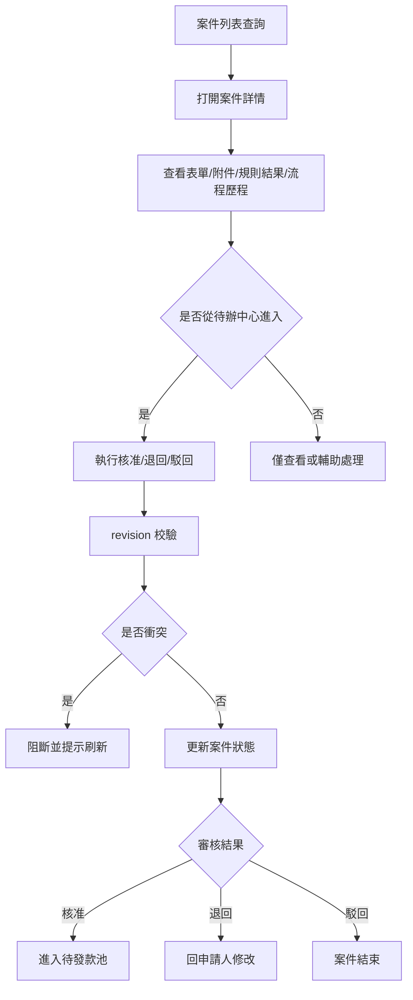
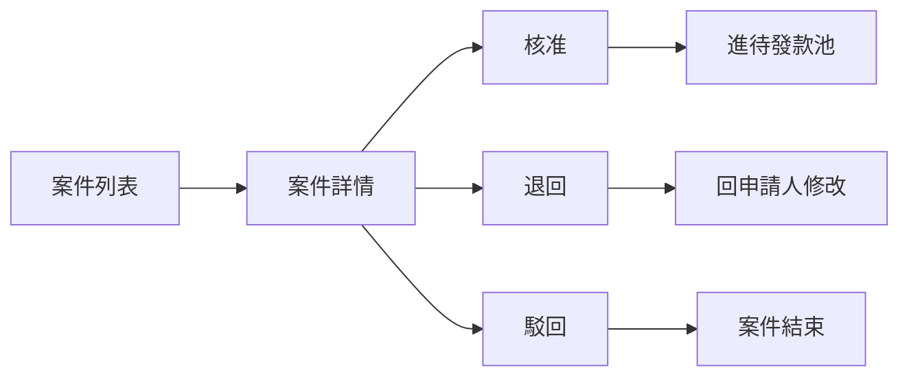
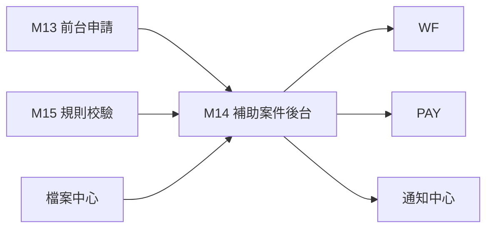
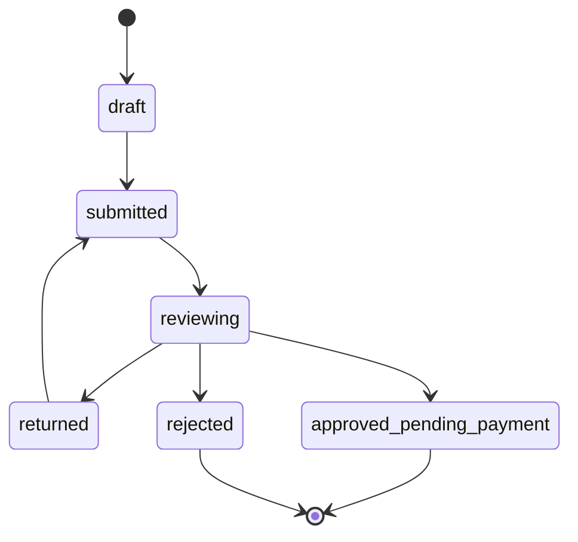

> 來源註記：本文件保留既有模塊拆分方式。凡文中未被客戶原始 PRD 明文定義的欄位、狀態碼、流程抽象或工程命名，均視為內部設計建議，不作為客戶權威需求表述。
>
> 對齊口徑：本文件已按主 PRD `v1.1` 與 `sql/tra_welfare_platform.sql` `v3.0-full` 收斂；後台案件處理以補助主表、校驗結果、紙本檢核點與流程橋接共同組成。

# M14《BEN－補助案件後台》子 PRD

## 1. 模塊名稱

BEN－補助案件後台

## 2. 模塊類型

後台頁面模塊

## 3. 模塊定位

本模塊是 BEN 在管理後台的業務承接面，負責把前台已建立、已送審、已退回、已駁回、已核准的補助案件，轉換成承辦人與主管可查詢、可審核、可追蹤、可統計的後台作業對象。
如果 M13 解決的是「職工怎麼發起申請」，M14 解決的就是：

- 後台怎麼看所有補助案件
- 承辦與主管如何從案件視角查看資料、附件、流程與校驗結果
- 待辦中心外，補助業務頁如何作為案件池與案件詳情入口
- 核准後如何銜接待發款池
- 退回與駁回後如何保留案件歷程與責任鏈

總體 PRD 在資訊架構中把「補助業務」獨立列為管理後台入口，同時又有「待辦中心」，這表示：
**待辦中心負責跨模塊執行，補助業務頁則負責 BEN 域的案件管理與案件詳情承接。**

## 4. 設計目標

本模塊設計目標如下：

1. 建立 BEN 專屬的案件管理後台，讓承辦與主管不只從待辦處理，也能從案件池查看全量補助案件狀態。這符合總體 PRD 對管理後台「補助業務」獨立入口的設計。
2. 讓案件詳情頁成為後台統一承接點，集中展示申請資料、附件、規則檢查結果、流程歷程與審批結果。總體 PRD 強調每張申請、每個審批節點都有歷程可查。
3. 嚴格承接流程邊界：核准後才進待發款池；退回預設回申請人；駁回即流程結束；版本衝突時不可直接覆蓋。
4. 為 PAY、WF、M09、SEC 提供穩定的案件事件與狀態輸出，讓案件後台成為業務與流程的橋接層。
5. 支援原始 PRD 所列補助主鏈的統一承接，至少需覆蓋結婚、生育/育兒、教育、慰問金與社團發展等核心類別。

## 5. 業務場景

### 場景 A：福利承辦人查看全部補助案件

承辦人進入管理後台「補助業務」後，可按狀態、補助類型、申請單號、申請人、時間區間查詢案件，快速找到待處理、已退回、已核准或已駁回案件。總體 PRD 已把補助業務列為管理後台一級入口。

### 場景 B：主管從待辦進入案件詳情審核

主管在待辦中心點開某筆案件後，進入 BEN 案件詳情頁查看表單內容、附件、規則檢查結果與流程歷程，再執行核准／退回／駁回。總體 PRD 的主流程與補助時序圖都支撐這條鏈路。

### 場景 C：案件被核准後進入待發款池

主管核准後，案件不能直接結案，而要進入待發款池，供承辦後續建立發款批次。總體 PRD 的端到端流程圖已直接規定這條鏈路。

### 場景 D：案件被退回後等待申請人修改

主管退回後，案件不在後台消失，而是保留狀態、退回原因與歷史；申請人在前台修改後重新送審，後台案件應能看到新一輪流程節點與新 revision。總體 PRD 已明確退回預設回申請人，且 BEN 包含退回修改與重新送審。

### 場景 E：案件在審批期間發生版本衝突

若承辦或主管打開案件後，主表資料被他人更新，系統需提示版本衝突，阻止直接覆蓋提交。這是總體 PRD 對流程相關邊界條件的直接要求。

## 6. 業務流程解讀

### 6.1 BEN 後台在整體主鏈路中的位置

總體 PRD 的端到端流程是：
建立申請 → 送審 → 流程建立待辦 → 主管審核 → 核准進待發款池 / 退回申請人 / 駁回結束。
M14 承接的，就是這條鏈路在後台的案件管理視角。

### 6.2 後台案件處理主流程

### 6.3 案件列表與待辦中心的分工

本模塊建議明確這個分工：

- **待辦中心**：看的是「現在輪到我處理的流程任務」
- **補助業務列表**：看的是「BEN 全量案件池與案件狀態」

這樣承辦能做全局管理，主管能做單筆審批，兩個入口互補而不是重複。

### 6.4 核准／退回／駁回在案件層的語義

總體 PRD 已明確：

- 核准 → 進待發款池
- 退回 → 回申請人
- 駁回 → 案件結束

因此案件主狀態建議至少涵蓋：

- draft
- submitted
- reviewing
- returned
- approved_pending_payment
- rejected
- closed_reserved

其中 `approved_pending_payment` 是本模塊與 PAY 之間最關鍵的橋接狀態。

### 6.5 revision 與案件安全

總體 PRD 已明確 BEN 主表需具備 `revision`，且已送審資料若被他人更新需提示版本衝突。
因此 M14 中所有高風險動作都應以 revision 為前置條件：

- 審核提交
- 承辦修改後台補充字段
- 人工標記案件資料
- 案件重送輔助操作

### 6.6 規則結果在後台的作用

雖資格、附件、年度上限規則屬 M15，但後台案件詳情必須能看到最近一次規則結果摘要，因為這直接影響主管判讀與承辦排錯。

## 7. 核心功能拆解

### 7.1 補助案件列表

提供 BEN 全量案件查詢與管理視角。
建議子能力包括：

- 按狀態查詢
- 按補助類型查詢
- 按申請單號查詢
- 按申請人查詢
- 按時間區間查詢
- 按是否已進待發款池查詢
- 列表匯出

### 7.2 補助案件詳情

作為後台案件的統一承接頁。
建議展示：

- 申請基本資料
- 申請人摘要
- 表單內容
- 附件區
- 規則檢查結果區
- 流程歷程區
- 退回原因 / 駁回原因區
- 審核操作區

### 7.3 案件審核操作承接

案件詳情頁若由待辦中心帶入，應允許直接執行：

- 核准
- 退回
- 駁回

若非由當前有效待辦帶入，則原則上只讀或僅允許承辦做輔助註記，不應繞過 WF 直接審批。

### 7.4 案件狀態管理

建議案件主狀態與流程狀態分層，但後台可融合顯示。
例如：

- 案件狀態：submitted / returned / approved_pending_payment / rejected
- 流程狀態：pending_step_1 / pending_manager / ended

這樣能同時滿足業務視角與流程視角。

### 7.5 退回與補件追蹤

後台應能看到：

- 最近一次 `returned_reason`
- 退回次數
- 是否已重新送審
- 補件後新附件差異
- 最新 revision

### 7.6 進待發款池標記

核准後，案件需被明確標記為可進入待發款池。
這一點不是 PAY 再次判斷才產生，而應在 BEN 後台狀態變更時就形成穩定輸出。

### 7.7 案件時間線與歷程

後台案件頁需統一顯示：

- 草稿建立
- 送審
- 退回
- 重送
- 核准
- 駁回
- 進入待發款池
  這呼應總體 PRD 對透明度與歷程可查的要求。

### 7.8 匯出與統計摘要

作為後台作業入口，案件列表頁通常還需支持：

- 列表匯出
- 狀態統計
- 補助類型統計
- 待處理數量摘要
  這部分雖未在總體 PRD 逐欄列出，但符合其「可統計、可追蹤、可責任切分」的一頁總結方向。

## 8. 與其他模塊的聯動關係

### 8.1 與 M13《補助申請前台》的聯動

M13 建立與送出申請；M14 接手後台案件查詢、審核承接與案件追蹤。
兩者共用同一補助主表與 `application_no / revision`，流程實例則透過橋接關聯維護。

### 8.2 與 M15《規則校驗與版本映射》的聯動

M14 不自己重寫資格/附件/年度上限規則，但要展示規則檢查結果，供承辦與主管判斷。

### 8.3 與 M10～M12《WF》的聯動

M14 是 BEN 與 WF 的橋接頁：

- 透過流程橋接關聯查流程歷程
- 若由待辦帶入則承接審批動作
- 顯示退回流向與當前節點摘要

### 8.4 與 PAY 的聯動

案件核准後，要進待發款池，成為 PAY 的上游來源。總體 PRD 已直接規定核准後進待發款池。

### 8.5 與 M08《檔案資源中心》的聯動

案件詳情中的附件區只應透過 `file_id` 取得預覽與下載能力，而非直連檔案路徑。總體 PRD 已明確檔案一律走 `file_resource`。

### 8.6 與 M09《通知中心》的聯動

核准／退回／駁回等案件狀態變更，都會觸發通知事件，由 M09 承接扇出。

### 8.7 與 SEC 的聯動

審核動作、批量匯出、敏感附件下載、版本衝突阻斷等，都應寫入稽核。總體 PRD 已明確高風險操作可被追蹤。

## 9. 頁面規劃

本模塊作為後台頁面模塊，建議至少包含 3 個核心頁面。

### 9.1 頁面一：補助案件列表頁

**定位**：管理後台的 BEN 全量案件池。

**頁面區塊**

1. 狀態統計卡
2. 搜尋與篩選區
3. 案件列表區
4. 批量匯出工具列

**查詢條件建議**

- application_no
- application_type
- 申請人姓名 / 員工編號
- 案件狀態
- 是否待發款
- 送審時間區間
- 核准時間區間
- 退回/駁回標記

**列表欄位建議**

- application_no
- application_type
- applicant_name
- status
- current_step_name
- submitted_at
- approved_at
- returned_reason 摘要
- payment_pool_flag

### 9.2 頁面二：補助案件詳情頁

**定位**：查看並承接單筆案件的完整後台處理。

**頁面區塊**

1. 案件摘要卡
2. 申請表單內容區
3. 附件區
4. 規則檢查結果區
5. 流程歷程區
6. 審核動作區
7. 稽核摘要區

**核心交互**

- 支持從待辦中心帶參數打開
- 打開時讀取當前 revision
- 提交審核前二次校驗 revision
- 顯示退回/駁回原因
- 核准後提示已進待發款池

### 9.3 頁面三：案件歷程 / 已處理紀錄頁

**定位**：查詢案件歷史流轉與審批結果。

**頁面區塊**

1. 流程時間線
2. 歷次動作列表
3. 規則檢查歷史摘要
4. 通知與稽核關聯摘要

## 10. 底層能力說明

### 10.1 能力邊界

本模塊負責：

- BEN 案件列表與詳情
- 後台案件狀態展示
- 規則結果承接展示
- 案件審核動作承接
- 進待發款池標記輸出
- 案件歷程查詢

本模塊不負責：

- 前台建立申請
- 規則真源維護
- 流程模板定義
- 待辦引擎本體
- 發款批次建立
- 通知實際發送

### 10.2 建議能力接口

- `listBenefitCases(filters)`
- `getBenefitCaseDetail(applicationId)`
- `getBenefitCaseTimeline(applicationId)`
- `approveBenefitCase(applicationId, revision, comment)`
- `returnBenefitCase(applicationId, revision, reason)`
- `rejectBenefitCase(applicationId, revision, reason)`
- `markPendingPayment(applicationId)`

### 10.3 能力實現原則

- 審核必須經由當前有效待辦
- 所有高風險動作帶 revision
- 核准後穩定輸出待發款標記
- 列表與詳情狀態由字典驅動
- 附件與流程歷程均走統一能力層

## 11. 角色權限與操作路徑

### 11.1 可操作角色

- 福利社承辦人：查詢案件、查看詳情、輔助處理
- 審核主管：核准、退回、駁回
- 系統管理員：查看與治理異常案件
- 資安稽核人員：查看高風險案件操作軌跡

總體 PRD 的角色表明確這些角色的主要職責。

### 11.2 操作路徑

管理後台 → 補助業務 → 案件列表
管理後台 → 補助業務 → 案件詳情
管理後台 → 待辦中心 → 補助案件詳情

### 11.3 權限建議

- 查看補助案件
- 查看案件詳情
- 核准案件
- 退回案件
- 駁回案件
- 匯出案件列表
- 查看案件歷程
- 查看敏感附件

其中「核准」「駁回」「匯出」「查看敏感附件」建議視為高風險權限。

## 12. 關鍵字段/配置項說明

### 12.1 來自總體 PRD 的核心字段

總體 PRD 與當前系統實作共同收斂出的 BEN 後台核心字段包括 `application_id`、`application_no`、`application_type_id`、`form_version`、`applicant_employee_id`、`submitted_at`、`approved_at`、`returned_reason`、`physical_stamp_status`、`revision`；流程實例則透過橋接關聯維護。

### 12.2 建議補充案件後台字段

| 字段名                    | 中文名稱         | 用途              |
| ------------------------- | ---------------- | ----------------- |
| application_status        | 案件狀態         | 後台案件主狀態    |
| current_step_name         | 當前節點名稱     | 後台列表/詳情展示 |
| pending_payment_flag      | 待發款標記       | 核准後橋接 PAY    |
| latest_validation_summary | 最近規則結果摘要 | 顯示規則狀態      |
| returned_count            | 退回次數         | 案件治理          |
| rejected_reason           | 駁回原因         | 後台查核          |
| last_action_at            | 最近處理時間     | 排序與追蹤        |

### 12.3 建議配置項

建議由 M07 / SYS 參數治理：

- `ben.case.list.default_page_size`
- `ben.case.export.enabled`
- `ben.case.approval.comment_required`
- `ben.case.return.reason_required`
- `ben.case.reject.reason_required`
- `ben.case.auto_mark_pending_payment_after_approval`
- `ben.case.show_validation_summary_enabled`

## 13. 異常情況與邊界條件

### 13.1 核准後未進待發款池

若案件核准後沒有形成待發款標記，視為主鏈路斷裂。總體 PRD 已明確核准後進待發款池。

### 13.2 退回未回申請人

除特殊流程外，退回必須回申請人，不能停留在後台內部狀態。這是總體 PRD 的直接規則。

### 13.3 已送審資料版本衝突

若 revision 不一致，審核提交應阻斷。總體 PRD 已明確流程相關的版本衝突邊界。

### 13.4 無有效待辦卻可直接審核

若案件詳情頁允許繞過待辦直接 approve/return/reject，會破壞 WF 主流程，應禁止。

### 13.5 已駁回案件再次進流程

駁回後案件原則上流程結束，不應直接重新進審批；若要再次申請，應走新案件或明確的重建流程。

### 13.6 已進批次案件仍可重複進池

案件進入待發款池或已進批次後，應避免重複成為新的待發款來源。這也與總體 PRD 發款邊界一致：已進批次的申請不可重複進入其他未結束批次。

## 14. Mermaid 圖

### 14.1 補助案件後台主流程圖

### 14.2 BEN 後台與其他模塊關係圖

### 14.3 案件狀態流轉圖

## 15. 研發落地建議

### 15.1 架構分層建議

- M13 管前台申請
- M14 管後台案件
- M15 管規則校驗
- WF 管流程
- PAY 管待發款與批次
  這樣最符合總體 PRD 的模塊分工與主鏈路設計。

### 15.2 頁面與交互建議

- 案件詳情與待辦詳情使用共用內容區
- 審核操作區與流程時間線採共用元件
- 列表頁加狀態統計卡，方便承辦管理全局
- 退回/駁回原因做標準化文案與必填控制

### 15.3 數據與併發建議

- 所有審核動作帶 revision
- 案件列表可讀快照摘要，詳情讀完整資料
- 待發款標記作為穩定狀態輸出，不臨時計算
- 高風險案件操作寫稽核與動作日誌

### 15.4 治理建議

- 列表匯出受權限控制
- 敏感附件預覽與下載受控
- 補助類型、狀態、退回/駁回原因碼走字典
- 核准後橋接 PAY 的事件應有可追蹤紀錄

## 16. 測試驗收要點

### 16.1 功能驗收

1. 後台可查詢所有補助案件。
2. 可查看案件詳情、附件、流程歷程與規則結果。
3. 主管可從案件詳情承接核准、退回、駁回。
4. 核准後案件正確進入待發款池。
   以上 3、4 點直接對應總體 PRD 的主流程與 BEN/PAY 銜接規則。

### 16.2 邊界驗收

1. 退回預設回申請人。
2. 駁回後案件流程結束。
3. revision 衝突時，審核提交被阻斷。
4. 無有效待辦時，不可繞過流程直接審核。
   其中 1、3 點直接對應總體 PRD 邊界。

### 16.3 聯動驗收

1. M13 前台送審後，M14 後台可看到案件。
2. M14 核准後，PAY 待發款池能看到案件。
3. M14 退回後，前台可看到退回原因並修改重送。
4. M14 審核動作後，M09 可建立相應通知。
   以上 2、3 點直接可由總體 PRD 的端到端流程圖支撐。

### 16.4 治理與安全驗收

1. 核准、退回、駁回、匯出與敏感附件下載都可被稽核追蹤。
2. 並發操作時 revision 可阻止靜默覆蓋。
3. 已進批次案件不會再次進入其他未結束批次。
4. 案件歷程可完整追查。
   其中第 3 點與總體 PRD 的發款邊界直接一致。
