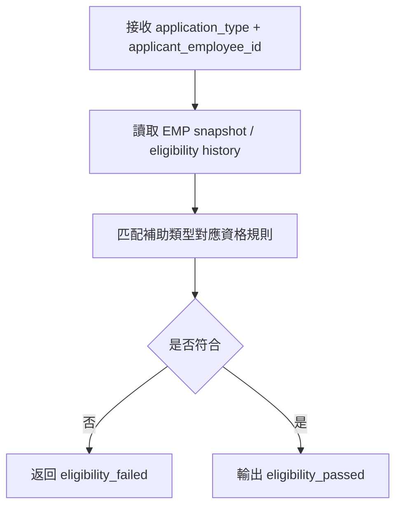
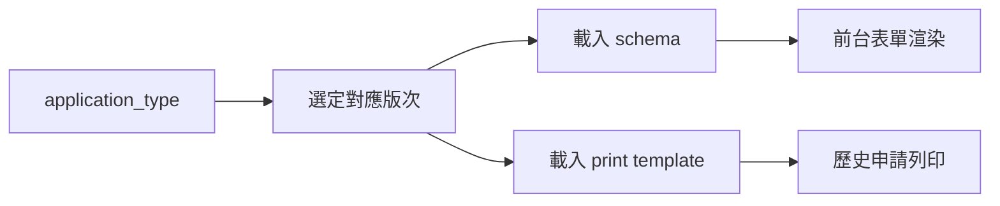
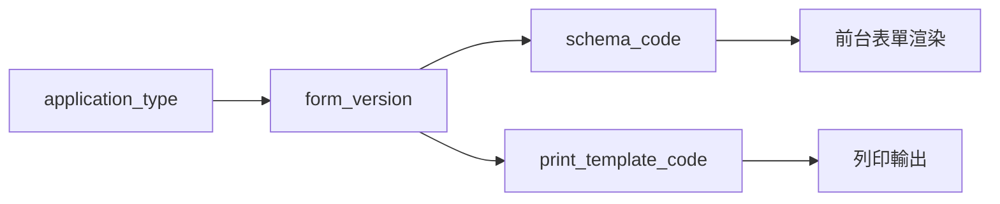
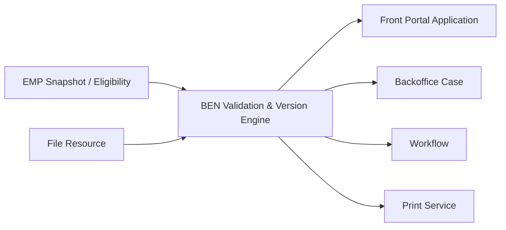

> 來源註記：本文件保留既有模塊拆分方式。凡文中未被客戶原始 PRD 明文定義的欄位、狀態碼、流程抽象或工程命名，均視為內部設計建議，不作為客戶權威需求表述。
>
> 對齊口徑：本文件已按主 PRD `v1.1` 與 `sql/tra_welfare_platform.sql` `v3.0-full` 收斂；規則粒度以 `application_type_id`、表單版本、列印模板與校驗結果為主，舊版 `domain_code` 僅保留作歷史術語說明。

# M15《BEN－資格校驗、附件校驗、年度上限、表單版本與列印模板》子 PRD

## 1. 模塊名稱

BEN－資格校驗、附件校驗、年度上限、表單版本與列印模板

## 2. 模塊類型

底層能力模塊

## 3. 模塊定位

本模塊是 BEN 的規則中樞，負責把補助申請中最容易散落在前端、後端、流程與報表中的共用規則，收斂成可被多個頁面與服務重複調用的能力層。
如果 M13 解決的是「職工如何在前台建立、保存與送出申請」，那 M15 解決的就是：

- 這筆申請是否具備送審資格
- 附件是否齊備且符合規則
- 本年度是否已超過申請上限
- 這種補助類型應載入哪一版表單 schema
- 列印時應套用哪一版 print template
- 退回重送時，規則應重新怎麼判

總體 PRD 已把這些內容分散寫在 BEN 需求、補助申請時序圖、字段字典與工程原則中；本份子 PRD 的目的，就是把它們從頁面與流程裡抽出來，形成單獨、可落地、可測試的能力模塊。

## 4. 設計目標

本模塊設計目標如下：

1. 建立補助送審前的統一校驗能力，保證資格、附件與年度上限任一不通過時不可送審。這是總體 PRD 對 BEN 的直接要求。
2. 建立版型映射能力，既支撐前台表單結構動態載入，也支撐歷史申請列印時正確還原當時版次。若系統採 `form_version` 管理，應視為內部設計實現，不宜回寫成客戶已指名的資料欄位。
3. 讓規則能力獨立於前台頁面與後台案件頁，避免資格與上限規則被重複實作在多個地方。這符合總體 PRD 對平台可治理、可擴展與避免硬編碼的整體方向。
4. 為 M13 前台申請、M14 後台案件、M11 審批執行、列印預覽與測試驗收提供同一套規則判準，降低不同入口判斷不一致。
5. 支撐原始 PRD 補助主鏈的規則配置與版本映射，優先覆蓋結婚、生育/育兒、教育、慰問金與社團發展等核心類別。

## 5. 業務場景

### 場景 A：前台送審婚嫁補助前做規則檢查

職工在前台填完婚嫁補助後點擊送審，系統不能直接送流程，而要先檢查資格、附件與年度上限。只有全數通過，才允許建立流程與通知。這條規則在補助申請時序圖與 BEN 需求說明中都已被直接寫明。

### 場景 B：退回補件後重新送審

主管退回後，職工補上附件或修正資料，重新送審時，系統仍要再次檢查資格、附件與年度上限，而不能沿用上一次結果。總體 PRD 已把「補件與重新送審」列為 BEN 一級功能。

### 場景 C：同一補助類型不同時期表單版本不同

某類補助可能在制度調整後更改表單欄位或列印版型，此時不能讓新版結構覆蓋舊資料展示。系統必須保留歷史版次映射，確保舊案仍能正確回顯與列印；若實作上使用 `form_version`，那是內部欄位設計。

### 場景 D：年度限制阻擋重複申請

若某員工在同一年度、同一補助類型下已達上限，則即使表單填寫完整、附件齊備，也不可送審。總體 PRD 已直接指出年度上限不通過時不可送審。

### 場景 E：後台查看與列印歷史案件

承辦或職工查詢歷史申請時，系統要能用當時的版次正確回顯與列印；否則歷史資料會因版本變更而失真。這與總體 PRD 對 Search & Print 與正式申請書版次正確性的要求一致。

## 6. 業務流程解讀

### 6.1 送審前規則檢查在主流程中的位置

總體 PRD 的補助申請時序圖已明確把 BEN 內部的「驗證資格、附件、上限」放在 `submit(applicationId, revision)` 與 `createWorkflow` 之間。這表示規則檢查是送審前最後一道閘門，而不是流程建立後再補查。

```mermaid
flowchart TD
    A[前台 submit(applicationId, revision)] --> B[revision 校驗]
    B --> C[資格校驗]
    C --> D[附件校驗]
    D --> E[年度上限校驗]
    E --> F{是否全部通過}
    F -->|否| G[返回阻斷原因]
    F -->|是| H[建立 workflow_instance]
    H --> I[建立通知]
```

### 6.2 規則引擎的分層流程

本模塊建議把四類能力拆成兩層：

第一層是**送審阻斷型校驗**：

- 資格校驗
- 附件校驗
- 年度上限校驗

第二層是**表單與列印映射型能力**：

- schema 版本映射
- print template 版本映射

前者決定「能不能送」，後者決定「表單怎麼長、列印怎麼長」。這種拆法能讓工程、設計與測試更容易分工。

### 6.3 資格校驗流程

總體 PRD 並未逐條列出每個補助的資格公式，但已明確 EMP/M06 存在補助資格歷史與 snapshot，因此 M15 的資格校驗應該是讀取 EMP 的當前有效資格摘要或必要時回溯歷史，而不是自己維護一套資格真源。



### 6.4 附件校驗流程

附件校驗不只是看有沒有檔案，而是看：

- 是否已上傳必填附件
- 附件引用是否有效
- 是否存在被刪除或停用的附件
- 是否符合該補助類型要求的附件集合

由於總體 PRD 已明確所有檔案都走 `file_resource`、業務表只保存 `file_id`，所以附件校驗應以 `file_id` 引用集合為中心。

### 6.5 年度上限校驗流程

年度上限校驗的核心是看「本年度、同一員工、同一補助類型是否已達申請次數/額度限制」。總體 PRD 沒有展開公式細節，但已把年度上限列為送審阻斷條件，因此子 PRD 建議把它做成可配置規則，至少支持：

- 同年度申請次數上限
- 同年度可核准次數上限
- 同年度累計金額上限
- 按 `application_type_id` 粒度控制

### 6.6 `form_version` 映射流程

版次資訊不是展示用備註，而是正式的規則鍵。總體 PRD 已明確系統需產出正確版次的申請書與列印內容；至於是否落成 `form_version`，屬工程實作選擇。



### 6.7 重送時的規則重新計算

補件重送時，不能偷用舊結果。
建議原則是：

- 每次 `submit` / `resubmit` 都重新跑資格、附件、年度上限
- 保留最近一次規則檢查結果摘要
- 若規則版本變更，應在不影響歷史列印的前提下，重新做當下送審判斷

## 7. 核心功能拆解

### 7.1 資格校驗能力

負責判斷申請人是否符合某類補助的當前申請資格。
建議子能力包括：

- 依 `application_type` 匹配資格規則
- 讀取 EMP snapshot / history
- 輸出 pass / fail 與原因碼
- 支援重送再次校驗
- 支援人工查驗結果展示

### 7.2 附件校驗能力

負責判斷某申請的附件是否完整且有效。
建議子能力包括：

- 必填附件規則映射
- 附件 `file_id` 有效性檢查
- 檔案狀態檢查
- 缺件列表輸出
- 重送前附件重檢

### 7.3 年度上限校驗能力

負責判斷某申請是否超過年度限制。
建議子能力包括：

- 依 `application_type_id` 載入上限規則
- 依 `applicant_employee_id + year` 查詢歷史申請
- 支援 count / amount / approval-based 上限
- 輸出剩餘額度或阻斷原因

### 7.4 規則結果彙總

將三類送審校驗結果合併成單一判定：

- `can_submit = true/false`
- `failed_rules = [eligibility, attachment, annual_limit]`
- `messages = [...]`

這能讓前台與後台顯示一致，測試也能直接驗證。

### 7.5 表單 schema 版本映射

負責按 `application_type + form_version` 載入正確的表單 schema。
建議子能力包括：

- schema registry
- 當前預設版本
- 歷史版本只讀回放
- 版本升級後的兼容策略

### 7.6 列印模板映射

負責按 `form_version` 對應 print template。
建議子能力包括：

- print template registry
- 版本對應關係
- 歷史資料列印回放
- 模板停用前引用檢查

### 7.7 規則配置與審計摘要

雖具體配置入口可分散在後台設定或 BEN 管理頁，但本模塊本身需要支持：

- 規則代碼與版本
- 最近一次命中規則結果摘要
- 規則變更後的可追溯性
- 供 SEC / 稽核查驗的檢查結果留痕

## 8. 與其他模塊的聯動關係

### 8.1 與 M13《補助申請前台》的聯動

M13 在點擊送審時調用本模塊做校驗；校驗不通過時，M13 只負責把錯誤提示給職工，不自行判斷業務規則。這與總體 PRD 的補助申請時序圖完全一致。

### 8.2 與 M14《補助案件後台》的聯動

後台案件頁在承辦查看退回原因、補件狀況或人工複核時，也應共享同一套規則結果，不另做一套附件/上限判定。

### 8.3 與 EMP / M06 的聯動

資格校驗依賴 EMP 補助資格歷史與 snapshot，這在總體 PRD 中已有明確體系。M15 不維護資格真源，只讀取有效摘要與必要歷史。

### 8.4 與 M08《檔案資源中心》的聯動

附件校驗依賴 `file_id`、`file_resource` 狀態與引用關係；BEN 不應直接處理實體檔案規則。這與總體 PRD 的檔案治理原則一致。

### 8.5 與 M10～M12《WF》的聯動

本模塊在通過校驗後，才允許進入送審與建立流程關聯。也就是說，WF 是 M15 通過後的下游，而非替代校驗層。總體 PRD 時序圖已直接畫出這個順序。

### 8.6 與 M07《字典與系統參數》的聯動

補助類型、規則狀態、錯誤碼、版本啟用狀態、年度上限規則開關等，都適合由字典與系統參數治理，符合總體 PRD 的平台治理方向。

### 8.7 與 M09《通知中心》的聯動

規則失敗本身通常不發正式業務通知，但規則通過並送審成功後，會由 BEN 往 M09 建通知。若需要對異常大量失敗做維運告警，則可輸出到 SEC/M09 的治理鏈。

### 8.8 與 SEC 的聯動

若出現規則配置錯誤、版本映射缺失、附件引用失效、年度上限計算異常等，應能輸出資料完整性或操作異常事件，供 SEC 追查。總體 PRD 對 `data_integrity` 與 `operation_anomaly` 已有規則分類。

## 9. 頁面規劃

本模塊屬底層能力模塊，但為了治理與排錯，建議至少提供 3 個後台視圖。

### 9.1 視圖一：補助規則檢查結果頁

**定位**：供承辦/管理員查看某申請最近一次規則檢查結果。

**頁面區塊**

1. 申請摘要區
2. 資格檢查結果區
3. 附件檢查結果區
4. 年度上限檢查結果區
5. 最終可送審結果區

### 9.2 視圖二：表單版本與列印模板映射頁

**定位**：治理 `application_type / form_version / schema / print template` 對應關係。

**頁面區塊**

1. 補助類型選擇區
2. 版本列表
3. schema 摘要區
4. print template 摘要區
5. 啟用狀態區
6. 引用風險提示區

### 9.3 視圖三：年度上限規則與命中查詢頁

**定位**：供承辦/管理員查詢某員工在某年度的規則命中情況。

**頁面區塊**

1. 申請人與年度篩選區
2. 歷史申請摘要
3. 上限計算結果區
4. 阻斷原因區

## 10. 底層能力說明

### 10.1 能力邊界

本模塊負責：

- 送審前資格校驗
- 送審前附件校驗
- 年度上限校驗
- `form_version` → schema 映射
- `form_version` → print template 映射
- 規則結果摘要輸出

本模塊不負責：

- 前台表單頁交互
- 實體檔案存儲
- 流程模板定義
- 待辦審批執行
- 員工資格真源維護
- 通知實際發送

### 10.2 建議能力接口

- `validateEligibility(applicationId)`
- `validateAttachments(applicationId)`
- `validateAnnualLimit(applicationId)`
- `validateBeforeSubmit(applicationId, revision)`
- `resolveFormSchema(applicationType, formVersion)`
- `resolvePrintTemplate(applicationType, formVersion)`
- `getValidationSummary(applicationId)`

### 10.3 輸入輸出

**輸入**

- application_id
- applicant_employee_id
- application_type_id
- form_version
- revision
- attached_file_ids

**輸出**

- can_submit
- validation_summary
- failed_rule_codes
- resolved_schema_code
- resolved_print_template_code

## 11. 角色權限與操作路徑

### 11.1 可操作角色

- 一般職工：間接受益者，在前台被規則檢查
- 福利社承辦人：查看規則結果與輔助排錯
- 審核主管：在後台查看校驗摘要，不直接維護規則
- 系統管理員：治理規則配置、版本映射與異常
- 資安稽核人員：查規則異常與資料完整性問題

### 11.2 操作路徑

前台 Portal → 補助申請表單 → 送審 → 規則檢查
管理後台 → 補助業務 / 系統設定 → 規則檢查結果
管理後台 → 補助業務 / 系統設定 → 表單版本與列印模板映射

### 11.3 權限建議

- 查看規則檢查摘要
- 查看附件校驗明細
- 查看年度上限命中紀錄
- 管理表單版本映射
- 管理列印模板映射
- 匯出規則結果報表

其中「管理版本映射」「匯出規則結果報表」建議視為高風險治理權限。

## 12. 關鍵字段/配置項說明

### 12.1 來自總體 PRD 的核心字段

總體 PRD 與當前系統實作共同收斂出的 BEN 核心字段包括 `application_no`、`application_type_id`、`form_version`、`applicant_employee_id`、`submitted_at`、`returned_reason`、`revision`；流程實例關聯以橋接方式維護，而不是把 `workflow_instance_id` 當作此模塊的主字段。

### 12.2 規則檢查結果字段

| 字段名              | 中文名稱       | 用途              |
| ------------------- | -------------- | ----------------- |
| validation_id       | 規則檢查 ID    | 主鍵              |
| application_id      | 申請 ID        | 關聯補助主表      |
| eligibility_result  | 資格結果       | pass/fail         |
| attachment_result   | 附件結果       | pass/fail         |
| annual_limit_result | 年度上限結果   | pass/fail         |
| can_submit          | 是否可送審     | 綜合結果          |
| failed_rule_codes   | 失敗規則碼集合 | 前後台提示        |
| validated_at        | 校驗時間       | 追蹤用            |
| validated_revision  | 校驗版本       | 對應主表 revision |

### 12.3 版本映射字段

| 字段名              | 中文名稱     | 用途            |
| ------------------- | ------------ | --------------- |
| mapping_id          | 映射 ID      | 主鍵            |
| application_type_id | 申請類型 ID  | 補助類型        |
| form_version        | 表單版本     | 版本鍵          |
| schema_code         | 表單結構代碼 | 前台載入        |
| print_template_code | 列印模板代碼 | 列印載入        |
| status              | 狀態         | active/inactive |
| is_default          | 是否預設版   | 新建申請時用    |
| revision            | 樂觀鎖版本號 | 併發防護        |

### 12.4 年度上限規則字段

| 字段名               | 中文名稱        | 用途                        |
| -------------------- | --------------- | --------------------------- |
| annual_limit_rule_id | 年度上限規則 ID | 主鍵                        |
| application_type_id  | 申請類型 ID     | 規則作用域                  |
| limit_mode           | 上限模式        | count/amount/approval_count |
| limit_value          | 上限值          | 規則值                      |
| effective_year       | 生效年度        | 可按年維護                  |
| status               | 狀態            | 啟用/停用                   |

### 12.5 建議配置項

建議由 M07 / SYS 參數治理：

- `ben.validation.enable_eligibility_check`
- `ben.validation.enable_attachment_check`
- `ben.validation.enable_annual_limit_check`
- `ben.validation.block_on_any_fail`
- `ben.form.default_version.by_type`
- `ben.print.template.mapping.versioned`
- `ben.annual_limit.rule_source`

## 13. 異常情況與邊界條件

### 13.1 任一校驗不通過

資格、附件或年度上限任一不通過時，不可送審。這是總體 PRD 的直接規則。

### 13.2 版本衝突

若 `submit(applicationId, revision)` 時 revision 不一致，應直接阻斷，避免在舊資料上做規則判定。總體 PRD 已要求主表具備 revision。

### 13.3 `form_version` 無對應 schema

若前台要建立或回顯某版本表單時找不到 schema，應視為配置異常，不可讓前台回退到錯誤版本。

### 13.4 `form_version` 有 schema 但無 print template

可允許先建立與送審，但列印功能需明確提示缺失，或在治理上阻斷啟用。建議以制度要求決定；若列印是必備交付物，則應視為高風險配置缺失。

### 13.5 附件已上傳但 `file_id` 失效

若附件引用指向停用/刪除/不可讀檔案，附件校驗必須失敗，不能默認視為存在。

### 13.6 歷史案件因規則升級被錯誤重判

歷史申請的列印與回顯必須依舊 `form_version`，但重新送審時是否沿用舊規則或重跑新規則，需明確採用「當次送審按當前規則、歷史展示按歷史版本」原則。

### 13.7 非 MVP 類型無規則配置

若某補助類型不在 MVP 範圍，應不開放申請入口或直接提示未開通；不可因為缺規則配置而進到流程後才失敗。總體 PRD 已明確 MVP 補助類型範圍。

## 14. Mermaid 圖

### 14.1 送審前規則檢查總流程圖

```mermaid
flowchart TD
    A[submit(applicationId, revision)] --> B[revision 檢查]
    B --> C[資格校驗]
    C --> D[附件校驗]
    D --> E[年度上限校驗]
    E --> F{全部通過?}
    F -->|否| G[返回失敗原因]
    F -->|是| H[允許 createWorkflow]
```

### 14.2 `form_version` 映射圖



### 14.3 規則模塊與上下游關係圖



## 15. 研發落地建議

### 15.1 架構分層建議

- 規則判定服務獨立於前台頁面與後台案件頁
- `validateBeforeSubmit` 作為單一入口
- schema/print template registry 與校驗規則 registry 分離
- 規則結果保存摘要，便於追查與測試回放

### 15.2 規則配置建議

- 不把資格、附件、年度上限規則硬寫在前端
- 規則應以 `application_type_id` 為粒度治理
- 版本映射表與規則表都加 `revision`
- 規則變更需保留 before/after 差異，方便稽核

### 15.3 表單與列印建議

- 前台渲染只讀 schema_code，不自己推斷欄位
- 列印永遠按歷史 `form_version` 做映射
- 新版表單啟用前應先完成 print template 對應驗證

### 15.4 測試與維運建議

- 對每個補助類型建立規則測試基準樣本
- 對每個 `form_version` 建立列印回歸樣本
- 年度上限應有跨年度、跨類型、重送案例測試
- 規則異常與映射缺失應能被系統管理員快速定位

## 16. 測試驗收要點

### 16.1 功能驗收

1. 送審前會依序執行資格、附件、年度上限校驗。
2. 任一校驗失敗時，送審被阻斷。
3. `form_version` 可正確對應表單 schema。
4. `form_version` 可正確對應 print template。
   以上 1～4 點都直接對應總體 PRD 的 BEN 規則與字段定義。

### 16.2 聯動驗收

1. M13 點送審時能正確調用本模塊並取得校驗結果。
2. 校驗通過後，才能建立流程關聯並進入送審。
3. 附件校驗會正確識別無效 `file_id`。
4. 列印功能能按歷史 `form_version` 正確輸出。
   其中第 2、4 點直接可由總體 PRD 的時序圖與 `form_version` 定義支撐。

### 16.3 邊界驗收

1. revision 不一致時，不執行規則判定直接阻斷。
2. `form_version` 缺 schema 或缺 print template 時，可正確報配置異常。
3. 非 MVP 類型無對應規則時，不可錯誤進入送審。
4. 退回重送會重新執行三類校驗。
   其中第 3 點直接對應總體 PRD 的 MVP 範圍。

### 16.4 治理與安全驗收

1. 規則版本與映射變更可被追蹤。
2. 高風險規則變更不會靜默覆蓋，revision 可阻止併發寫入。
3. 規則異常可輸出治理事件供系統管理與資安追查。
4. 歷史列印不會因新版本上線而失真。
   第 2、4 點與總體 PRD 的 revision 原則及 `form_version` 定義一致。
