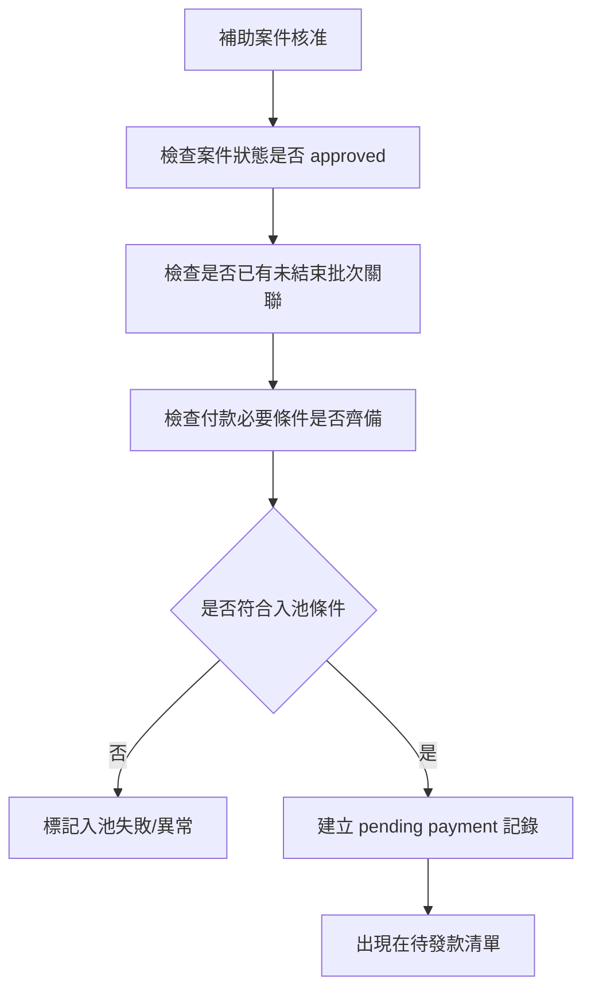
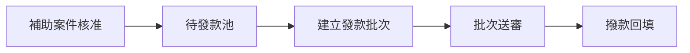
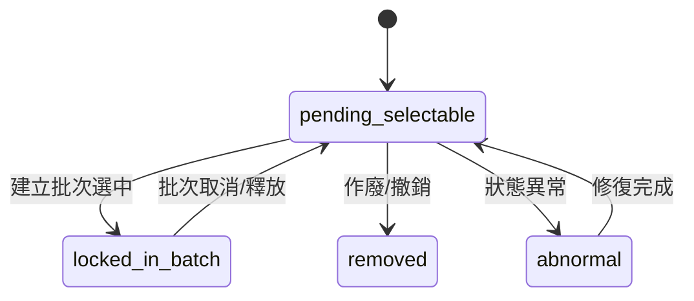
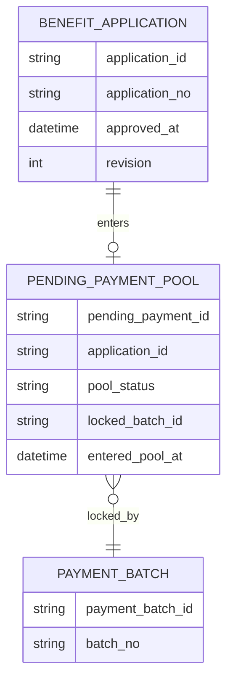

> 來源註記：本文件保留既有模塊拆分方式。凡文中未被客戶原始 PRD 明文定義的欄位、狀態碼、流程抽象或工程命名，均視為內部設計建議，不作為客戶權威需求表述。
>
> 對齊口徑：本文件已按主 PRD `v1.1` 與 `sql/tra_welfare_platform.sql` `v3.0-full` 收斂；待發款池承接補助核准案件，並服務於報銷單與發款批次兩條後續主鏈。

# M16《PAY－待發款池與案件入池規則》子 PRD

## 1. 模塊名稱

PAY－待發款池與案件入池規則

## 2. 模塊類型

業務支撐模塊

## 3. 模塊定位

本模塊是 BEN 與 PAY 之間的橋接層，負責把**已核准、可付款、尚未進入有效批次**的補助案件，轉換成承辦可操作的待發款清單。
如果 M14 解決的是「補助案件後台如何審核」，那 M16 解決的就是：

- 哪些案件有資格進入待發款池
- 什麼時候入池
- 哪些案件不能再入池
- 已入池案件如何被批次建立頁挑選
- 如何避免重複入批、髒數據入池、錯誤狀態流轉

總體 PRD 的端到端流程圖清楚表明：**主管核准 → 進入待發款池 → 承辦建立發款批次**。這代表待發款池不是列表展示附屬功能，而是整個發款主鏈的正式節點。

## 4. 設計目標

1. 建立 BEN 到 PAY 的標準銜接機制，確保只有已核准案件才可進入待發款池。
2. 建立清晰的入池規則與排除規則，避免未核准、已駁回、已在未結束批次中的案件混入待發款池。
3. 讓承辦可在發款管理中穩定取得待發款清單，作為後續建立批次的唯一來源。
4. 保證待發款池狀態可追蹤、可查詢、可與批次關係回溯，符合平台「每張申請、每次處理都有歷程可查」的價值。
5. 與 M17 發款批次、M18 領款確認、SEC 稽核建立穩定事件邊界。

## 5. 業務場景

### 場景 A：補助案件核准後自動入池

主管在補助案件後台核准案件後，系統不直接發款，而是先把案件標記為可付款並加入待發款池，等待承辦挑選建立批次。這是總體 PRD 主流程的直接規則。

### 場景 B：承辦從待發款清單挑選案件建批

承辦人在「發款管理」中從待發款清單選擇已核准案件，填寫批次資料並上傳傳票。總體 PRD 的場景二直接這樣描述。

### 場景 C：案件已進未結束批次，不可再次入池

如果某案件已被某個未結束批次引用，就不能再次進入另一個未結束批次。這是總體 PRD 的直接邊界。

### 場景 D：核准後但資料異常案件不應放行

若案件雖已核准，但缺關鍵付款資訊、狀態不一致、或流程實例異常，系統應阻止入池或標記異常待處理，而不是默默讓它出現在待發款清單。

### 場景 E：待發款案件被撤銷或重新退回

若後續出現異常更正、人工撤銷或狀態回退，該案件應從待發款池移除，避免流入後續批次。

## 6. 業務流程解讀

### 6.1 入池主流程

### 6.2 承辦挑選建批流程中的位置

### 6.3 入池核心原則

- 核准是入池前提，不是建立批次後再反查。
- 待發款池是**案件級**清單，不是批次級清單。
- 已進未結束批次的案件，不可再次被另一批次引用。
- 入池結果應穩定保存，不依賴每次列表臨時計算。
- 入池異常要可追蹤，不能靜默丟失。

## 7. 核心功能拆解

### 7.1 待發款池建立

系統在案件核准後，自動建立待發款記錄。
建議子能力：

- 核准後自動入池
- 入池前條件檢查
- 記錄入池時間
- 記錄來源案件與流程資訊
- 入池失敗事件輸出

### 7.2 待發款清單查詢

提供承辦在 PAY 中查詢可建批案件。
建議子能力：

- 按案件單號查詢
- 按補助類型查詢
- 按申請人查詢
- 按核准時間區間查詢
- 按 branch / domain 查詢
- 按是否已鎖定於批次查詢

### 7.3 入池資格判定

建議入池判定至少包含：

- 案件狀態 = approved / approved_pending_payment
- 已具 `approved_at`
- 未結束批次未引用
- 未被標記為作廢/撤銷
- 必要付款資訊完整

### 7.4 入池排除規則

建議排除以下案件：

- draft / submitted / reviewing / returned / rejected
- 已在未結束批次中
- 已完成付款並結案
- 已轉入異常或爭議前置狀態
- 關聯主表 revision / 狀態不一致

### 7.5 池內狀態治理

建議待發款池記錄至少支持：

- pending_selectable：可選
- locked_in_batch：已被某批次鎖定
- removed：已移出
- abnormal：異常待處理

### 7.6 入池與移池事件

建議輸出：

- `payment_pool_entered`
- `payment_pool_enter_failed`
- `payment_pool_locked_by_batch`
- `payment_pool_removed`
- `payment_pool_released`

### 7.7 與批次建立的鎖定機制

一旦承辦在 M17 建立批次並選中案件，案件應從 `pending_selectable` 轉為 `locked_in_batch`，直到批次結束或被取消，避免重複挑選。

## 8. 與其他模塊的聯動關係

### 8.1 與 M14《補助案件後台》的聯動

M14 核准案件，M16 承接入池。
核准後進待發款池，是這兩個模塊最關鍵的狀態橋接。

### 8.2 與 M17《發款批次、送審與撥款回填》的聯動

M17 的批次建立頁只應從 M16 的待發款池取數，不能繞過待發款池直接抓任意已核准案件。這樣才能確保唯一性與可治理。

### 8.3 與 M18《領款確認與異議處理》的聯動

M16 本身不處理領款確認，但它決定哪些案件會流入 M17 並最終進到 M18，因此是領款主鏈的上游起點。

### 8.4 與 WF 的聯動

入池的前提是流程已走到核准結束節點。
M16 不是流程引擎，但依賴 WF/案件狀態結果判定是否可入池。

### 8.5 與 ORG / 權限的聯動

待發款清單應受資料範圍控制，例如承辦只能看到自己 branch 或授權範圍內的案件。總體 PRD 已明確權限與資料範圍需正確限制列表與詳情。

### 8.6 與 M09《通知中心》的聯動

入池通常不直接通知職工，但可以通知承辦或產生營運提醒事件；若入池失敗，也可形成異常通知。

### 8.7 與 SEC 的聯動

重複入池阻斷、批量移池、異常解除鎖定、繞過規則手工入池，都屬高風險操作或資料完整性異常，應可被稽核。

## 9. 頁面規劃

本模塊作為業務支撐模塊，建議至少包含 2 個主要後台視圖。

### 9.1 頁面一：待發款清單頁

**定位**：承辦挑選待付款案件的主入口。

**頁面區塊**

1. 待發款統計卡
2. 搜尋與篩選區
3. 待發款列表
4. 批量加入批次操作區

**查詢條件建議**

- application_no
- application_type
- applicant_name / employee_no
- approved_at 區間
- branch
- application_type_id
- pool_status

**列表欄位建議**

- application_no
- application_type
- applicant_name
- approved_at
- amount_summary（若有）
- branch
- pool_status
- locked_batch_no
- selectable_flag

### 9.2 頁面二：待發款詳情抽屜/頁

**定位**：查看單筆待發款案件的付款前摘要。

**頁面區塊**

1. 案件摘要卡
2. 申請人摘要
3. 核准資訊
4. 附件與證明摘要
5. 入池狀態區
6. 批次鎖定摘要區
7. 歷史事件區

## 10. 底層能力說明

### 10.1 能力邊界

本模塊負責：

- 核准案件入池
- 待發款記錄與狀態
- 待發款清單查詢
- 入池排除與重複控制
- 與批次建立的鎖定/釋放銜接

本模塊不負責：

- 批次主檔建立
- 批次送審
- 撥款回填
- 領款確認
- 異議處理
- 流程模板與待辦執行

### 10.2 建議能力接口

- `enterPendingPaymentPool(applicationId)`
- `listPendingPaymentCases(filters)`
- `lockPendingCaseForBatch(applicationId, batchId)`
- `releasePendingCaseFromBatch(applicationId, batchId)`
- `removePendingPaymentCase(applicationId, reason)`
- `checkPendingPoolEligibility(applicationId)`

### 10.3 能力實現原則

- 入池由核准事件驅動
- 入池與建批之間有顯式狀態轉換
- 不用前端臨時計算是否可付款
- 重複入池與重複入批要後端強約束
- 池內狀態變更要可追溯

## 11. 角色權限與操作路徑

### 11.1 可操作角色

- 福利社承辦人：主要使用者，查看待發款清單並建立批次
- 審核主管：通常查看，不直接建批
- 系統管理員：處理異常與治理
- 資安稽核人員：查看入池/移池異常與高風險操作

總體 PRD 已明確福利社承辦人的主要操作包含建立發款批次。

### 11.2 操作路徑

管理後台 → 發款管理 → 待發款清單
管理後台 → 發款管理 → 待發款詳情

### 11.3 權限建議

- 查看待發款清單
- 查看待發款詳情
- 建立批次前選取案件
- 解除異常鎖定
- 匯出待發款清單

其中「解除異常鎖定」「匯出待發款清單」建議視為高風險權限。

## 12. 關鍵字段/配置項說明

### 12.1 依據總體 PRD 的關鍵字段

總體 PRD 已明確補助案件關鍵字段包括 `application_id`、`application_no`、`approved_at`、`revision`；PAY 關鍵字段包括 `payment_batch_id`、`batch_no`、`total_amount`、`item_count`。流程關聯由橋接表維護，不要求待發款池保存 `workflow_instance_id`。

### 12.2 建議的待發款池字段

| 字段名                | 中文名稱      | 用途                                                      |
| --------------------- | ------------- | --------------------------------------------------------- |
| pending_payment_id    | 待發款記錄 ID | 主鍵                                                      |
| application_id        | 申請 ID       | 關聯補助案件                                              |
| application_no        | 申請單號      | 顯示與查詢                                                |
| applicant_employee_id | 申請人員工 ID | 關聯 EMP                                                  |
| application_type_id   | 補助類型 ID   | 查詢/規則                                                 |
| application_type      | 補助類型      | 顯示/統計                                                 |
| approved_at           | 核准時間      | 入池依據                                                  |
| pool_status           | 池內狀態      | pending_selectable / locked_in_batch / removed / abnormal |
| locked_batch_id       | 鎖定批次 ID   | 關聯 M17                                                  |
| entered_pool_at       | 入池時間      | 歷程追蹤                                                  |
| removed_at            | 移池時間      | 可空                                                      |
| removed_reason        | 移池原因      | 可空                                                      |
| revision              | 樂觀鎖版本號  | 併發控制                                                  |

### 12.3 建議配置項

- `pay.pending_pool.auto_enter_after_approval`
- `pay.pending_pool.block_if_batch_unfinished`
- `pay.pending_pool.default_page_size`
- `pay.pending_pool.show_abnormal_cases`
- `pay.pending_pool.export_enabled`

## 13. 異常情況與邊界條件

### 13.1 未核准案件入池

不允許。核准是入池前提。

### 13.2 已進未結束批次的案件再次入批

不允許。這是總體 PRD 的直接邊界。

### 13.3 批次未核准就允許撥款

雖屬 M17 範圍，但本模塊要確保池內案件只供建批，不代表可直接撥款；總體 PRD 已明確批次未核准前不可執行撥款回填。

### 13.4 案件狀態與池狀態不一致

例如案件被駁回但池內仍是 selectable，應視為資料完整性異常。

### 13.5 批次取消後案件未釋放

若批次被取消/作廢，案件應從 `locked_in_batch` 釋放回可選狀態，除非有其他異常原因。

### 13.6 手工解除鎖定造成重複付款風險

手工解除必須受權限控制並進稽核，否則可能造成重複進批與重複付款。

## 14. Mermaid 圖

### 14.1 待發款池在主鏈中的位置

### 14.2 池內狀態圖

### 14.3 入池與建批關係圖

## 15. 研發落地建議

### 15.1 架構建議

- 待發款池獨立表承接案件付款前狀態
- 由 BEN 核准事件驅動入池，而非列表臨時計算
- 與 M17 之間用顯式鎖定關係，而非僅靠查詢條件排除

### 15.2 一致性建議

- `application_id` 在待發款池表上做唯一約束，避免重複入池
- `locked_batch_id + pool_status` 做狀態約束，避免重複鎖定
- 入池與鎖定操作都帶 revision 或原子更新條件

### 15.3 UI/交互建議

- 待發款清單頁與批次建立頁共用選取表格組件
- 已鎖定案件要明確顯示對應 `batch_no`
- 異常案件要有獨立視覺標識，不與可選案件混在一起

### 15.4 治理建議

- 批量入池異常、手工釋放、重複入池阻斷都要落稽核
- 對「長期停留待發款池未建批」可後續加營運監控
- 對「已核准但未入池」建立對賬檢查

## 16. 測試驗收要點

### 16.1 功能驗收

1. 補助案件核准後可自動進入待發款池。
2. 承辦可在待發款清單中看到可建批案件。
3. 建立批次時可從待發款池挑選案件。
4. 待發款案件可查詢詳情與入池歷程。
   其中 1、3 直接對應總體 PRD 的主流程與場景二。

### 16.2 邊界驗收

1. 未核准案件不可入池。
2. 已進未結束批次的案件不可重複進入其他未結束批次。
3. 批次未核准前不可把案件誤當作已付款。
4. 批次取消後案件可正確釋放回池。
   其中第 2、3 點直接對應總體 PRD 邊界。

### 16.3 聯動驗收

1. M14 核准後，M16 能自動收到入池事件。
2. M17 建批時，只能從 M16 取案件。
3. M17 鎖定案件後，M16 清單即反映不可再選。
4. 異常入池或重複入池阻斷可輸出給 SEC。

### 16.4 治理與安全驗收

1. 手工解除鎖定、批量移池、匯出待發款清單都可被稽核追蹤。
2. 並發建批時，不會把同一案件放進兩個未結束批次。
3. 狀態不一致案件能被標示為 abnormal。
4. 池內資料可回溯來源案件與核准時間。
