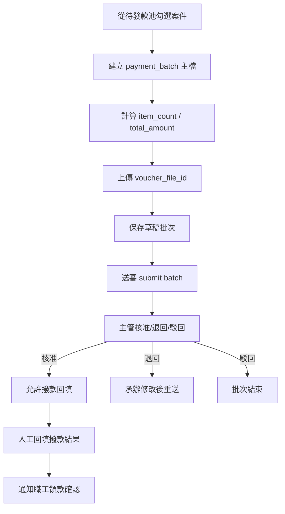
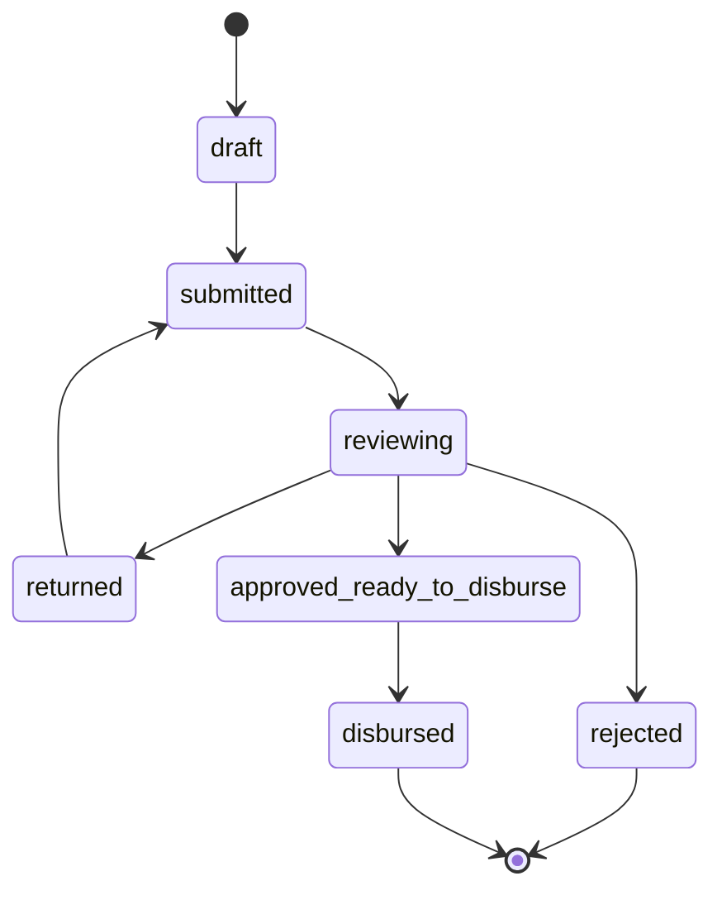
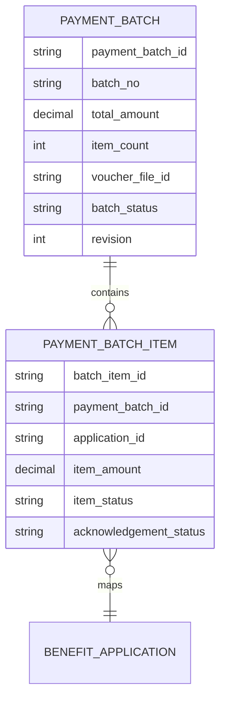

> 來源註記：本文件保留既有模塊拆分方式。凡文中未被客戶原始 PRD 明文定義的欄位、狀態碼、流程抽象或工程命名，均視為內部設計建議，不作為客戶權威需求表述。
>
> 對齊口徑：本文件已按主 PRD `v1.1` 與 `sql/tra_welfare_platform.sql` `v3.0-full` 收斂；批次主表可關聯報銷單，並與傳票檔案、AI 傳票產製結果與流程橋接共同運作。

# M17《PAY－發款批次、送審與撥款回填》子 PRD

## 1. 模塊名稱

PAY－發款批次、送審與撥款回填

## 2. 模塊類型

後台頁面模塊

## 3. 模塊定位

本模塊是 PAY 領域的主操作頁，負責把待發款池中的案件整理成一筆可審批、可追蹤、可回填、可對帳的發款批次。
如果 M16 解決的是「哪些案件可以付款」，那 M17 解決的就是：

- 承辦如何從待發款清單挑選案件建立批次
- 批次主檔怎麼保存與計算總金額、總筆數
- 傳票附件怎麼上傳與綁定
- 批次怎麼送審、由誰核准
- 核准後承辦如何人工回填撥款結果
- 回填之後如何把案件推向領款確認

總體 PRD 的核心場景二已把這條主線寫得非常清楚：
**承辦從待發款清單挑選已核准案件建立批次 → 上傳傳票 → 批次送審 → 主管核准 → 承辦回填人工撥款結果 → 系統通知職工進行領款確認。**

## 4. 設計目標

1. 建立標準化發款批次主檔，將多筆已核准補助案件收斂為一個可審核、可回填、可追溯的批次單位。
2. 保證批次送審與核准後的狀態邊界清晰，避免在批次未核准時就先進行撥款回填。這是總體 PRD 的直接規定。
3. 以人工撥款回填作為 MVP 正式方案，為未來可能接銀行 API 預留邊界，但不把外部對接複雜度帶入 MVP。
4. 與 M16 待發款池、M18 領款確認、WF 審批、M08 檔案中心、M09 通知中心形成清晰分層。
5. 為承辦與主管提供批次級別的查詢、送審、回填與歷程能力，符合平台「可審、可追蹤、可責任切分」的整體目標。

## 5. 業務場景

### 場景 A：承辦建立發款批次

福利承辦人進入「發款管理」後，從待發款清單中挑選已核准案件建立批次，填寫批次資訊並上傳傳票附件。這是總體 PRD 場景二的直接描述。

### 場景 B：主管核准發款批次

承辦完成批次建立後送審，主管在待辦中心或批次詳情頁查看批次摘要、總金額、總筆數、傳票附件與案件清單，決定核准、退回或駁回。這條鏈路來自整體端到端流程與場景二。

### 場景 C：承辦人工回填撥款結果

批次核准後，承辦依實際人工撥款結果，在系統中回填成功／失敗／部分完成等結果，系統再通知職工進行領款確認。總體 PRD 已明確 MVP 採人工撥款回填，且核准後才可執行。

### 場景 D：批次被退回修改

若主管審核批次後退回，承辦需重新調整批次內容或附件，再次送審。這與 WF 的一般送審規則一致，也符合平台對可退回、可修正流程的整體設計。

### 場景 E：批次內案件不得重複

若某案件已經進入未結束批次，不可再次加入其他未結束批次。這是總體 PRD 對發款邊界的直接規定。

## 6. 業務流程解讀

### 6.1 發款批次主流程

這條流程直接對應總體 PRD 的場景二與端到端流程。

### 6.2 建批流程解讀

發款批次不是單筆案件的狀態改寫，而是一個**批次主檔 + 批次案件關聯**的組合。
因此建議流程是：

1. 從 M16 待發款池選中案件
2. 建立批次主檔
3. 產生 `batch_no`
4. 計算 `item_count` 與 `total_amount`
5. 上傳傳票附件，保存 `voucher_file_id`
6. 保存為批次草稿
7. 可後續送審

### 6.3 批次送審流程解讀

批次送審本質上與 BEN 的送審一致：
只是業務主體從單筆申請變成一筆批次。
總體 PRD 已明確 PAY 也屬 WF 的共用流程消費方。

建議流程：

- 保存草稿時不建流程
- 點送審時建立流程實例橋接關聯
- 進入主管核准節點
- 主管可 approve / return / reject
- 核准後批次狀態進入 `approved_ready_to_disburse`

### 6.4 撥款回填流程解讀

這是本模塊最重要的執行邊界。
總體 PRD 直接規定：**批次未核准前，不可執行撥款回填。**

因此回填流程應為：

1. 僅已核准批次可進入回填頁
2. 承辦錄入人工撥款結果
3. 批次與批次內案件同步更新付款相關狀態
4. 系統建立通知給職工
5. 案件流向 M18 的領款確認

### 6.5 退回與駁回流程解讀

- **退回**：批次回到承辦可編輯狀態，可調整案件或附件後重送
- **駁回**：批次結束，通常需要釋放案件回待發款池或進異常流程，視批次是否尚未產生任何有效付款回填決定
  這是子 PRD 對總體送審規則在 PAY 領域的工程化落地。

### 6.6 與 M18 的主鏈銜接

總體 PRD 的整體流程明確指出：人工撥款後，下一步是職工領款確認；若職工提出異議，進入爭議處理，而非直接改回已確認。
因此 M17 的輸出不只是「批次已付款」，還包括：

- 每筆案件/付款項目是否可進入 acknowledgement
- 初始 `acknowledgement_status = pending`

## 7. 核心功能拆解

### 7.1 發款批次建立

建議子能力：

- 從待發款池選取案件
- 建立批次主檔
- 自動計算總筆數與總金額
- 保存草稿狀態
- 生成 `batch_no`

### 7.2 批次案件清單管理

建議子能力：

- 顯示批次內案件明細
- 顯示案件單號、申請人、金額、補助類型
- 允許草稿狀態下移除案件
- 顯示案件是否已鎖定在本批次

### 7.3 傳票附件管理

總體 PRD 已明確 `voucher_file_id` 是發款批次核心字段之一。
建議子能力：

- 上傳傳票附件
- 更新/替換附件
- 預覽與下載附件
- 保存 `voucher_file_id`
- 附件缺失時阻止送審（建議規則）

### 7.4 批次送審

建議子能力：

- `submitBatch(batchId, revision)`
- 建立流程實例與批次橋接關聯
- 進入待辦中心
- 支援主管 approve / return / reject
- 顯示流程歷程

### 7.5 撥款回填

建議子能力：

- 僅核准後可進入
- 回填批次整體結果
- 回填批次內案件結果
- 記錄回填時間、操作人、備註
- 回填後通知職工領款確認

### 7.6 批次狀態治理

建議批次主狀態至少包含：

- draft
- submitted
- reviewing
- returned
- approved_ready_to_disburse
- disbursed
- rejected
- closed_reserved

### 7.7 批次歷程與追蹤

建議提供：

- 建立時間
- 送審時間
- 核准時間
- 退回/駁回原因
- 回填時間
- 通知摘要
- 關聯爭議案件摘要（後續銜接 M18）

### 7.8 匯出與對帳輔助

建議支持：

- 匯出批次內案件清單
- 匯出批次摘要
- 顯示批次總額對帳資訊
  這符合總體 PRD 對承辦「可統計、可責任切分」的價值要求。

## 8. 與其他模塊的聯動關係

### 8.1 與 M16《待發款池》的聯動

M16 是 M17 的唯一案件來源。
M17 建批時只能從待發款池選案，選中後要回寫鎖定狀態，避免重複入批。這與總體 PRD 發款邊界一致。

### 8.2 與 WF 的聯動

批次送審走 WF 共用流程。
批次核准、退回、駁回都應走待辦與流程歷程，不應在 PAY 頁面直接跳過流程操作。

### 8.3 與 M08《檔案資源中心》的聯動

傳票附件通過 `voucher_file_id` 引用 M08 的 `file_resource`。總體 PRD 對 `voucher_file_id` 與檔案統一路徑均有明確定義。

### 8.4 與 M09《通知中心》的聯動

批次核准後、撥款回填後、批次退回後，都可輸出通知事件；尤其撥款回填後要通知職工進行領款確認。

### 8.5 與 M18《領款確認與異議處理》的聯動

M17 撥款回填後，案件進入 acknowledgement 主鏈；M18 承接職工確認與 disputed 分支。總體 PRD 已明確 disputed 需建立獨立案件，不可直接改回已確認。

### 8.6 與 ORG / 權限的聯動

承辦只能看自己資料範圍內可建批案件與批次；主管可看自己可審批批次。這符合平台對資料範圍控制的整體要求。

### 8.7 與 SEC 的聯動

建立批次、送審、核准、駁回、回填、匯出、傳票下載都屬高風險操作或重要流程節點，需進稽核。總體 PRD 已要求高風險操作同步寫入，且所有高風險操作可被追蹤。

## 9. 頁面規劃

本模塊作為後台頁面模塊，建議至少包含 4 個核心頁面。

### 9.1 頁面一：發款批次列表頁

**定位**：查看所有批次狀態與進度。

**頁面區塊**

1. 批次統計卡
2. 搜尋與篩選區
3. 批次列表區
4. 批量匯出工具列

**查詢條件建議**

- batch_no
- 批次狀態
- 建立人
- 建立時間區間
- 核准時間區間
- 是否已回填
- 是否有異議

**列表欄位建議**

- batch_no
- item_count
- total_amount
- status
- voucher_file_id 摘要
- created_at
- submitted_at
- approved_at
- disbursed_at
- acknowledgement_summary

### 9.2 頁面二：建立/編輯發款批次頁

**定位**：從待發款池選案、建立批次與上傳傳票。

**頁面區塊**

1. 批次基本資料區
2. 待發款選案區
3. 已選案件清單
4. 傳票附件區
5. 總額/總筆數摘要區
6. 草稿保存與送審區

### 9.3 頁面三：批次詳情頁

**定位**：查看單筆批次的完整資訊與流程歷程。

**頁面區塊**

1. 批次摘要卡
2. 案件清單
3. 傳票附件區
4. 流程歷程區
5. 回填結果區
6. 操作區（送審/重送/回填）

### 9.4 頁面四：撥款回填頁

**定位**：批次核准後，由承辦回填人工撥款結果。

**頁面區塊**

1. 批次基本資訊
2. 批次內案件回填清單
3. 回填狀態與備註區
4. 確認提交區

**交互建議**

- 未核准批次不可進入
- 支援整批或逐筆回填
- 提交前二次確認
- 回填後不可任意覆蓋，除非走特定更正流程

## 10. 底層能力說明

### 10.1 能力邊界

本模塊負責：

- 批次主檔
- 批次案件關聯
- 批次送審
- 傳票附件綁定
- 人工撥款回填
- 批次歷程與結果輸出

本模塊不負責：

- 待發款入池判定
- 領款確認
- 異議案件處理
- 銀行 API 自動撥款（MVP 不納入）
- 流程模板定義
- 通知實際發送

### 10.2 建議能力接口

- `createPaymentBatch(selectedApplicationIds, payload)`
- `updatePaymentBatch(batchId, revision, payload)`
- `submitPaymentBatch(batchId, revision)`
- `approvePaymentBatch(batchId, revision, comment)`
- `returnPaymentBatch(batchId, revision, reason)`
- `rejectPaymentBatch(batchId, revision, reason)`
- `confirmDisbursement(batchId, revision, disbursementPayload)`
- `getPaymentBatchDetail(batchId)`

### 10.3 能力實現原則

- 批次是獨立業務主表
- 批次與案件關聯需顯式保存
- 送審與回填都必須做 revision 校驗
- `voucher_file_id` 只保存 file_id，不保存路徑
- 回填之後穩定輸出到 M18 的 acknowledgement 起點

## 11. 角色權限與操作路徑

### 11.1 可操作角色

- 福利社承辦人：建立批次、送審、回填
- 審核主管：核准、退回、駁回批次
- 系統管理員：查看與治理異常批次
- 資安稽核人員：查看批次高風險操作與下載記錄

總體 PRD 的角色表已明確福利社承辦人「建立發款批次」，審核主管「處理待辦、核准、退回、駁回」。

### 11.2 操作路徑

管理後台 → 發款管理 → 發款批次列表
管理後台 → 發款管理 → 建立發款批次
管理後台 → 發款管理 → 批次詳情
管理後台 → 發款管理 → 撥款回填

### 11.3 權限建議

- 查看批次列表
- 建立批次
- 編輯草稿批次
- 送審批次
- 核准批次
- 退回批次
- 駁回批次
- 回填撥款
- 匯出批次資料
- 查看/下載傳票附件

其中「核准批次」「回填撥款」「匯出」「下載傳票附件」建議視為高風險權限。

## 12. 關鍵字段/配置項說明

### 12.1 來自總體 PRD 的核心字段

當前系統實作下，發款字段包括 `payment_batch_id`、`batch_no`、`total_amount`、`item_count`、`voucher_file_id`、`submitted_at`、`approved_at`、`disbursed_at`、`revision`；領款確認與異議則在收款/異議子表維護，流程實例關聯透過橋接方式保存。

### 12.2 建議的批次主檔字段

| 字段名               | 中文名稱     | 用途                                                         |
| -------------------- | ------------ | ------------------------------------------------------------ |
| payment_batch_id     | 發款批次 ID  | 主鍵                                                         |
| batch_no             | 批次單號     | 對外識別                                                     |
| total_amount         | 總金額       | 批次總額                                                     |
| item_count           | 總筆數       | 批次內案件數                                                 |
| voucher_file_id      | 傳票檔案 ID  | 對應 M08                                                     |
| batch_status         | 批次狀態     | draft/submitted/reviewing/returned/approved_ready_to_disburse/disbursed/rejected |
| submitted_at         | 送審時間     | 流程時間                                                     |
| approved_at          | 核准時間     | 核准時間                                                     |
| disbursed_at         | 回填完成時間 | 撥款完成時間                                                 |
| revision             | 樂觀鎖版本號 | 併發控制                                                     |

### 12.3 建議的批次案件關聯字段

| 字段名                   | 中文名稱     | 用途                                       |
| ------------------------ | ------------ | ------------------------------------------ |
| batch_item_id            | 批次明細 ID  | 主鍵                                       |
| payment_batch_id         | 發款批次 ID  | 關聯批次                                   |
| application_id           | 申請 ID      | 關聯補助案件                               |
| application_no           | 申請單號     | 展示/追蹤                                  |
| item_amount              | 單筆金額     | 對帳                                       |
| item_status              | 明細狀態     | pending/disbursed/failed/disputed_reserved |
| acknowledgement_status   | 領款確認狀態 | pending/confirmed/disputed                 |
| dispute_case_id_reserved | 異議案件 ID  | 後續 M18 對接預留                          |

### 12.4 建議配置項

- `pay.batch.no.rule`
- `pay.batch.require_voucher_before_submit`
- `pay.batch.allow_edit_in_draft_only`
- `pay.batch.disbursement_enabled_after_approval_only`
- `pay.batch.default_page_size`
- `pay.batch.export_enabled`

## 13. 異常情況與邊界條件

### 13.1 批次未核准前執行撥款回填

不允許。這是總體 PRD 的直接邊界。

### 13.2 同一案件進入多個未結束批次

不允許。這是總體 PRD 的直接邊界。

### 13.3 沒有傳票附件就送審

總體 PRD明確場景中承辦建立批次會上傳傳票，因此子 PRD 建議將傳票作為送審前必填條件；若制度上允許例外，可再參數化。

### 13.4 批次 revision 衝突

若批次草稿被他人更新後仍用舊 revision 送審或回填，必須阻斷，避免覆蓋。

### 13.5 回填後再改批次案件組成

不應允許。撥款回填完成後，批次內案件應凍結；若需修正，應走更正或異常流程。

### 13.6 已提出異議的領款直接結案

不允許。總體 PRD 已明確 disputed 不可直接把原狀態改回已確認。

### 13.7 草稿批次長期未送審

可視為治理問題，建議後續加提醒或清理策略，但不應影響已鎖定案件一致性。

## 14. Mermaid 圖

### 14.1 發款批次主流程圖

### 14.2 批次狀態圖

### 14.3 批次與案件關係圖

## 15. 研發落地建議

### 15.1 架構分層建議

- M16 只管待發款池
- M17 管批次主檔、送審與回填
- M18 管領款確認與異議
- WF 管批次送審流程
- M08 管傳票檔案
  這樣最符合總體 PRD 的主鏈分層。

### 15.2 一致性與併發建議

- 批次主表與批次明細都加 revision 或條件更新
- 建批與鎖定案件用交易或原子條件
- 回填前再次確認批次狀態為 approved_ready_to_disburse
- 已回填批次禁止再次修改明細

### 15.3 UI/交互建議

- 建批頁與待發款清單共用選案表格
- 回填頁與批次詳情頁共用批次摘要卡
- 傳票上傳區與 M08 共用上傳組件
- 送審、核准、回填都需二次確認

### 15.4 治理建議

- 傳票附件下載、批次匯出、回填更正都進稽核
- 對長期未回填的已核准批次可做營運提醒
- 對總額與明細總和不一致設資料完整性檢查
- 對批次與案件關係建立完整歷程

## 16. 測試驗收要點

### 16.1 功能驗收

1. 承辦可從待發款池建立發款批次。
2. 批次可保存草稿並送審。
3. 主管可核准、退回、駁回批次。
4. 批次核准後，承辦可進行人工撥款回填。
5. 回填後可通知職工進行領款確認。
   以上 1、3、4、5 點都直接對應總體 PRD 的場景二與 PAY 功能清單。

### 16.2 邊界驗收

1. 批次未核准前不可執行撥款回填。
2. 同一案件不可進入其他未結束批次。
3. 已提出異議的領款不可直接結案。
4. revision 衝突時，送審與回填都被阻斷。
   其中 1、2、3 直接對應總體 PRD 邊界。

### 16.3 聯動驗收

1. M16 鎖定案件後，M17 能正確建立批次。
2. M17 核准後，M18 能看到待確認領款起點。
3. `voucher_file_id` 可正確引用 M08 檔案。
4. 批次送審可建立流程實例橋接關聯並進待辦中心。
   以上 2、4 點可由總體 PRD 端到端流程與當前流程橋接實作支撐。

### 16.4 治理與安全驗收

1. 建批、送審、核准、退回、駁回、回填、匯出、傳票下載都可被稽核追蹤。
2. 高風險主表 revision 可阻止靜默覆蓋。
3. 批次總額、總筆數與明細能保持一致。
4. 回填後歷程可完整追查到每筆案件。
   其中第 1、2 點與總體 PRD 的高風險稽核與 revision 原則一致。
