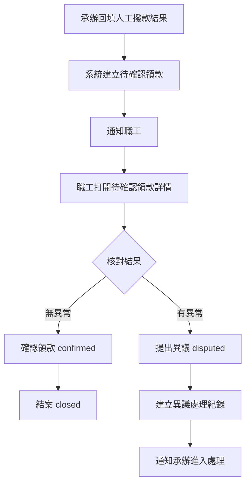
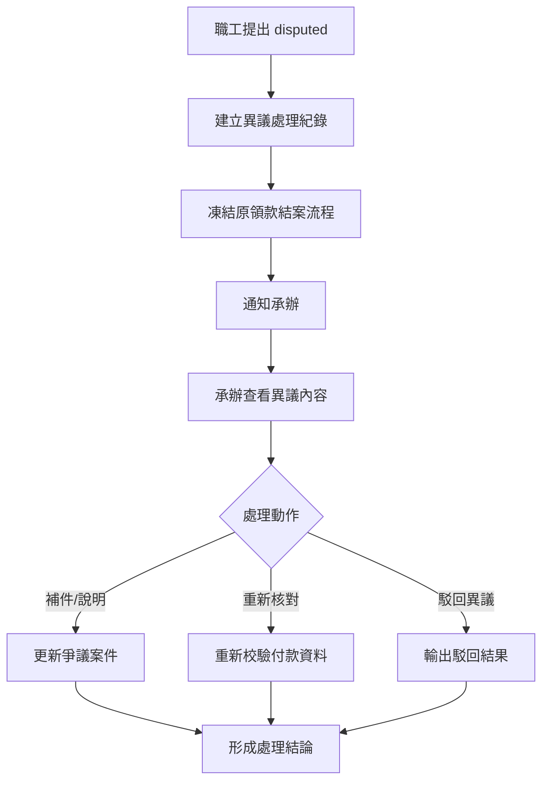
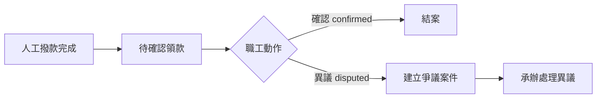
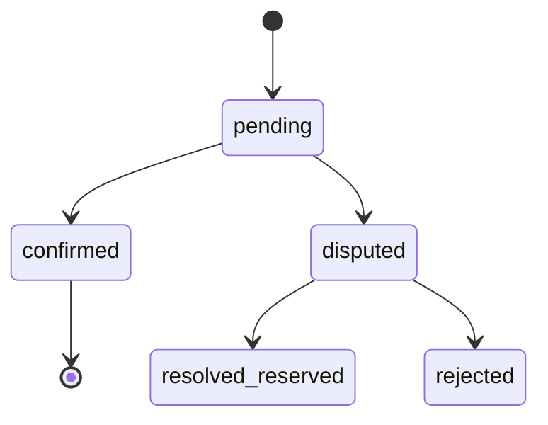
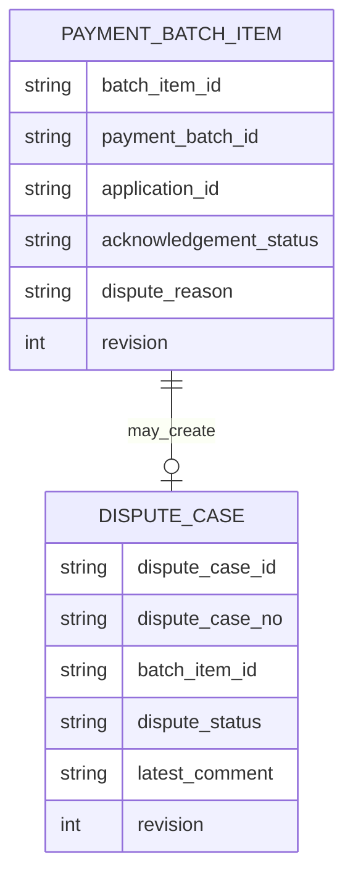

> 來源註記：本文件保留既有模塊拆分方式。凡文中未被客戶原始 PRD 明文定義的欄位、狀態碼、流程抽象或工程命名，均視為內部設計建議，不作為客戶權威需求表述。
>
> 對齊口徑：本文件已按主 PRD `v1.1` 與 `sql/tra_welfare_platform.sql` `v3.0-full` 收斂；當前系統將領款確認、收執、滿意度與異議案件分層保存，不直接覆蓋原確認紀錄。

# M18《PAY－領款確認與異議處理》子 PRD

## 1. 模塊名稱

PAY－領款確認與異議處理

## 2. 模塊類型

業務支撐模塊

## 3. 模塊定位

本模塊是整個福利平台「發款主鏈」的收口層，負責承接 M17 撥款回填後的職工確認動作，並在職工對結果有疑義時，把簡單的領款確認分流為正式的爭議處理流程。
如果 M17 解決的是「承辦如何建立批次、送審與回填撥款結果」，那 M18 解決的就是：

- 職工如何看到待確認領款清單
- 職工如何對單筆領款執行「確認」
- 職工若發現金額不符或資料異常，如何提出「異議」
- 異議提出後，原本的結案流程如何被凍結
- 承辦如何查看、補件、說明、重新核對或駁回異議
- 哪些狀態可以結案、哪些狀態不能直接結案

總體 PRD 已把「發款批次與領款確認」列為平台主線之一，且前台資訊架構中單獨存在 `Pending Acknowledgement／待確認領款` 入口，這表示 M18 不是發款模塊的一個小按鈕，而是前台與後台共同完成責任閉環的正式模塊。

## 4. 設計目標

1. 建立職工可理解、可操作的領款確認流程，讓撥款結果不只停留在後台回填，而是由職工完成最終確認。這直接對應總體 PRD 的端到端主流程。
2. 建立正式的異議分流機制，當職工對金額或資料有疑義時，必須進入可追蹤的異議處理流程，而不是在原付款狀態上直接覆寫。若系統採獨立爭議案件或子流程實作，皆屬內部設計選擇。
3. 明確「確認」與「異議」兩條結果分支的責任界線，避免承辦、主管、職工對狀態語義理解不一致。這符合總體 PRD 的產品目標：「讓發款、領款確認與異議處理有清晰的責任界線。」
4. 與 M17 撥款回填、M09 通知中心、WF 與 SEC 稽核形成閉環，讓每一次確認、每一次異議與每一筆處理都有歷程可查。總體 PRD 對透明度與高風險追蹤有明確要求。

## 5. 業務場景

### 場景 A：職工確認已撥款領款

承辦在 M17 回填人工撥款結果後，系統通知職工前往前台 `待確認領款`。職工打開領款詳情，核對資訊無誤後，點擊「確認領款」，該筆領款進入 confirmed，流程結案。這是總體 PRD 端到端流程中的直接主線。

### 場景 B：職工對金額不符提出異議

職工在前台看到待確認領款通知後，若發現金額不符或資料異常，可點擊「提出異議」。系統需建立可追蹤的異議處理紀錄，凍結原本結案流程，通知承辦進入處理。這是總體 PRD 場景三的直接描述。

### 場景 C：承辦處理異議案件

承辦收到異議通知後，在後台查看異議原因、原付款資料、批次資訊與附件，並可補件、說明、重新核對或駁回異議。這同樣直接來自總體 PRD 的場景三。

### 場景 D：異議中的領款不可直接結案

一旦職工已提出異議，該領款就不能再走一般 confirmed → closed 的快速結案路徑，也不能直接把原狀態改回已確認。這是總體 PRD 的直接邊界。

### 場景 E：前台待確認領款列表作為職工主入口

前台資訊架構明確存在 `待確認領款 Pending Acknowledgement`，說明職工應該能集中查看所有待確認項目，而不是只靠單條通知跳轉。

## 6. 業務流程解讀

### 6.1 領款確認在主鏈中的位置

總體 PRD 的端到端流程非常清楚：
補助核准 → 進待發款池 → 建立發款批次 → 批次審核 → 人工撥款 → 職工領款確認 → confirmed 結案 / disputed 進入爭議處理。
因此 M18 是整個發款主鏈的最後一段，也是責任真正閉合的地方。

### 6.2 前台領款確認主流程

這個流程直接對應總體 PRD 的端到端流程與場景三。

### 6.3 異議處理主流程

職工提出異議後，流程不應回到原本的「待確認」直接覆寫，而要轉入可追蹤的異議處理流。建議流程如下：

總體 PRD 已明確：異議提出後不可直接結案，需凍結原本結案流程，承辦可補件、說明、重新核對或駁回異議；若要拆成獨立主表，屬實作層細化。

### 6.4 confirmed / disputed 的狀態語義

總體字段表已明確 `acknowledgement_status` 例如可為 `pending、confirmed、disputed`。
因此本模塊建議：

- `pending`：待職工確認
- `confirmed`：職工已確認，領款主鏈完成，可結案
- `disputed`：職工已提出異議，需進入爭議處理，不可直接結案

### 6.5 凍結原本結案流程的含義

「凍結」不是把原資料刪掉，而是表示：

- 原付款結果仍保留歷史
- 原領款確認不再可直接完成結案
- 後續必須以異議處理結論作為結果依據
- 不允許把原本 `acknowledgement_status` 直接從 disputed 改回 confirmed
  這一點正是總體 PRD 強調的關鍵邊界。

### 6.6 前後台分工解讀

- **前台**：職工看待確認領款、確認或提出異議
- **後台**：承辦查異議案件、補件、說明、重核、駁回異議
  這種分工與總體 PRD 的角色表和前後台資訊架構完全一致。

## 7. 核心功能拆解

### 7.1 待確認領款列表

提供職工在前台集中查看所有待確認項目。
建議子能力包括：

- 列表查詢
- 狀態篩選
- 依批次/單號查詢
- 顯示金額、時間與來源案件摘要
- 顯示 pending / disputed / confirmed 狀態

### 7.2 領款確認詳情

提供職工查看單筆待確認領款的完整資訊。
建議展示：

- 來源申請單號
- 批次單號
- 金額摘要
- 撥款時間
- 補助類型
- 附件/傳票摘要（若需展示受限信息）
- 狀態與操作區

### 7.3 確認領款

提供職工執行 `confirmed` 動作。
建議子能力包括：

- 二次確認
- 記錄確認時間
- 記錄確認人
- 更新 `acknowledgement_status = confirmed`
- 觸發結案或後續關閉事件

### 7.4 提出異議

提供職工執行 `disputed` 動作。
總體 PRD 已明確 `dispute_reason` 是發款核心字段之一。
建議子能力包括：

- 填寫異議原因
- 可補充附件/說明（如制度允許）
- 建立異議處理紀錄（如系統採獨立主表亦可）
- 更新 `acknowledgement_status = disputed`
- 凍結原結案流程
- 建立通知給承辦

### 7.5 異議處理後台處理

提供承辦查看與處理異議紀錄或異議主表。
建議子能力包括：

- 異議處理列表
- 異議詳情
- 查看原案件/批次/付款資料
- 補件
- 說明
- 重新核對
- 駁回異議
- 輸出處理結論

### 7.6 異議狀態治理

若系統採獨立異議主表，建議其處理狀態至少有：

- open
- processing
- waiting_material_reserved
- resolved
- rejected
- closed_reserved

這些狀態是子 PRD 工程化補充，用來保證異議處理不只是單一欄位，而是可被後台追蹤的正式對象。

### 7.7 原領款與爭議案件的雙向關聯

建議支持：

- 從待確認領款跳到異議處理紀錄
- 從異議處理紀錄反查原 payment batch / batch_item / application
- 顯示目前凍結狀態與處理進度

### 7.8 通知與歷程輸出

建議輸出：

- `ack_pending_created`
- `ack_confirmed`
- `ack_disputed`
- `dispute_case_created`
- `dispute_case_updated`
- `dispute_case_rejected`
- `dispute_case_resolved`

## 8. 與其他模塊的聯動關係

### 8.1 與 M17《發款批次、送審與撥款回填》的聯動

M17 回填人工撥款後，M18 才有 `pending acknowledgement` 的來源資料。
因此 M17 是 M18 的上游觸發器，M18 是 M17 的後續責任閉環。

### 8.2 與 BEN 的聯動

異議案件處理時，承辦往往需要回看原補助案件內容、附件與審批歷程，因此 M18 必須能關聯 `application_id / application_no` 與 BEN 案件詳情。

### 8.3 與 WF 的聯動

總體 PRD沒有直接規定異議案件一定走 WF，但既然異議需建立獨立案件，且平台強調審批與責任切分，子 PRD 建議預留兩種模式：

- MVP：承辦後台處理為主，不額外走完整 WF
- 後續：如異議流程需升級為正式送審，再接 WF
  本份先按 MVP 可落地性優先設計。

### 8.4 與 M09《通知中心》的聯動

待確認領款建立後通知職工；職工提出異議後通知承辦；異議結果處理後可再通知職工。總體 PRD 的通知扇出能力支持這種事件驅動模型。

### 8.5 與 EMP / AUTH 的聯動

前台待確認領款只應展示給對應職工本人；這依賴 AUTH 會話與 EMP 身份主檔。

### 8.6 與 M08《檔案資源中心》的聯動

若異議允許補充說明附件或承辦補件，附件仍應走 `file_resource`，不可在異議案件上自建檔案邏輯。總體 PRD 已明確全站檔案統一走 `file_resource`。

### 8.7 與 SEC 的聯動

提出異議、駁回異議、下載敏感附件、手動結案、強制關閉爭議案件等，都屬需要追蹤的重要操作；總體 PRD 對高風險追蹤有明確要求。

## 9. 頁面規劃

本模塊作為業務支撐模塊，建議分前台與後台兩組頁面。

### 9.1 前台頁面一：待確認領款列表頁

**定位**：職工查看所有待確認領款的主入口。

**頁面區塊**

1. 待確認統計卡
2. 查詢與篩選區
3. 領款列表區

**查詢條件建議**

- application_no
- batch_no
- acknowledgment_status
- 撥款時間區間

**列表欄位建議**

- application_no
- batch_no
- 補助類型
- 金額
- disbursed_at
- acknowledgement_status
- 操作入口（查看/確認/提出異議）

### 9.2 前台頁面二：領款確認詳情頁

**定位**：職工確認或提出異議的主頁。

**頁面區塊**

1. 領款摘要卡
2. 原申請資料摘要
3. 金額與撥款資訊區
4. 狀態說明區
5. 操作區（確認 / 提出異議）

**交互建議**

- 前台文案避免技術術語
- 確認需二次提示
- 提出異議需填原因
- disputed 後不再顯示一般確認按鈕

### 9.3 前台頁面三：提出異議頁 / 彈窗

**定位**：收集職工異議內容。

**頁面區塊**

1. 問題描述區
2. 原付款摘要區
3. 補充附件區（如開放）
4. 提交確認區

### 9.4 後台頁面一：異議案件列表頁

**定位**：承辦查看所有異議處理紀錄。

**頁面區塊**

1. 異議統計卡
2. 搜尋與篩選區
3. 異議案件列表
4. 批量匯出區

**列表欄位建議**

- dispute_case_no
- application_no
- batch_no
- employee_name
- acknowledgement_status
- dispute_status
- created_at
- latest_action_at

### 9.5 後台頁面二：異議案件詳情頁

**定位**：承辦處理爭議的主頁。

**頁面區塊**

1. 爭議摘要卡
2. 原付款資料區
3. 原補助案件摘要區
4. 異議原因區
5. 補件與說明區
6. 處理結果區
7. 歷程與通知摘要區

## 10. 底層能力說明

### 10.1 能力邊界

本模塊負責：

- 待確認領款生成後的前台承接
- confirmed / disputed 執行
- 異議處理紀錄建立
- 爭議案件後台處理
- 原結案流程凍結控制
- 狀態與事件輸出

本模塊不負責：

- 發款批次建立
- 人工撥款回填本體
- 銀行 API 對接
- 補助申請建立
- 流程模板定義
- 通知實際發送

### 10.2 建議能力接口

- `listPendingAcknowledgements(employeeId, filters)`
- `getAcknowledgementDetail(batchItemId, employeeId)`
- `confirmAcknowledgement(batchItemId, revision)`
- `createDisputeCase(batchItemId, revision, disputeReason, attachments?)`
- `listDisputeCases(filters)`
- `getDisputeCaseDetail(disputeCaseId)`
- `updateDisputeCase(disputeCaseId, action, payload)`

### 10.3 能力實現原則

- 前台只操作自己的待確認領款
- 提出 disputed 後立即凍結原結案鏈
- 異議處理紀錄與原 batch item 顯式關聯
- 已異議領款不可直接結案
- 所有關鍵狀態變更可追溯

## 11. 角色權限與操作路徑

### 11.1 可操作角色

- 一般職工：查看待確認領款、確認領款、提出異議
- 福利社承辦人：查看與處理異議案件
- 審核主管：通常查看高級別異議結果或特殊升級處理
- 系統管理員：治理異常案件
- 資安稽核人員：查看高風險爭議處理操作

總體 PRD 的角色表已明確一般職工主要操作含「確認領款」，福利社承辦人負責營運處理，主管負責核准／退回／駁回。

### 11.2 操作路徑

前台 Portal → 待確認領款 → 領款詳情 → 確認 / 提出異議
管理後台 → 發款管理 → 異議案件列表 → 異議案件詳情

### 11.3 權限建議

- 查看自己的待確認領款
- 確認自己的領款
- 提出自己的異議
- 查看異議案件
- 補件/說明異議案件
- 駁回異議
- 匯出異議案件清單

其中「駁回異議」「匯出異議案件」建議視為高風險權限。

## 12. 關鍵字段/配置項說明

### 12.1 來自總體 PRD 的核心字段

總體 PRD 已明確發款字段包含 `payment_batch_id`、`batch_no`、`voucher_file_id`、`acknowledgement_status`、`dispute_reason`。

### 12.2 建議的 acknowledgement / batch item 字段

| 字段名                 | 中文名稱     | 用途                       |
| ---------------------- | ------------ | -------------------------- |
| batch_item_id          | 批次明細 ID  | 對應單筆付款項目           |
| payment_batch_id       | 發款批次 ID  | 關聯批次                   |
| application_id         | 申請 ID      | 關聯補助案件               |
| acknowledgement_status | 領款確認狀態 | pending/confirmed/disputed |
| acknowledged_at        | 確認時間     | 職工確認時間               |
| disputed_at            | 異議提出時間 | 職工提出異議時間           |
| dispute_reason         | 異議原因     | 來自職工輸入               |
| revision               | 樂觀鎖版本號 | 併發控制                   |

### 12.3 建議的 dispute_case 字段

| 字段名           | 中文名稱        | 用途                              |
| ---------------- | --------------- | --------------------------------- |
| dispute_case_id  | 爭議案件 ID     | 主鍵                              |
| dispute_case_no  | 爭議單號        | 對外識別                          |
| batch_item_id    | 批次明細 ID     | 關聯原領款                        |
| application_id   | 申請 ID         | 關聯補助案件                      |
| payment_batch_id | 發款批次 ID     | 關聯批次                          |
| employee_id      | 提出異議職工 ID | 關聯 EMP                          |
| dispute_reason   | 異議原因        | 主訴內容                          |
| dispute_status   | 異議狀態        | open/processing/resolved/rejected |
| latest_comment   | 最近說明        | 承辦處理摘要                      |
| resolved_at      | 解決時間        | 可空                              |
| revision         | 樂觀鎖版本號    | 併發控制                          |

### 12.4 建議配置項

- `pay.ack.confirmation_enabled`
- `pay.ack.dispute_enabled`
- `pay.ack.dispute_reason_required`
- `pay.dispute.allow_attachment`
- `pay.dispute.case_no.rule`
- `pay.dispute.export_enabled`

## 13. 異常情況與邊界條件

### 13.1 已提出異議的領款直接結案

不允許。這是總體 PRD 的直接邊界。

### 13.2 將 disputed 直接改回 confirmed

不允許。總體 PRD 已明確異議需建立獨立案件，不可直接把原狀態改回已確認。

### 13.3 職工確認非本人領款

不允許。前台列表與詳情只能展示當前登入職工自己的領款項目。

### 13.4 重複提出異議

同一 batch item 在既有異議處理未結束前，不應允許再次建立新的 open 爭議紀錄。

### 13.5 職工在 disputed 後仍可點確認

不允許。狀態一旦轉為 disputed，前台應切換為只讀或僅顯示爭議進度。

### 13.6 承辦未處理異議卻手工關閉

需受高權限控制並進稽核，不應成為一般操作。

### 13.7 revision 衝突

職工確認或提出異議時，若 batch item 狀態已被更新，需提示版本衝突，防止重複操作。

## 14. Mermaid 圖

### 14.1 領款確認主流程圖

### 14.2 acknowledgement 狀態圖

### 14.3 原領款與爭議案件關係圖

## 15. 研發落地建議

### 15.1 架構分層建議

- M17 管批次與回填
- M18 管確認與異議
- M09 管通知
- M08 管異議附件
- SEC 管稽核與異常追蹤
  這樣最符合總體 PRD 對責任界線清晰的要求。

### 15.2 狀態治理建議

- `acknowledgement_status` 與 `dispute_status` 分層管理
- disputed 不回寫成 confirmed
- 原付款項與異議處理紀錄顯式雙向關聯
- 已結案與爭議中狀態嚴格互斥

### 15.3 頁面與交互建議

- 前台文案以「確認領款」「提出異議」這種易懂語言呈現
- 前台不暴露 `batch_item_id / revision` 等技術術語
- disputed 後顯示「已提交異議，等待承辦處理」而不是技術狀態碼
- 後台異議詳情與原批次詳情採共用摘要組件

### 15.4 治理與安全建議

- 異議建立、駁回、關閉、匯出、附件下載都進稽核
- 重要處理結果需保留 before / after 摘要
- 對長時間未處理異議可後續加營運提醒
- 異議案件與原領款項的狀態對帳應可定期掃描

## 16. 測試驗收要點

### 16.1 功能驗收

1. 職工可在前台看到待確認領款清單。
2. 職工可對單筆待確認領款執行確認。
3. 職工可提出異議並填寫原因。
4. 提出異議後可建立異議處理紀錄並通知承辦。
5. 承辦可在後台查看與處理異議案件。
   以上 2～5 點都直接對應總體 PRD 的 PAY 功能清單與場景三。

### 16.2 邊界驗收

1. 已提出異議的領款不可直接結案。
2. disputed 不可直接改回 confirmed。
3. 異議處理未結束前，不可重複建立新的 open 異議紀錄。
4. 職工不能確認或異議非本人領款。
   其中 1、2 直接對應總體 PRD 邊界。

### 16.3 聯動驗收

1. M17 回填後，M18 可生成待確認領款資料。
2. 職工 confirmed 後，主鏈可進結案。
3. 職工 disputed 後，原結案流程被凍結。
4. M09 可建立待確認與異議通知。
   以上 2、3 直接對應總體 PRD 端到端流程與場景三。

### 16.4 治理與安全驗收

1. 確認、異議、駁回異議、匯出與附件下載都可被稽核追蹤。
2. revision 可阻止重複確認或重複異議的併發覆蓋。
3. 爭議案件可完整追查到原申請、原批次與原付款項。
4. 前台文案不暴露技術術語，符合總體 PRD 產品語言原則。
