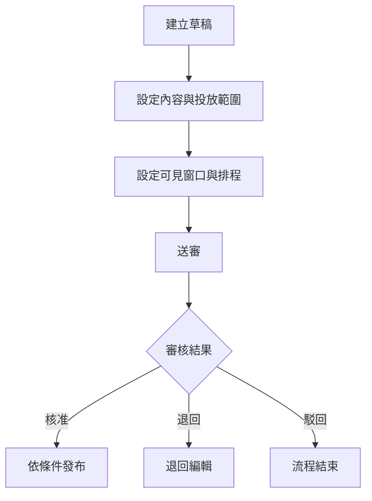
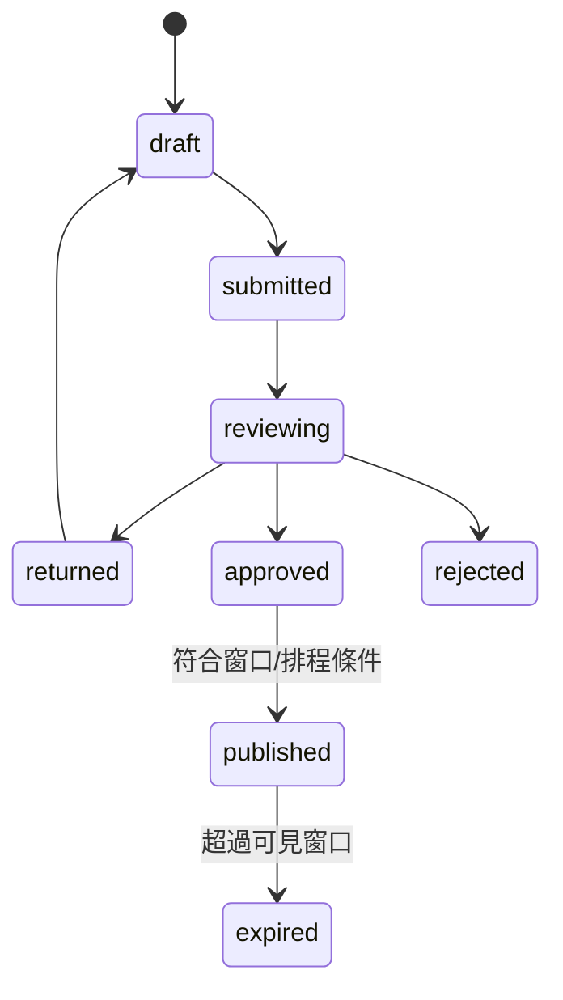
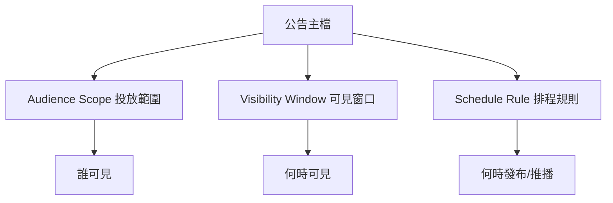
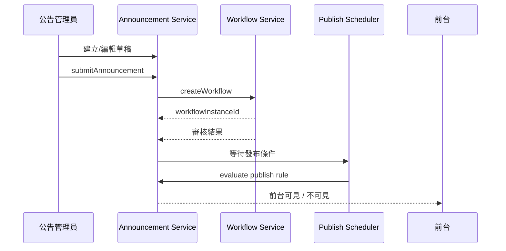

> 來源註記：本文件保留既有模塊拆分方式。凡文中未被客戶原始 PRD 明文定義的欄位、狀態碼、流程抽象或工程命名，均視為內部設計建議，不作為客戶權威需求表述。
>
> 對齊口徑：本文件已按主 PRD `v1.1` 與 `sql/tra_welfare_platform.sql` `v3.0-full` 收斂；公告投放範圍、排程與地理圍欄均以當前系統子表模型承接，舊欄位命名僅保留作術語對照。

# M19《ANN－公告草稿、審批與發布》子 PRD

## 1. 模塊名稱

ANN－公告草稿、審批與發布

## 2. 模塊類型

後台頁面模塊

## 3. 模塊定位

本模塊是福利平台中「公告、規章、通知性內容」的內容生產與發布中樞，負責將公告從草稿編輯、投放配置、可見窗口與排程設定，一路推進到送審、核准、發布與前台展示。平台產品目標已明確要求「讓特約商店、公告與福利規章能有一致的審批與發布機制」，而 ANN 正是這條內容治理主線的承載模塊。

如果 M13/M14 解決的是補助案件的前後台流轉，M17/M18 解決的是發款與領款確認，那 M19 解決的是：

- 公告內容如何以草稿形態建立與迭代
- 公告該給誰看，也就是投放對象
- 公告什麼時間可見，也就是可見窗口
- 公告什麼時間發布或推播，也就是發布/推播排程
- 退回後如何回到可編輯狀態
- 核准後如何依條件正式發布到前台首頁與公告列表

## 4. 設計目標

1. 建立標準化公告草稿與送審流程，讓公告內容不再靠臨時貼文或人工轉發，而是走正式審批與發布機制。
2. 明確拆分「可見窗口」與「排程規則」兩類時間語義，避免產品、工程、營運混用。總體 PRD 已直接規定兩者不可混用。
3. 以前台展示安全與一致性為底線，要求富文本受白名單限制，避免 XSS 與非受控內容格式。
4. 讓公告管理員、審核主管、前台職工三方都能基於同一套狀態與流程理解公告生命週期。
5. 為後續 M20《ANN－瀏覽追蹤與前台公告中心》提供穩定的發布主檔與展示輸出。

## 5. 業務場景

### 場景 A：公告管理員建立福利公告草稿

公告管理員在後台建立公告內容，編寫標題與富文本正文，設定投放範圍、可見窗口與排程規則，保存為草稿後送審。這是總體 PRD 場景四與公告發布流程圖的直接描述。

### 場景 B：主管退回公告草稿修改

主管審核公告後若認為內容、投放範圍或窗口設定有誤，可選擇退回；公告需回到可編輯狀態，由公告管理員修改後再送審。總體 PRD 的公告流程圖已明確存在「退回編輯」分支。

### 場景 C：公告核准後依條件發布

主管核准後，公告不一定立即顯示；系統需依可見窗口與排程條件決定何時真正出現在前台首頁與公告列表。總體 PRD 明確指出：時間窗口決定前台能否看見，排程規則決定何時發布或推播。

### 場景 D：未到窗口的公告不可前台展示

即使排程任務已執行、公告已核准，只要還沒到 `publish_start_at`，就不得在前台顯示。這是總體 PRD 的直接邊界。

### 場景 E：公告內容需防止富文本風險

公告支援富文本，但必須受白名單限制，避免腳本、惡意 HTML 或不受控樣式進入前台。這是總體 PRD 的直接安全要求。

## 6. 業務流程解讀

### 6.1 公告發布主流程

總體 PRD 已直接給出公告發布流程圖，主線非常清晰：建立草稿 → 設定內容與投放範圍 → 設定可見窗口與排程 → 送審 → 核准/退回/駁回。

### 6.2 可見窗口與排程規則的分工

這是 ANN 最關鍵的產品邊界。
總體 PRD明確指出：

- `publish_start_at / publish_end_at` 代表前台能否看見
- `publish_mode / schedule_rule` 代表何時發布或推播
- 兩者不可混用
- 排程執行結果不可覆蓋可見窗口語義

因此子 PRD 建議採以下原則：

- **可見窗口**：控制展示權
- **排程規則**：控制任務觸發或發布/推播時點
- **前台展示條件**：必須同時滿足「已核准/已發布」與「當前時間位於可見窗口內」

### 6.3 草稿到發布的狀態流轉

建議 ANN 主狀態至少包含：

- draft
- submitted
- reviewing
- returned
- approved
- published
- rejected
- expired / offline_reserved

其中：

- `approved` 表示審核通過，但未必已前台可見
- `published` 表示已達到對外發布條件
- `expired` 表示超過 `publish_end_at` 或被手動下架

### 6.4 富文本白名單流程

公告內容是富文本，但不表示可以存任意 HTML。
建議流程：

1. 編輯器輸出受限格式
2. 後端保存前再做白名單清洗
3. 發布前再做一次安全過濾
4. 前台渲染只使用安全子集

這與總體 PRD 對富文本白名單與 XSS 防護的要求一致。

### 6.5 退回編輯的業務含義

退回不是刪草稿，而是：

- 保留原公告主檔
- 保留退回原因與退回歷程
- 允許公告管理員在 returned 狀態下繼續編輯
- 再次送審後進入新一輪流程

這與總體 PRD 對流程退回的通用規則以及公告流程圖中的「退回編輯」一致。

## 7. 核心功能拆解

### 7.1 公告草稿建立

提供公告管理員建立新公告草稿。
建議子能力包括：

- 建立 `announcement_id`
- 填寫 `title`
- 編輯 `content`
- 保存草稿
- 記錄建立人與最近更新時間

總體 PRD 已明確 ANN 包含 Announcement Draft，且公告核心字段包含 `announcement_id`、`title`、`content`。

### 7.2 投放範圍設定

用於定義哪些人能看到公告。
當前實作以投放範圍子表、地理圍欄子表與範圍摘要共同表達，不把 `audience_scope` 當成唯一主表字段；客戶原始需求的重點是「投放對象必須可配置」。
建議子能力包括：

- 選擇投放對象與範圍條件
- 顯示適用角色/組織摘要
- 支援預設投放範圍模板
- 送審前校驗是否已配置

### 7.3 可見窗口設定

用於設定前台可見時間。
核心字段：

- `publish_start_at`
- `publish_end_at`

建議子能力包括：

- 設定開始/結束時間
- 校驗開始小於結束
- 顯示當前是否在窗口內
- 與前台可見判斷直接掛鉤

### 7.4 排程規則設定

用於控制發布或推播時點，而不是替代可見窗口。
當前實作以 `publish_mode` 搭配排程規則表達，不要求把 `schedule_type` 作為唯一公告主檔字段。
建議子能力包括：

- 單次/每日/每週類型
- 排程摘要顯示
- 排程任務與發布任務綁定
- 排程結果與公告主狀態回寫

### 7.5 公告送審

公告草稿完成後，可送審給主管。
建議子能力包括：

- `submitAnnouncement(announcementId, revision)`
- 建立流程實例與公告橋接關聯
- 進入待辦中心
- 支援退回/駁回/核准

總體 PRD 已明確 ANN 與 WF 有直接依賴，且公告發布流程含送審節點。

### 7.6 依條件發布

核准後，公告要依條件發布，而不是一律立刻上線。
建議子能力包括：

- 判斷是否立即發布
- 判斷是否等待排程
- 判斷是否尚未到可見窗口
- 發布後回寫 published 狀態
- 發布事件輸出給通知/前台展示層

### 7.7 退回編輯與重送

建議子能力包括：

- 顯示退回原因
- returned 狀態下可編輯
- 再次送審
- 保留版本與歷程

### 7.8 置頂與排序控制

總體字段表已明確 `is_pinned` 是公告核心字段，用於控制前台排序優先度。
建議子能力包括：

- 設置/取消置頂
- 置頂權重與時間輔助排序
- 置頂不覆蓋可見窗口規則

## 8. 與其他模塊的聯動關係

### 8.1 與 WF 的聯動

ANN 的送審、退回、駁回、核准都依賴 WF。
總體 PRD 模組關係圖已明確 ANN → WF。

### 8.2 與 M09《通知中心》的聯動

公告核准、排程生效或特定公告發布時，可由 M09 建立站內通知或可選 Email 任務。總體 PRD 的通知扇出模型與公告場景都支持這種事件式設計。

### 8.3 與 M07《字典與系統參數》的聯動

公告狀態、投放範圍類型、排程類型、置頂規則可由字典管理；公告排程任務本身則屬系統排程配置的一部分。總體 PRD 已明確字典支持投放範圍，且排程任務最低集合包含公告排程。

### 8.4 與 ORG / 權限的聯動

後台公告列表與詳情應受資料範圍控制；前台公告可見人群則由投放對象規則控制。兩者不是一回事：

- 後台可編輯/可查看：走 ORG/M04 權限
- 前台誰能看到：走 ANN 自己的投放對象規則

### 8.5 與 AUTH / EMP 的聯動

前台顯示公告時，需要依登入職工身分、角色與可能的投放條件判斷可見性；是否細分更多受眾，應回到客戶原始投放需求，不宜自行擴張角色集合。

### 8.6 與 SEC 的聯動

公告發布、下架、富文本內容更新、排程修改、置頂變更等都是應納入稽核的重要操作；富文本又有 XSS 風險，因此 ANN 與 SEC 之間天然需要審計與安全聯動。

## 9. 頁面規劃

本模塊作為後台頁面模塊，建議至少包含 4 個核心頁面。

### 9.1 頁面一：公告列表頁

**定位**：管理所有公告主檔。

**頁面區塊**

1. 狀態統計卡
2. 搜尋與篩選區
3. 公告列表區
4. 批量操作區

**查詢條件建議**

- 標題
- 狀態
- scope_summary
- is_pinned
- 建立時間區間
- 發布窗口區間
- publish_mode

**列表欄位建議**

- title
- scope_summary
- publish_start_at
- publish_end_at
- publish_mode
- is_pinned
- status
- updated_at
- updated_by

### 9.2 頁面二：公告草稿編輯頁

**定位**：建立與編輯草稿。

**頁面區塊**

1. 標題區
2. 富文本內容區
3. 投放範圍區
4. 可見窗口區
5. 排程規則區
6. 置頂設定區
7. 草稿保存 / 送審區

**交互建議**

- 富文本編輯器限制白名單格式
- audience/window/schedule 三塊視覺分區明確
- 送審前顯示配置摘要
- returned 狀態下可直接進入此頁修改

### 9.3 頁面三：公告詳情 / 審核頁

**定位**：主管審核公告或管理員查看已發布公告。

**頁面區塊**

1. 公告摘要卡
2. 內容預覽區
3. 投放與窗口摘要區
4. 排程摘要區
5. 流程歷程區
6. 審核動作區（核准/退回/駁回）

### 9.4 頁面四：排程與發布監看頁

**定位**：查看公告是否已發布、是否等待排程、是否受窗口限制。

**頁面區塊**

1. 發布狀態統計
2. 待生效公告列表
3. 已發布公告列表
4. 異常公告列表（窗口/排程配置異常）

## 10. 底層能力說明

### 10.1 能力邊界

本模塊負責：

- 公告主檔
- 草稿編輯
- audience scope 設定
- visibility window 設定
- schedule rule 設定
- 送審與發布狀態控制
- 公告內容安全過濾

本模塊不負責：

- 通知實際發送
- 流程模板配置
- 前台公告瀏覽追蹤明細統計頁
- 富文本編輯器底層第三方套件治理
- 權限體系本身的定義

### 10.2 建議能力接口

- `createAnnouncementDraft(payload)`
- `updateAnnouncementDraft(announcementId, revision, payload)`
- `submitAnnouncement(announcementId, revision)`
- `approveAnnouncement(announcementId, revision, comment)`
- `returnAnnouncement(announcementId, revision, reason)`
- `rejectAnnouncement(announcementId, revision, reason)`
- `evaluateAnnouncementVisibility(announcementId, atTime)`
- `publishAnnouncementIfEligible(announcementId)`

### 10.3 能力實現原則

- 富文本保存前做白名單清洗
- audience/window/schedule 分開存儲與判定
- 公告狀態與發布可見性分層處理
- 所有高風險主表加 `revision`
- 前台不直接讀草稿或未發布內容

## 11. 角色權限與操作路徑

### 11.1 可操作角色

- 公告管理員：建立草稿、設定投放範圍、設定排程、送審
- 審核主管：核准、退回、駁回
- 系統管理員：查看與治理異常公告
- 一般職工：前台瀏覽適用公告（非本模塊直接配置者）

總體 PRD 的角色表已直接列出公告管理員的主要操作。

### 11.2 操作路徑

管理後台 → 公告管理 → 公告列表
管理後台 → 公告管理 → 建立公告草稿
管理後台 → 公告管理 → 公告詳情 / 審核
管理後台 → 公告管理 → 排程與發布監看

### 11.3 權限建議

- 查看公告列表
- 建立公告
- 編輯草稿
- 設定投放範圍
- 設定窗口與排程
- 送審公告
- 核准公告
- 退回公告
- 駁回公告
- 設定置頂
- 匯出公告清單

其中「核准公告」「駁回公告」「修改已發布公告」「置頂變更」建議視為高風險操作。

## 12. 關鍵字段/配置項說明

### 12.1 來自總體 PRD 的核心字段

總體 PRD 與當前系統實作共同收斂出的公告核心字段包括 `announcement_id`、`title`、`content`、`publish_start_at`、`publish_end_at`、`publish_mode`、`is_pinned`、`announcement_status`、`returned_reason`、`revision`；投放範圍與地理圍欄由子表維護，流程實例則透過橋接關聯管理。

### 12.2 建議補充公告主檔字段

| 字段名               | 中文名稱     | 用途                                                         |
| -------------------- | ------------ | ------------------------------------------------------------ |
| announcement_id      | 公告 ID      | 主鍵                                                         |
| title                | 標題         | 公告標題                                                     |
| content              | 內容         | 白名單富文本內容                                             |
| publish_start_at     | 可見開始時間 | 前台可見起始                                                 |
| publish_end_at       | 可見結束時間 | 前台可見截止                                                 |
| publish_mode         | 發布模式     | 立即發布 / 排程發布 / 條件發布                              |
| is_pinned            | 是否置頂     | 前台排序優先度                                               |
| revision             | 樂觀鎖版本號 | 併發控制                                                     |
| announcement_status  | 公告狀態     | draft/submitted/reviewing/returned/approved/published/rejected |
| returned_reason      | 退回原因     | 退回編輯依據                                                 |
| published_at         | 實際發布時間 | 發布追蹤                                                     |

### 12.3 建議配置項

- `ann.rich_text.whitelist_profile`
- `ann.publish.scheduler.cron`
- `ann.default_visibility_required`
- `ann.allow_publish_without_schedule`
- `ann.pin.max_count_reserved`
- `ann.export.enabled`

其中公告排程任務屬總體 PRD 明確列出的最低必備排程之一。

## 13. 異常情況與邊界條件

### 13.1 未到可見窗口卻前台展示

不允許。這是總體 PRD 的直接邊界。

### 13.2 排程結果覆蓋窗口語義

不允許。排程執行不能替代可見窗口，這是總體 PRD 的直接規定。

### 13.3 富文本含非法腳本或標籤

必須在保存或發布前被清洗/阻斷。總體 PRD 已明確要求富文本做白名單過濾以防 XSS。

### 13.4 已送審公告被他人更新

應提示版本衝突而不是直接覆蓋，這符合平台對流程資料 revision 的通用原則。

### 13.5 已發布公告直接刪除

不建議物理刪除；應採下架或停用狀態，保留歷史與稽核追查。

### 13.6 無 audience scope 或窗口配置直接送審

建議阻斷。因為這兩者是公告發布的核心配置項，缺失會直接造成前台可見性歧義。

### 13.7 置頂公告超量或排序衝突

建議採參數化控制或後台明示排序規則，避免前台首頁排序失控。

## 14. Mermaid 圖

### 14.1 公告生命週期圖

### 14.2 audience / window / schedule 關係圖

### 14.3 公告審批與發布時序圖

## 15. 研發落地建議

### 15.1 架構分層建議

- ANN 主檔負責內容、窗口、投放與排程配置
- WF 負責送審
- M09 負責通知
- 前台展示服務只讀已發布且窗口內的公告
- 瀏覽追蹤獨立在後續 M20 處理

### 15.2 富文本實作建議

- 前端編輯器限制可用格式
- 後端保存前再次清洗
- 前台渲染採安全白名單渲染
- 不允許 script、iframe、危險 inline event

### 15.3 狀態與可見性建議

- 公告狀態不等於前台可見性
- `approved` 不一定前台可見
- `published` 也要再受窗口控制
- 排程任務只負責狀態切換或觸發，不覆蓋窗口判斷

### 15.4 頁面與交互建議

- 草稿頁、審核頁、發布監看頁共用公告摘要頭部
- 富文本內容預覽與前台實際樣式盡量一致
- 退回原因以明確中文展示
- audience/window/schedule 用不同色塊或卡片分區，降低理解成本

## 16. 測試驗收要點

### 16.1 功能驗收

1. 公告管理員可建立草稿並設定投放範圍。
2. 可設定可見窗口與排程規則。
3. 公告可送審，主管可核准、退回、駁回。
4. 核准後可依條件發布到前台。
   以上 1～4 點都直接對應總體 PRD 的 ANN 功能清單與公告發布流程圖。

### 16.2 邊界驗收

1. 未到可見窗口的公告不得在前台展示。
2. 排程執行結果不可覆蓋可見窗口語義。
3. 富文本非法內容會被阻斷或清洗。
4. 已送審公告被更新時，revision 可阻止靜默覆蓋。
   其中 1、2、3 直接對應總體 PRD 邊界。

### 16.3 聯動驗收

1. 公告送審可建立流程實例橋接關聯。
2. 核准/退回/駁回結果可回寫公告主狀態。
3. 發布事件可被 M09 消費生成通知。
4. 前台只看到符合投放範圍配置且位於窗口內的公告。
   其中 1、4 點直接可由總體 PRD 的模組關係圖、公告流程與字段定義支撐。

### 16.4 治理與安全驗收

1. 草稿編輯、送審、核准、退回、駁回、置頂、下架都可被稽核追蹤。
2. 高風險主表 revision 可阻止併發覆蓋。
3. 已發布公告不會因配置錯誤直接消失且無歷程。
4. 公告管理能力符合 MVP 範圍與驗收重點。
