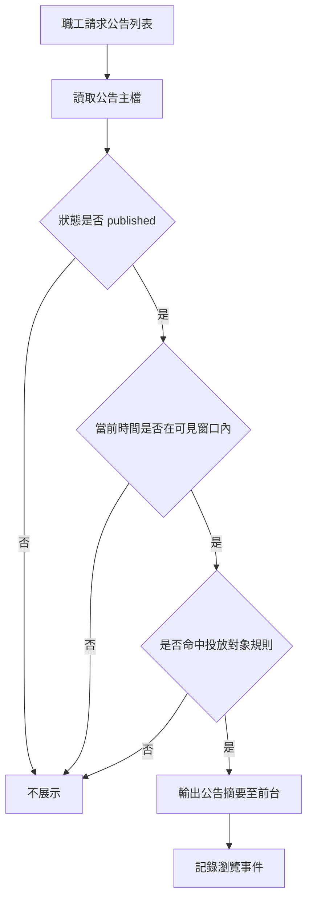
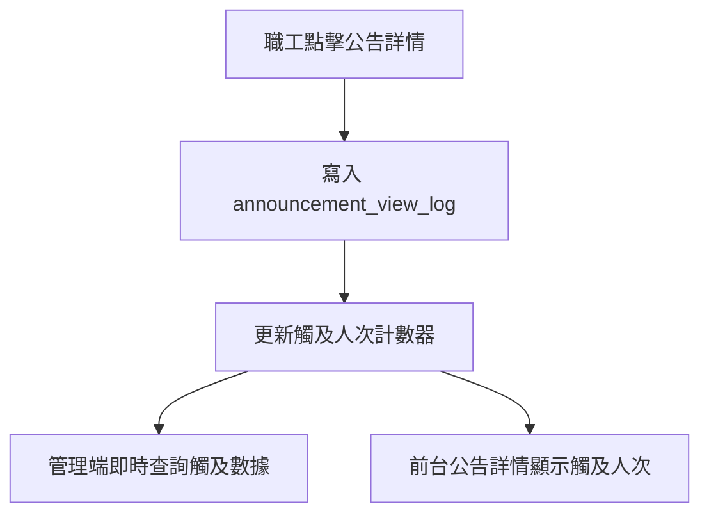
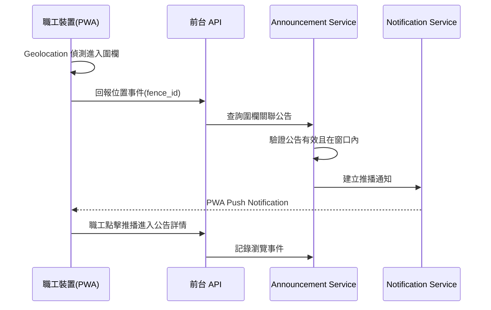
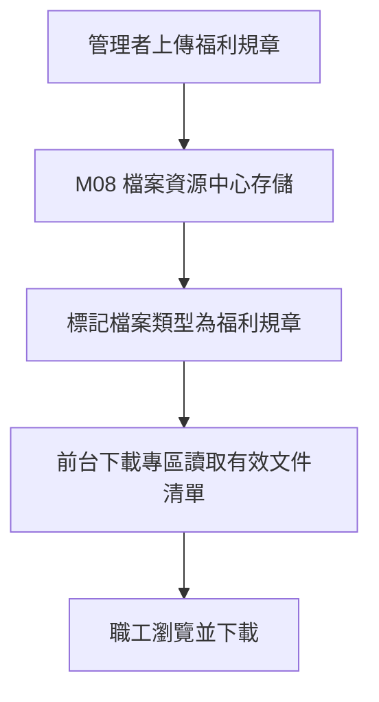
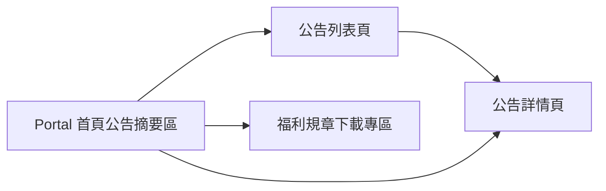
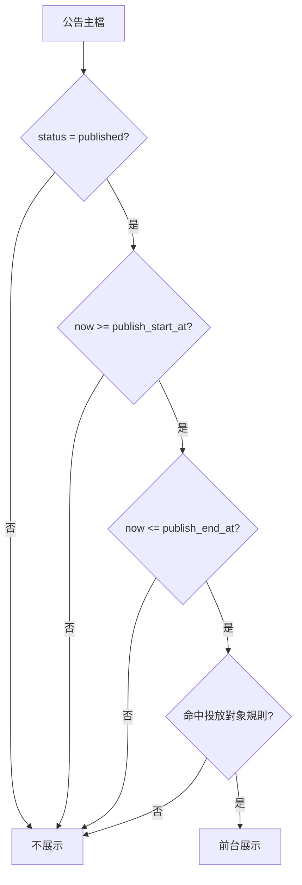
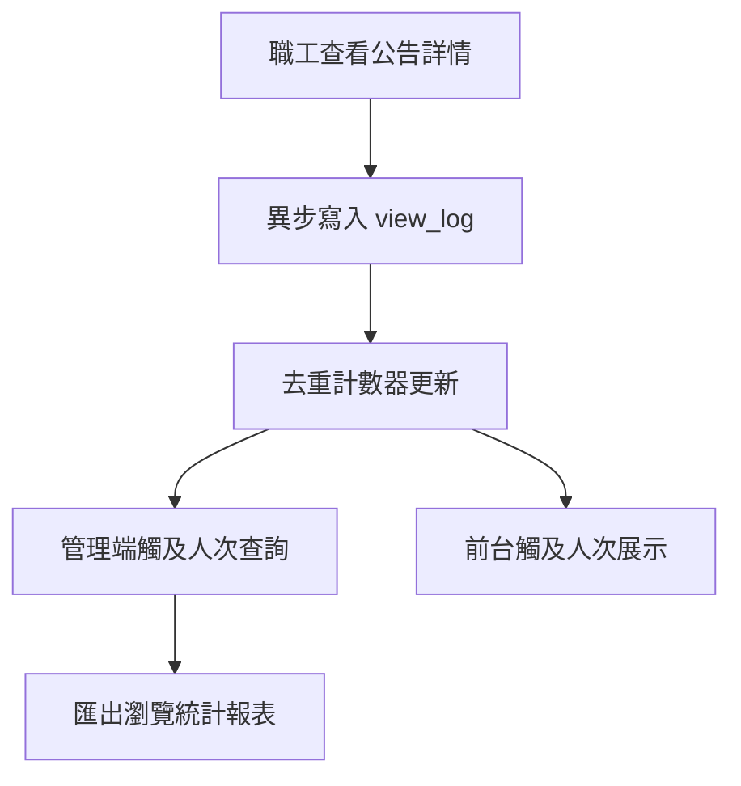
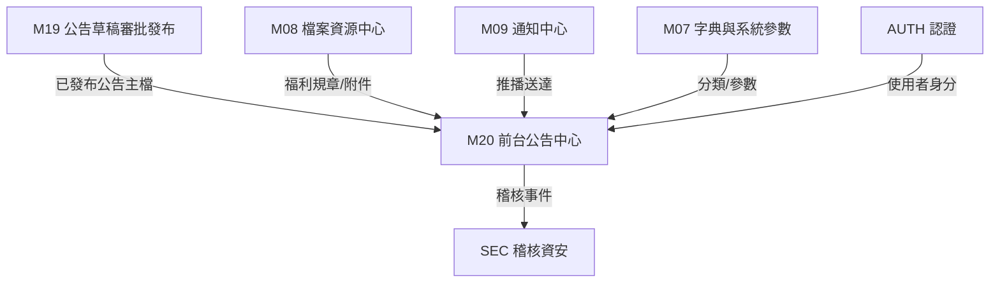

# M20《ANN－前台公告中心與瀏覽追蹤》子 PRD

> 來源註記：本文件保留既有模塊拆分方式。凡文中未被客戶原始 PRD 明文定義的欄位、狀態碼、流程抽象或工程命名，均視為內部設計建議，不作為客戶權威需求表述。
>
> 對齊口徑：本文件已按主 PRD `v1.1` 與 `sql/tra_welfare_platform.sql` `v3.0-full` 收斂；公告前台以職工為核心受眾，其他可見對象屬可配置擴展能力。

---

[toc]

---

## 1. 模塊名稱

ANN－前台公告中心與瀏覽追蹤

## 2. 模塊類型

業務支撐模塊

## 3. 模塊定位

本模塊是福利平台中公告內容的「前台消費層」與「閱讀追蹤層」，承接 M19 已完成審批並發布的公告主檔，將其轉化為職工可瀏覽、可篩選、可接收推播的前台體驗，並同步記錄瀏覽行為以供觸及率統計與營運分析。

如果 M19 解決的是「公告如何從草稿走到發布」，那 M20 解決的就是：

- 職工在前台首頁與公告列表看到什麼
- 公告如何依分類標籤篩選
- 觸及人次如何即時統計與展示
- 地理圍欄推播如何在職工進入特定範圍時觸發
- 過期公告如何自動下架不再展示
- 福利規章下載專區如何同步至員工端首頁

## 4. 設計目標

1. 建立前台公告中心的標準化展示機制，讓職工登入後能在首頁與公告區即時看到適用公告，並可依五種訊息分類標籤快速篩選。這直接對應原始需求第 6 節對前台公告列表與分類篩選的要求。
2. 實現觸及人次即時統計，讓管理端能評估訊息傳達率，為後續營運決策提供數據基礎。原始需求已明確要求觸及人次的即時顯示。
3. 支援地理圍欄推播（到點即知），讓職工進入特定區域時透過 PWA 推播收到相關公告。原始需求已明確此能力。
4. 保證可見時間窗機制在前台嚴格生效，過期公告自動下架、未到窗口的公告不得展示，與 M19 的可見窗口語義完全一致。
5. 將管理者上傳的福利規章、申請表、合約範本等文件，自動同步至員工端首頁下載專區，讓職工能直接取用。原始需求已明確此同步機制。

## 5. 業務場景

### 場景 A：職工登入後瀏覽首頁公告

職工登入前台 Portal 後，首頁公告區展示目前有效的公告摘要卡片，包含置頂公告優先展示與最新公告排序。職工可直接點入查看公告詳情。原始需求已明確職工登入後在首頁/公告區看到公告。

### 場景 B：職工依分類標籤篩選公告

職工進入公告列表頁，可透過五種訊息分類標籤（一般公告、活動通知、補助業務、特約商店、系統公告）快速篩選感興趣的公告，縮小瀏覽範圍。原始需求已明確這五種分類標籤。

### 場景 C：管理端查看觸及人次評估傳達率

公告發布後，系統即時統計觸及人次（瀏覽人數），管理端可查看觸及數據，評估某則公告的訊息傳達率是否達標，作為後續公告策略調整依據。原始需求已明確觸及人次即時顯示的需求。

### 場景 D：職工進入特定區域收到地理圍欄推播

公告管理員在 M19 配置了地理圍欄推播規則，當職工攜帶裝置進入指定地理範圍時，PWA 推播通知自動觸發，職工即時收到關聯公告。原始需求稱之為「到點即知」。

### 場景 E：過期公告自動從前台下架

公告超過 `publish_end_at` 後，系統自動將其從前台列表與首頁移除，職工不再看到過期內容。原始需求已明確公告有生效/失效時間，過期自動下架。

### 場景 F：職工在下載專區取用福利規章

管理者透過後台上傳的福利規章、申請表範本、合約範本等文件，自動同步至員工端首頁下載專區，職工可直接瀏覽清單並下載所需文件。原始需求已明確此同步機制。

## 6. 業務流程解讀

### 6.1 前台公告展示主流程

前台展示公告不是把所有公告主檔都列出來，而是要經過「是否已發布」、「是否在可見窗口內」與「是否命中投放對象規則」三層判斷。

### 6.2 瀏覽追蹤與觸及人次統計流程

職工每次查看公告詳情，系統寫入一筆 view log；觸及人次以去重後的獨立使用者數為統計口徑，即時更新至管理端與前台展示。

### 6.3 地理圍欄推播流程

地理圍欄推播依賴 PWA 的 Geolocation API 與 Service Worker。當職工裝置偵測到進入指定圍欄範圍時，前端觸發推播請求，後端驗證公告有效性後透過 M09 通知中心下發推播。

### 6.4 福利規章下載專區同步流程

管理者在後台上傳福利規章文件後，檔案經 M08 檔案資源中心存儲，並標記為「福利規章」類型；前台下載專區讀取已標記的有效文件清單，職工可直接下載。

### 6.5 可見窗口與前台展示的關係

本模塊嚴格遵循 M19 已定義的可見窗口語義：

- `publish_start_at` 之前：不展示
- `publish_start_at` 至 `publish_end_at` 之間：展示
- `publish_end_at` 之後：自動下架，不展示
- 排程執行結果不影響前台可見判斷，可見性只看窗口

## 7. 核心功能拆解

### 7.1 首頁公告摘要區

負責在前台首頁展示少量高優先公告。
建議子能力包括：

- 展示置頂公告（`is_pinned = true`）優先
- 依發布時間倒序排列
- 顯示標題、分類標籤、發布日期
- 限制展示筆數（可由系統參數控制）
- 點擊進入公告詳情

### 7.2 公告列表頁

負責展示所有可見公告的完整列表。
建議子能力包括：

- 依五種分類標籤篩選：一般公告、活動通知、補助業務、特約商店、系統公告
- 關鍵字搜尋標題
- 分頁瀏覽
- 列表顯示標題、分類、發布日期、觸及人次
- 置頂公告置頂展示

### 7.3 公告詳情頁

負責展示單一公告完整內容。
建議子能力包括：

- 顯示標題、分類標籤、發布日期
- 渲染白名單富文本內容
- 顯示附件下載連結（走 M08 file_id）
- 顯示觸及人次
- 記錄瀏覽事件（寫入 view log）

### 7.4 瀏覽追蹤與觸及人次統計

負責記錄與統計公告閱讀行為。
建議子能力包括：

- 每次查看詳情寫入 `announcement_view_log`
- 觸及人次以獨立使用者去重統計
- 提供管理端查詢接口（依公告 ID、時間區間）
- 前台公告詳情可選展示觸及人次
- 支援匯出瀏覽統計報表

### 7.5 地理圍欄推播

負責在職工進入特定地理範圍時觸發推播通知。
建議子能力包括：

- 圍欄定義：中心點座標 + 半徑
- 圍欄與公告的關聯配置
- PWA Geolocation + Service Worker 前端偵測
- 進入圍欄時回報後端、驗證公告有效性
- 透過 M09 下發 PWA Push Notification
- 推播頻率控制（同一圍欄同一公告不重複推播）
- 推播記錄留存

### 7.6 福利規章下載專區

負責將後台上傳的福利規章同步至前台下載。
建議子能力包括：

- 讀取 M08 中標記為福利規章類型的有效文件
- 前台以列表形式展示文件名稱、上傳日期、檔案大小
- 支援直接下載
- 文件上架/下架由後台管理，前台僅展示有效項目
- 下載行為記錄（可供統計與稽核）

### 7.7 公告可見性判斷服務

負責統一判斷單筆公告是否可對特定職工展示。
建議子能力包括：

- 檢查 `announcement_status = published`
- 檢查當前時間位於 `publish_start_at` 至 `publish_end_at` 之間
- 檢查當前使用者是否命中投放對象規則
- 統一由服務層輸出 boolean，供列表、詳情、推播共用

## 8. 與其他模塊的聯動關係

### 8.1 與 M19《公告草稿、審批與發布》的聯動

M19 負責公告從草稿到發布的完整後台生命週期；M20 承接 M19 已發布且在窗口內的公告進行前台展示。兩者邊界明確：

- M19：草稿、送審、審批、發布狀態管理、可見窗口與排程配置
- M20：前台列表、詳情、瀏覽追蹤、觸及統計、地理圍欄推播

### 8.2 與 M09《通知中心》的聯動

地理圍欄推播的實際下發走 M09 通知中心。職工進入圍欄後，M20 驗證公告有效性，再呼叫 M09 建立推播通知任務。M09 負責推播送達與送達記錄，M20 只負責觸發與公告有效性判斷。

### 8.3 與 M08《檔案資源中心》的聯動

福利規章下載專區的文件存儲與引用走 M08。前台下載專區只透過 `file_id` 引用文件，實際存儲、防護與下載追蹤由 M08 統一管理。公告附件的下載同理。

### 8.4 與 AUTH / EMP 的聯動

前台展示公告時，需依登入職工身分判斷是否命中投放對象規則。職工的角色、組織歸屬等資訊來自 AUTH 與 EMP，M20 據此做可見性判斷。

### 8.5 與 M07《字典與系統參數》的聯動

公告分類標籤（一般公告、活動通知、補助業務、特約商店、系統公告）、首頁展示筆數上限、分頁大小、圍欄推播頻率限制等均可由字典或系統參數管理。

### 8.6 與 SEC 的聯動

福利規章下載、敏感公告瀏覽、瀏覽統計匯出等操作，可回流 SEC 作為稽核事件。原始需求已要求敏感操作留稽核日誌。

## 9. 頁面規劃

本模塊為前台業務支撐模塊，建議包含 4 個核心頁面。

### 9.1 頁面一：前台首頁公告摘要區

**定位**：Portal 首頁中的公告展示區塊，非獨立頁面。

**頁面區塊**

1. 置頂公告卡片區（最多展示 N 筆，由系統參數控制）
2. 最新公告列表區（按發布時間倒序）
3. 「查看更多」入口（導向公告列表頁）

**展示欄位建議**

- title（標題）
- category_label（分類標籤）
- published_at（發布日期）
- is_pinned（置頂標記）

### 9.2 頁面二：公告列表頁

**定位**：職工瀏覽所有可見公告的主入口。

**頁面區塊**

1. 分類標籤篩選區（五種分類標籤 Tab 或 Tag）
2. 搜尋區（標題關鍵字）
3. 公告列表區（分頁展示）
4. 空列表提示區

**列表欄位建議**

- title
- category_label
- published_at
- view_count（觸及人次）
- is_pinned

**交互建議**

- 分類標籤支援單選或「全部」
- 置頂公告永遠排在列表最上方
- 下拉或分頁載入更多

### 9.3 頁面三：公告詳情頁

**定位**：查看單一公告完整內容。

**頁面區塊**

1. 標題與分類區
2. 發布日期與觸及人次區
3. 富文本內容區（白名單安全渲染）
4. 附件下載區（若有附件，透過 file_id 引用）
5. 返回列表入口

**交互建議**

- 進入頁面即記錄瀏覽事件
- 富文本渲染只使用安全子集
- 附件下載走 M08 受控下載路徑

### 9.4 頁面四：福利規章下載專區

**定位**：職工取用福利規章、申請表範本、合約範本等官方文件。

**頁面區塊**

1. 文件分類篩選區（若文件類型多元）
2. 文件列表區
3. 空列表提示區

**列表欄位建議**

- file_name（文件名稱）
- file_category（文件分類）
- uploaded_at（上傳日期）
- file_size（檔案大小）
- 下載按鈕

## 10. 底層能力說明

### 10.1 能力邊界

本模塊負責：

- 前台公告列表與詳情展示
- 公告分類標籤篩選
- 瀏覽事件記錄（view log）
- 觸及人次即時統計
- 地理圍欄推播觸發與有效性驗證
- 福利規章下載專區前台展示
- 公告可見性統一判斷

本模塊不負責：

- 公告草稿建立與編輯（M19）
- 公告審批與發布狀態管理（M19）
- 可見窗口與排程規則配置（M19）
- 推播通知實際送達（M09）
- 檔案存儲與治理（M08）
- 流程模板與節點配置（M10/M11）
- 權限體系定義（M04）

### 10.2 建議能力接口

- `getVisibleAnnouncements(userContext, filters, pagination)`
- `getAnnouncementDetail(announcementId, userContext)`
- `recordAnnouncementView(announcementId, userId)`
- `getAnnouncementViewStats(announcementId, dateRange)`
- `triggerGeofencePush(userId, fenceId)`
- `getWelfareDocuments(filters, pagination)`
- `evaluateAnnouncementVisibility(announcementId, userId, atTime)`

### 10.3 能力實現原則

- 前台只讀取 `published` 且在窗口內的公告，絕不直接讀草稿或未發布內容
- view log 寫入採異步方式，避免阻塞主查詢流程
- 觸及人次統計以獨立使用者去重，可採 Redis 計數器 + 定期回寫方式
- 地理圍欄推播需做頻率控制，避免同一職工對同一公告重複收到推播
- 福利規章下載走 M08 受控路徑，前台不直接暴露檔案存儲位置
- 高風險主表加 `revision`

## 11. 角色權限與操作路徑

### 11.1 可操作角色

- 一般職工：瀏覽公告列表與詳情、接收地理圍欄推播、下載福利規章
- 公告管理員：查看觸及人次統計、匯出瀏覽報表（透過管理後台）
- 系統管理員：配置系統參數（首頁展示筆數、分頁大小、圍欄推播頻率等）

原始需求的角色映射已明確：使用者（職工）為前台瀏覽公告、接收推播的主要角色。

### 11.2 操作路徑

前台 Portal → 首頁公告摘要區
前台 Portal → 公告列表
前台 Portal → 公告詳情
前台 Portal → 福利規章下載專區
管理後台 → 公告管理 → 觸及人次統計（M19 頁面內嵌或獨立 Tab）

### 11.3 權限建議

- 瀏覽公告列表
- 查看公告詳情
- 下載公告附件
- 下載福利規章
- 查看觸及人次統計
- 匯出瀏覽統計報表

其中「匯出瀏覽統計報表」與「下載敏感福利規章」建議視為中風險操作，進入稽核。

## 12. 關鍵字段/配置項說明

### 12.1 來自 M19 的公告主檔字段（M20 只讀）

M20 前台展示依賴 M19 公告主檔的標題、內容、窗口、投放對象、置頂與發布狀態等資料；若實作上拆成 `audience_scope` 等欄位，屬內部資料模型。

### 12.2 訊息分類標籤

| 標籤代碼          | 中文名稱 | 說明                       |
| ----------------- | -------- | -------------------------- |
| general           | 一般公告 | 一般性公告訊息             |
| activity          | 活動通知 | 福利社或機關活動相關       |
| subsidy           | 補助業務 | 補助申請相關公告           |
| merchant          | 特約商店 | 特約商店優惠或異動相關     |
| system            | 系統公告 | 平台維護、功能更新等       |

原始需求已明確這五種訊息分類標籤。

### 12.3 建議瀏覽追蹤字段

| 字段名               | 中文名稱     | 用途                     |
| -------------------- | ------------ | ------------------------ |
| view_log_id          | 瀏覽記錄 ID | 主鍵                     |
| announcement_id      | 公告 ID      | 關聯公告                 |
| user_id              | 使用者 ID    | 瀏覽人                   |
| viewed_at            | 瀏覽時間     | 記錄時間戳               |
| source               | 來源         | homepage / list / push / geofence |
| device_info          | 裝置資訊     | 可選，供統計分析         |

### 12.4 建議地理圍欄配置字段

| 字段名               | 中文名稱     | 用途                     |
| -------------------- | ------------ | ------------------------ |
| geofence_id          | 圍欄 ID      | 主鍵                     |
| announcement_id      | 公告 ID      | 關聯公告                 |
| fence_name           | 圍欄名稱     | 管理用途                 |
| latitude             | 中心緯度     | 圍欄定位                 |
| longitude            | 中心經度     | 圍欄定位                 |
| radius_meters        | 半徑（公尺） | 觸發範圍                 |
| is_active            | 是否啟用     | 控制是否觸發             |

### 12.5 建議配置項

- `ann.portal.homepage_limit`：首頁公告摘要展示筆數上限
- `ann.portal.list_page_size`：公告列表分頁大小
- `ann.view.dedup_window_minutes`：同一使用者重複瀏覽的去重時間窗口
- `ann.geofence.cooldown_minutes`：同一圍欄推播冷卻時間
- `ann.geofence.max_radius_meters`：圍欄半徑上限
- `ann.welfare_doc.enabled`：福利規章下載專區啟用開關
- `ann.view_count.display_on_portal`：前台是否展示觸及人次

## 13. 異常情況與邊界條件

### 13.1 未到可見窗口或已過期公告出現在前台

不允許。M20 的可見性判斷必須與 M19 的 `publish_start_at / publish_end_at` 嚴格一致。這是原始需求的直接邊界。

### 13.2 audience scope 不命中卻展示

不允許。前台每次查詢都要經過 audience scope 判斷，不可繞過。

### 13.3 瀏覽記錄寫入失敗

view log 寫入失敗不應阻斷公告詳情展示。建議 view log 採異步寫入，失敗時重試或落入死信佇列，不影響職工瀏覽體驗。

### 13.4 地理圍欄定位權限未授權

職工裝置未授權 Geolocation 時，圍欄推播功能靜默降級，不顯示錯誤，不影響其他公告瀏覽功能。

### 13.5 同一職工短時間重複瀏覽同一公告

觸及人次以獨立使用者去重；短時間內同一人重複查看不應重複計數。建議透過 `ann.view.dedup_window_minutes` 配置去重時間窗口。

### 13.6 福利規章文件被後台下架但前台仍可見

不允許。前台下載專區只展示 M08 中狀態為有效的文件，後台下架後應即時或短延遲（快取失效）從前台移除。

### 13.7 圍欄推播風暴（大量職工同時進入同一區域）

需做推播限流。建議後端對圍欄推播請求做佇列化處理與速率控制，避免瞬時高併發壓垮 M09 通知服務。

### 13.8 公告附件下載失敗

走 M08 受控下載；若 M08 回傳失敗，前台顯示友善提示並記錄異常事件。

## 14. Mermaid 圖

### 14.1 前台公告中心頁面關係圖

### 14.2 公告可見性判斷邏輯圖

### 14.3 瀏覽追蹤與觸及統計資料流圖

### 14.4 M20 模塊依賴關係圖

## 15. 研發落地建議

### 15.1 架構分層建議

- M20 前台 API 層只讀取已發布且在窗口內的公告，不直接存取草稿表
- 可見性判斷封裝為統一服務方法，供列表、詳情、推播共用
- view log 採異步寫入（Message Queue 或 async worker），不阻塞主查詢
- 觸及人次計數可採 Redis HyperLogLog 或 Set 去重，定期回寫持久層
- 地理圍欄推播走 M09 通知中心，M20 只負責觸發判斷

### 15.2 前台體驗建議

- 首頁公告區與公告列表頁共用公告摘要元件
- 分類標籤篩選採視覺明確的 Tab 或 Chip 形式
- 富文本渲染採白名單安全子集，與 M19 前台預覽保持一致
- 福利規章下載專區入口放在首頁顯眼位置，降低使用者尋找成本
- 空列表提示清楚，例如「目前沒有公告」或「此分類暫無公告」

### 15.3 地理圍欄實作建議

- 前端使用 Geolocation API 搭配 Service Worker 背景偵測
- 圍欄判斷可先在前端做初步距離計算，命中後再回報後端
- 後端驗證公告有效性後才建立推播任務
- 冷卻機制建議前後端雙重控制：前端本地記錄已推播圍欄，後端也做去重
- PWA 推播需要使用者授權 Notification Permission，未授權時靜默降級

### 15.4 治理與安全建議

- view log 保留期限由系統參數控制，過期資料可歸檔或清理
- 觸及人次匯出走稽核
- 福利規章下載走 M08 受控路徑，敏感文件下載進 SEC 稽核
- 地理圍欄推播記錄保留，供異常排查與營運分析

## 16. 測試驗收要點

### 16.1 功能驗收

1. 職工登入後，首頁公告區展示有效且命中 audience scope 的公告。
2. 公告列表頁可依五種分類標籤篩選公告。
3. 公告詳情頁可顯示完整富文本內容與附件下載。
4. 觸及人次即時統計且以獨立使用者去重。
5. 地理圍欄推播在職工進入指定範圍時觸發。
6. 福利規章下載專區展示後台上傳的有效文件並可下載。
   以上 1~6 點直接對應原始需求第 6 節的前台公告功能要求。

### 16.2 邊界驗收

1. 未到可見窗口或已過期的公告不得在前台展示。
2. 不命中 audience scope 的公告不得展示。
3. 同一職工短時間重複瀏覽不重複計入觸及人次。
4. Geolocation 未授權時圍欄推播靜默降級，不影響其他功能。
5. 後台下架的福利規章文件及時從前台移除。

### 16.3 聯動驗收

1. M19 發布公告後，M20 前台可即時展示。
2. M19 公告過期後，M20 前台自動下架。
3. 地理圍欄推播可透過 M09 成功送達。
4. 福利規章文件透過 M08 file_id 正確下載。
5. 瀏覽統計匯出與敏感文件下載可被 SEC 稽核追蹤。

### 16.4 效能與穩定性驗收

1. view log 異步寫入不阻塞公告詳情載入。
2. 大量職工同時進入同一圍欄時推播不崩潰。
3. 觸及人次計數在高併發下數據一致。
4. 公告列表分頁查詢回應時間符合預期。
