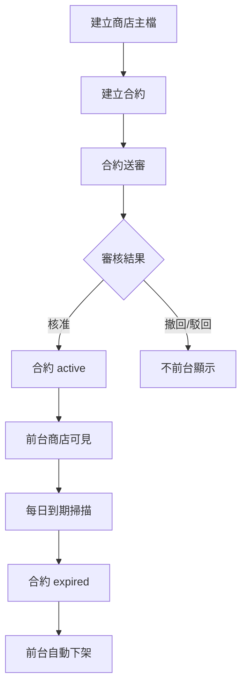
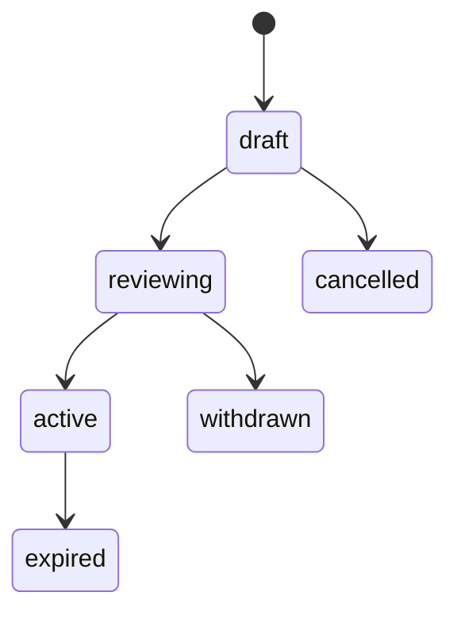
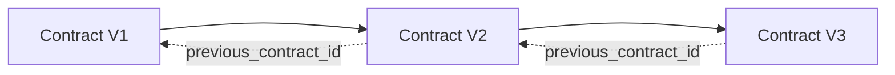
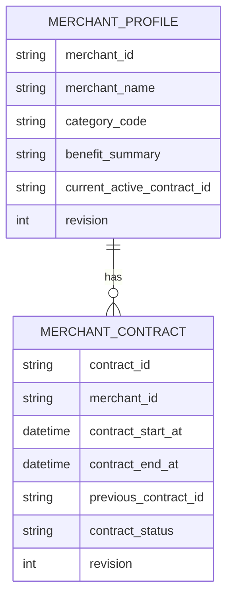

> 來源註記：本文件保留既有模塊拆分方式。凡文中未被客戶原始 PRD 明文定義的欄位、狀態碼、流程抽象或工程命名，均視為內部設計建議，不作為客戶權威需求表述。
>
> 對齊口徑：本文件已按主 PRD `v1.1` 與 `sql/tra_welfare_platform.sql` `v3.0-full` 收斂；商店主檔、合約版本鏈與流程橋接均以當前資料模型為準。

# M21《MCH－商店主檔與合約管理》子 PRD

## 1. 模塊名稱

MCH－商店主檔與合約管理

## 2. 模塊類型

後台頁面模塊

## 3. 模塊定位

本模塊是特約商店能力的主資料中樞，負責把「商店」與「商店合約」這兩層資料拆開治理，並用合約生命週期來決定前台是否應展示某家商店的優惠內容。總體 PRD 已把 MCH 定義為管理商店、合約、優惠、適用規則、聯絡據點的模塊，且在整體模組關係圖中，MCH 與 WF、Portal、Admin Console 都有直接關聯。

如果前面的 M19、M20 解決的是公告從後台到前台的內容發布，那 M21 解決的就是：

- 商店主檔怎麼建立與維護
- 合約怎麼建立、續約、審批、生效、到期
- 商店前台可見性如何受合約狀態控制
- 合約版本如何串成可追溯版本鏈
- 商店主檔與合約主檔怎麼分層，避免資料責任混亂

## 4. 設計目標

1. 建立商店主檔與合約雙層模型，讓「商店基本資訊」與「合約生效邏輯」分開治理，避免把所有狀態塞在單一表裡。總體 PRD 已同時列出 Merchant Profile 與 Contract Management 兩個獨立功能。
2. 明確以前台展示受「已核准且在有效期間內」控制，確保未核准、未生效、已到期或已撤回的合約不會讓前台繼續顯示商店優惠。這是總體 PRD 的直接規則。
3. 建立續約版本鏈，讓商店合約能從舊版平滑銜接到新版，並保留完整歷史；若系統採 `previous_contract_id` 關聯，屬內部實作建議。
4. 與 WF、M22、前台商店中心與每日到期排程形成清晰邊界，讓工程與營運都能理解商店從建檔到前台展示的主鏈。
5. 符合平台產品目標中「讓特約商店、公告與福利規章有一致審批與發布機制」的整體方向。

## 5. 業務場景

### 場景 A：承辦建立新商店主檔

福利社承辦人在後台建立一家新的特約商店，輸入商店名稱、分類、基本描述與聯絡資訊，先形成商店主檔，再建立對應合約資料，後續經送審與核准後才會對前台可見。總體 PRD 的場景五直接描述了承辦建立商店與合約資料後送審的流程。

### 場景 B：承辦建立首版合約並送審

承辦完成商店主檔後，建立首版合約，填寫生效起日與到期日，送審給主管；只有核准且處於有效期間後，該商店才可在前台顯示。這是總體 PRD 對商店前台展示條件的直接定義。

### 場景 C：合約到期自動下架

每天固定時間，系統掃描已到期合約，自動把合約標記為到期，並同步更新商店前台顯示狀態，避免過期優惠繼續顯示。這是總體 PRD 場景五與實施說明中的直接要求。

### 場景 D：商店續約形成版本鏈

原合約到期前，承辦可建立續約版合約，新合約以 `previous_contract_id` 指向上一版，形成版本鏈；這讓後續歷史查核、比對與前台展示切換都有據可循。總體 PRD 對續約版本鏈有直接規定。

### 場景 E：合約未 active 不得前台展示

無論商店主檔是否完整，只要合約未核准或不在有效期間內，前台就不應顯示。這條邊界在總體 PRD 中是直接明寫的。

## 6. 業務流程解讀

### 6.1 商店與合約的主鏈關係

MCH 的主鏈不是「建一筆商店資料就上線」，而是：建立商店主檔 → 建立合約 → 送審 → 核准 → 合約 active → 前台顯示 → 到期排程下架。總體 PRD 的場景五與商店合約生命週期圖共同支持這條鏈路。

### 6.2 商店主檔與合約分層原則

建議把商店主檔理解為「相對穩定的商家資料」，而把合約理解為「影響前台是否可見、何時生效、何時到期的交易性/法務性資料」。總體 PRD 將 Merchant Profile 與 Contract Management 明確拆成兩個功能點，本身就支持這種分層。

### 6.3 合約生命週期解讀

總體 PRD 已直接提供商店合約生命週期：`draft → reviewing → active / withdrawn → expired / cancelled`。这代表合約不是單一狀態欄位，而是一條正式生命週期。

### 6.4 到期自動下架規則

到期自動下架不是前台查詢時順便判斷，而應由每日排程正式回寫合約狀態，並同步更新商店前台顯示。總體 PRD 已明確「合約到期需由每日排程自動更新」，且排程任務最低集合中也包含「商店到期更新」。

### 6.5 續約版本鏈解讀

續約時，不應覆蓋原合約，而應新建一版，並用 `previous_contract_id` 指回前一版。這樣可以保證：

- 歷史優惠內容可追溯
- 到期與生效切換有版本依據
- 續約與重新送審不會污染原始合約資料
  這完全符合總體 PRD 的版本鏈設計。

## 7. 核心功能拆解

### 7.1 商店主檔管理

負責維護商店基本資料。
建議子能力包括：

- 建立商店主檔
- 編輯商店基本資訊
- 設定商店分類 `category_code`
- 管理商店狀態與前台摘要
- 查看關聯合約列表

總體 PRD 已把 Merchant Profile 列為 MCH 的一級功能，並在字段表中明確 `merchant_id`、`merchant_name`、`category_code`、`benefit_summary` 等字段。

### 7.2 合約管理

負責管理商店對外生效的合約主檔。
建議子能力包括：

- 建立合約
- 編輯草稿合約
- 送審合約
- 撤回/取消草稿
- 查看合約狀態
- 查看合約歷程
- 關聯前一版合約

總體 PRD 已把 Contract Management 列為一級功能，並給出合約狀態與版本鏈規則。

### 7.3 合約狀態與前台顯示控制

這是本模塊的核心規則。
建議子能力包括：

- 僅已核准且在有效期間內的合約允許前台展示
- `reviewing/withdrawn/cancelled/expired` 一律不前台展示
- 顯示前台可見原因摘要
- 合約狀態變更時同步回寫商店展示狀態

這直接對應總體 PRD 的需求說明與邊界條件。

### 7.4 合約續約與版本鏈

建議子能力包括：

- 基於既有 active/expired 合約建立續約版
- 自動帶出前一版摘要
- 設定 `previous_contract_id`
- 顯示版本鏈視圖
- 支援比對新舊合約關鍵欄位差異

總體 PRD 已直接要求以 `previous_contract_id` 串接版本鏈。

### 7.5 商店前台摘要輸出

雖前台展示詳情會在 M22 展開，但 M21 需要輸出穩定的前台摘要能力，例如：

- `merchant_name`
- `category_code`
- `benefit_summary`
- 當前有效合約摘要
- 是否前台可見

字段表已直接提供 `benefit_summary` 這一前台列表展示字段。

### 7.6 合約送審承接

商店合約也屬 WF 的送審消費方。
建議子能力包括：

- `submitContract(contractId, revision)`
- 建立流程實例與合約橋接關聯
- 承接 approve / return / reject
- 核准後進 active
- 退回後回 draft 或 returned_editable

這與總體 PRD 模組關係圖中 MCH → WF 的依賴一致。

### 7.7 每日到期更新承接

建議子能力包括：

- 到期掃描結果查看
- 到期狀態批量更新
- 前台下架同步摘要
- 到期異常列表

總體 PRD 已明確「合約到期需由每日排程自動更新」。

## 8. 與其他模塊的聯動關係

### 8.1 與 WF 的聯動

MCH 的合約送審與審批依賴 WF。
總體 PRD 模組關係圖明確畫出 MCH → WF。

### 8.2 與 M22《優惠規則、適用對象、聯絡據點與前台商店中心》的聯動

M21 管商店主檔與合約生效；M22 再接續處理優惠規則、適用對象、據點與前台展示。
兩者邊界如下：

- M21：商店主體 + 合約是否有效
- M22：商店對外呈現的優惠內容與適用規則細節

### 8.3 與 AUTH / Portal 的聯動

前台商店中心是否能看到某商店，首先取決於 M21 的合約狀態是否為 active。Portal 與 MCH 在模組關係圖中也有直接關聯。

### 8.4 與 M07《字典與系統參數》的聯動

商店分類 `category_code`、合約狀態、續約類型、前台展示標記等建議由字典驅動；每日到期掃描排程則由系統參數治理。總體 PRD 已明確字典與排程治理方向。

### 8.5 與 M08《檔案資源中心》的聯動

若合約掃描件、附件或補充文件需要保存，應走 `file_resource`，業務表只存 `file_id`。總體 PRD 對全站檔案治理有統一要求。

### 8.6 與 M09《通知中心》的聯動

合約核准、退回、到期下架、續約生效等事件，都可輸出給通知中心，通知承辦或相關角色。

### 8.7 與 SEC 的聯動

合約狀態手動修改、續約版本替換、到期下架失敗、敏感檔案下載等都應可被稽核；總體 PRD 已要求高風險操作可被追蹤，且敏感檔案下載需記錄稽核。

## 9. 頁面規劃

本模塊作為後台頁面模塊，建議至少包含 4 個核心頁面。

### 9.1 頁面一：商店列表頁

**定位**：管理所有商店主檔。

**頁面區塊**

1. 狀態統計卡
2. 搜尋與篩選區
3. 商店列表區
4. 批量匯出區

**查詢條件建議**

- `merchant_name`
- `category_code`
- 商店狀態
- 是否前台可見
- 最近更新時間區間

**列表欄位建議**

- merchant_name
- category_code
- benefit_summary
- current_contract_status
- front_visible_flag
- updated_at
- updated_by

### 9.2 頁面二：商店主檔編輯頁

**定位**：建立與編輯商店主檔。

**頁面區塊**

1. 基本資料區
2. 優惠摘要區
3. 分類設定區
4. 關聯合約摘要區
5. 保存區

### 9.3 頁面三：合約列表 / 合約詳情頁

**定位**：查看商店所有合約與版本鏈。

**頁面區塊**

1. 合約版本鏈區
2. 合約摘要卡
3. 合約內容區
4. 狀態與流程歷程區
5. 操作區（送審/續約/取消）

### 9.4 頁面四：合約到期監看頁

**定位**：查看即將到期、已到期與排程處理異常的合約。

**頁面區塊**

1. 到期統計卡
2. 到期列表
3. 排程結果摘要
4. 異常處理區

## 10. 底層能力說明

### 10.1 能力邊界

本模塊負責：

- 商店主檔
- 合約主檔
- 合約狀態與版本鏈
- 合約前台可見控制
- 合約到期更新承接
- 商店前台摘要輸出

本模塊不負責：

- 優惠規則細節配置
- 適用對象細節規則
- 聯絡據點與權益保障細項頁
- 前台商店搜尋與瀏覽中心
- 通知實際發送
- 流程模板配置

### 10.2 建議能力接口

- `createMerchantProfile(payload)`
- `updateMerchantProfile(merchantId, revision, payload)`
- `createContract(merchantId, payload)`
- `submitContract(contractId, revision)`
- `renewContract(contractId, payload)`
- `evaluateMerchantFrontVisibility(merchantId)`
- `expireContractsDaily(batchSize)`
- `listMerchantContracts(merchantId)`

### 10.3 能力實現原則

- 商店與合約分表
- 合約 active 才前台可見
- 續約一定新建版本，不覆蓋舊合約
- 到期更新由正式排程回寫
- 高風險主表加 `revision`
- 前台不直接自行判斷合約邏輯，而讀取已整理好的可見結果

## 11. 角色權限與操作路徑

### 11.1 可操作角色

- 福利社承辦人：建立商店、建立合約、送審、續約、查看到期監看
- 審核主管：核准、退回、駁回合約
- 系統管理員：治理異常商店與合約配置
- 一般職工：前台瀏覽可見商店（非本模塊直接配置者）

總體 PRD 的角色表已明確福利社承辦人負責商店資料維護，審核主管負責核准、退回、駁回。

### 11.2 操作路徑

管理後台 → 特約商店 → 商店列表
管理後台 → 特約商店 → 建立商店
管理後台 → 特約商店 → 合約管理
管理後台 → 特約商店 → 到期監看

### 11.3 權限建議

- 查看商店列表
- 建立商店主檔
- 編輯商店主檔
- 建立合約
- 送審合約
- 核准合約
- 退回合約
- 駁回合約
- 續約合約
- 匯出商店 / 合約清單

其中「核准合約」「駁回合約」「手工更改合約狀態」「續約合約」建議視為高風險操作。

## 12. 關鍵字段/配置項說明

### 12.1 來自總體 PRD 的核心字段

總體 PRD 已明確商店與合約核心字段：`merchant_id`、`merchant_name`、`category_code`、`contract_id`、`contract_start_at`、`contract_end_at`、`previous_contract_id`、`benefit_summary`。

### 12.2 建議的商店主檔字段

| 字段名                     | 中文名稱        | 用途                                   |
| -------------------------- | --------------- | -------------------------------------- |
| merchant_id                | 商店 ID         | 主鍵                                   |
| merchant_name              | 商店名稱        | 前後台顯示名稱                         |
| category_code              | 分類代碼        | 商店分類                               |
| benefit_summary            | 優惠摘要        | 前台列表摘要                           |
| merchant_status            | 商店狀態        | draft/active/inactive/offline_reserved |
| current_active_contract_id | 當前有效合約 ID | 快速定位有效合約                       |
| front_visible_flag         | 前台可見標記    | 前台查詢加速                           |
| revision                   | 樂觀鎖版本號    | 併發控制                               |

### 12.3 建議的合約主檔字段

| 字段名               | 中文名稱      | 用途                                               |
| -------------------- | ------------- | -------------------------------------------------- |
| contract_id          | 合約 ID       | 主鍵                                               |
| merchant_id          | 商店 ID       | 關聯商店                                           |
| contract_start_at    | 合約開始時間  | 生效起日                                           |
| contract_end_at      | 合約結束時間  | 到期日                                             |
| previous_contract_id | 前一版合約 ID | 版本鏈                                             |
| contract_status      | 合約狀態      | draft/reviewing/active/withdrawn/expired/cancelled |
| revision             | 樂觀鎖版本號  | 併發控制                                           |

### 12.4 建議配置項

- `mch.contract.expire.scan.cron`
- `mch.contract.front_visible_only_active`
- `mch.contract.require_review_before_active`
- `mch.contract.allow_renew_before_expire`
- `mch.merchant.export.enabled`

其中合約到期掃描屬總體 PRD 明確列入的最低必備排程之一。

## 13. 異常情況與邊界條件

### 13.1 合約非 active 卻前台展示

不允許。這是總體 PRD 的直接邊界。

### 13.2 合約已到期但未自動下架

不允許長期存在。到期需由每日排程自動更新，若未更新應視為排程異常與資料完整性問題。

### 13.3 續約直接覆蓋舊合約

不允許。應新建一版並用 `previous_contract_id` 串接版本鏈。

### 13.4 已送審合約被他人覆蓋

應以 `revision` 阻斷靜默覆蓋，這符合總體 PRD 對高風險主表的通用原則。

### 13.5 商店主檔存在但沒有有效合約

允許存在，但前台不可見；這應視為「已建檔未上線」而非錯誤前台資料。

### 13.6 多個 active 合約同時生效

原則上不應允許同一商店同時存在多個前台有效合約，否則前台優惠顯示會失真。建議在保存或核准時做約束。

## 14. Mermaid 圖

### 14.1 商店與合約主鏈圖

### 14.2 合約版本鏈圖

### 14.3 商店與合約模型圖

## 15. 研發落地建議

### 15.1 架構分層建議

- 商店主檔與合約主檔分表
- 前台可見性由合約狀態驅動，不由前端臨時計算
- 續約以新版本新主鍵方式處理
- 到期排程獨立為每日任務
  這與總體 PRD 的合約狀態、版本鏈與排程要求一致。

### 15.2 狀態治理建議

- 所有 MCH 狀態由字典驅動
- 合約狀態與商店前台可見標記分層
- 商店是否展示以 active contract 為準
- 合約狀態變更需保留動作歷程與差異摘要

### 15.3 頁面與交互建議

- 商店摘要頭在商店頁、合約頁、到期監看頁共用
- 版本鏈用時間線或樹狀視圖展示
- 續約時預填前一版資訊，但不覆蓋原資料
- 到期監看頁顯示即將到期與已到期分區

### 15.4 治理與安全建議

- 合約核准、續約、手工狀態修正、匯出、附件下載都進稽核
- 對「應到期未到期」「active 重複」做資料完整性掃描
- 對前台展示狀態與合約狀態建立對賬檢查
- 敏感檔案下載記錄稽核，符合平台安全要求。

## 16. 測試驗收要點

### 16.1 功能驗收

1. 承辦可建立商店主檔。
2. 承辦可建立合約並送審。
3. 合約核准後，商店可對前台顯示。
4. 續約可透過 `previous_contract_id` 串接版本鏈。
   以上 2、3、4 點都直接對應總體 PRD 的 MCH 功能與需求說明。

### 16.2 邊界驗收

1. 合約未核准或不在有效期間內時，前台不得顯示商店。
2. 合約到期後，會由每日排程自動更新為到期並下架。
3. 續約不會覆蓋舊合約，而是建立版本鏈。
4. revision 可阻止高風險主表併發覆蓋。
   其中 1、2、3 直接對應總體 PRD 規則。

### 16.3 聯動驗收

1. MCH 合約送審可建立流程實例橋接關聯。
2. 合約核准後，前台商店中心可正確讀到有效商店。
3. 到期排程執行後，前台顯示同步更新。
4. M22 可正確承接商店主檔與有效合約輸出。
   其中 2、3 點直接可由總體 PRD 場景五與邊界條件支撐。

### 16.4 治理與安全驗收

1. 建店、送審、核准、退回、續約、到期下架都可被稽核追蹤。
2. 敏感檔案下載有稽核。
3. 到期掃描異常可形成治理事件。
4. 商店合約管理能力符合 MVP「特約商店與公告管理」範圍。
