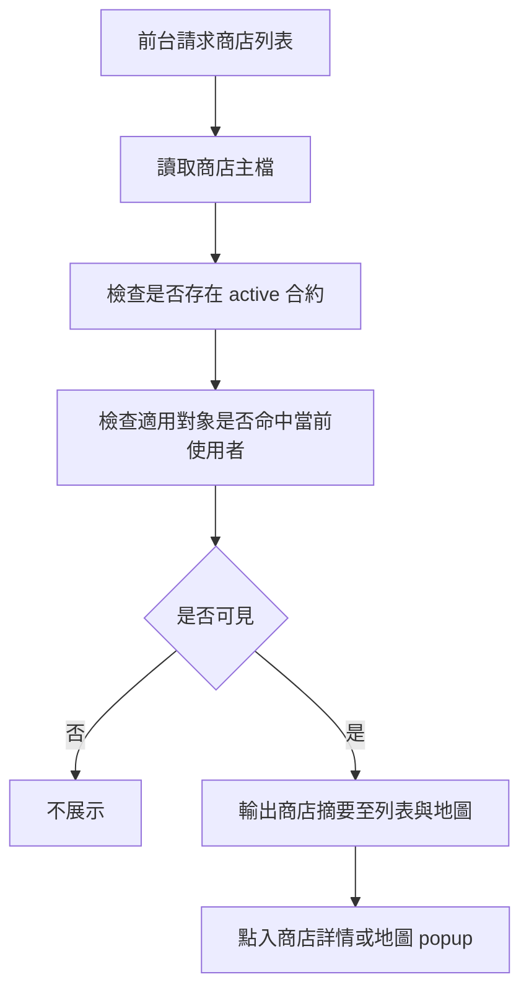
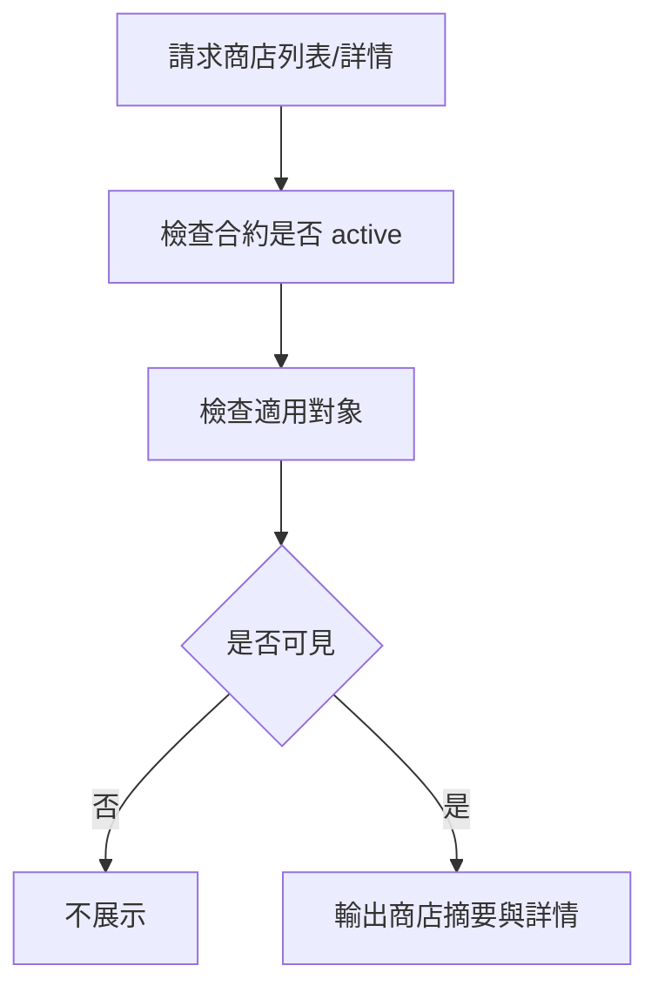
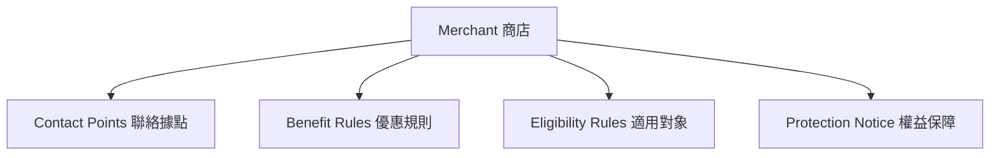
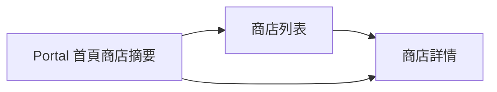

> 來源註記：本文件保留既有模塊拆分方式。凡文中未被客戶原始 PRD 明文定義的欄位、狀態碼、流程抽象或工程命名，均視為內部設計建議，不作為客戶權威需求表述。
>
> 對齊口徑：本文件已按主 PRD `v1.1` 與 `sql/tra_welfare_platform.sql` `v3.0-full` 收斂；前台商店中心以職工為核心，退休/家屬適用規則僅視為可配置擴展能力，不作本期基線。

# M22《MCH－優惠規則、適用對象、聯絡據點與前台商店中心》子 PRD

## 1. 模塊名稱

MCH－優惠規則、適用對象、聯絡據點與前台商店中心

## 2. 模塊類型

業務支撐模塊

## 3. 模塊定位

本模塊是特約商店能力的「對外消費層」與「商店內容配置層」，承接 M21 已建立的商店主檔與有效合約，進一步定義商店對前台實際呈現的優惠內容、誰可使用、去哪裡使用、以及權益與注意事項。總體 PRD 已把這四塊能力直接列為 MCH 一級功能，且前台 Portal 中單獨存在 `特約商店` 入口，表示商店不只是後台資料，而是明確面向登入職工的前台服務。

如果 M21 解決的是「哪一家商店、哪一版合約有效」，那 M22 解決的就是：

- 前台到底看到什麼優惠內容
- 哪些人可以使用這個優惠
- 商店有哪些聯絡據點
- 有哪些使用限制、權益保障或注意事項
- 前台商店中心如何查詢、篩選、瀏覽與查看詳情

## 4. 設計目標

1. 將商店主檔與合約之外、真正影響前台使用者理解與使用行為的內容能力獨立出來，包括優惠說明、適用對象、聯絡據點與權益保障。這直接對應 MCH 功能清單。
2. 保證前台商店中心只展示合約有效的商店，同時把 `benefit_summary`、分類與聯絡資訊轉成可理解的前台內容。
3. 讓登入職工能在前台以列表與地圖兩種模式找到適用的優惠商店，並支援 popup 詳情、外部導流與店點查詢，符合原始 PRD 對特約商店瀏覽與地圖查詢的使用目標。
4. 對齊原始 PRD 的前台保護要求，前台商店中心需納入登入限制、防爬蟲、浮水印與禁止直接複製等保護機制，避免商店資料被非授權大量擷取。
5. 為後續營運、公告導流、商店到期下架、瀏覽統計與權益爭議處理提供穩定的前台展示與後台配置邊界。
6. 符合平台產品目標中「讓特約商店、公告與福利規章有一致審批與發布機制」的整體方向。

## 5. 業務場景

### 場景 A：職工在前台瀏覽特約商店

職工登入前台後，進入 `特約商店`，可瀏覽目前有效商店、優惠摘要與分類，點入詳情查看適用條件、聯絡據點與權益保障。前台資訊架構已明確存在 `特約商店 Merchants` 入口，且一般職工主要操作包含「瀏覽特約商店」。

### 場景 B：職工以地圖查找鄰近適用商店

職工進入前台商店中心後，可切換至地圖模式查看鄰近店點，點擊地圖 popup 取得商店摘要、優惠內容與外部導航/官網連結，再決定是否前往使用。這直接對應原始 PRD 的列表＋地圖雙模式與外部連結要求。

### 場景 C：商店合約有效，但只對特定對象適用

某家商店雖然合約有效，但其優惠可能僅限特定職工身分、或只限特定福利社/分處/角色使用。這就需要在 M22 中透過 `Eligibility Rule` 進一步控制可見與可用說明。MCH 功能清單已明確包含 `適用對象（Eligibility Rule）`。

### 場景 D：使用者需要知道去哪裡使用優惠

商店可能有多個聯絡據點，前台使用者需要知道門市地址、聯絡方式、營業資訊或適用分店，因此 `Contact Point` 不能只是後台備註，而應是前台可消費資料。MCH 功能清單已直接包含 `聯絡據點（Contact Point）`。

### 場景 E：到期商店自動從前台下架

總體 PRD 明確指出商店合約到期後，系統每日掃描並同步更新商店前台顯示，避免過期優惠繼續露出。M22 需承接這個結果，保證前台商店中心不展示無效商店。

## 6. 業務流程解讀

### 6.1 商店前台展示主流程

前台商店中心不是直接把所有商店主檔都展示出來，而是要先經過「合約是否有效」與「適用對象是否命中」兩層判斷，再輸出前台列表與地圖。總體 PRD 已明確合約非有效不得前台展示，且前台商店中心是登入職工使用的服務。

### 6.2 商店主檔、合約與內容配置的分工

建議前後關係如下：

- **M21 商店主檔**：商店名稱、分類、基礎摘要、合約狀態
- **M21 合約管理**：是否生效、何時到期、是否前台可展示
- **M22 優惠規則/適用對象/聯絡據點/權益保障**：前台真正可閱讀、可使用的內容與限制

這種分工正好對應 MCH 在總體 PRD 中的功能拆分。

### 6.3 優惠規則的前台語義

優惠規則不是法務合約全文，而是對前台使用者可理解的「可得利益描述」。總體字段表已明確 `benefit_summary` 是前台列表展示的優惠說明，因此 M22 應把優惠規則區分成：

- 列表摘要：短版 `benefit_summary`
- 詳情規則：完整優惠內容、適用範圍、限制條件

### 6.4 適用對象規則解讀

MCH 功能清單中的 `Eligibility Rule` 本質是商店優惠適用條件，而不是 EMP 補助資格那種人事真源。
建議至少支持這類條件表達：

- 一般職工適用
- 特定身分類型適用
- 全體登入職工適用
- 特定組織/分處適用
- 特定福利身分類型適用

這樣才能實際對應角色表中的前台差異。

### 6.5 聯絡據點與權益保障的角色

- **聯絡據點**：回答「去哪裡用」「怎麼聯絡」
- **權益保障**：回答「使用前要注意什麼」「有哪些限制或例外」

總體 PRD 雖未逐欄定義這兩類字段，但已把它們列為 MCH 正式功能，因此子 PRD 需要把它們落成正式子能力，而不是隨意的備註欄。

### 6.6 商店前台中心與公告前台中心的差異

M20 的前台公告中心以「可見窗口 + audience scope」為主；
M22 的前台商店中心則以「active 合約 + 適用對象 + 分類 + 優惠摘要」為主。
兩者同樣都面向職工，但展示邏輯不同，不能混用。總體 PRD 已在邊界條件中分別對公告與商店前台展示給出獨立規則。

## 7. 核心功能拆解

### 7.1 優惠規則管理

負責配置商店可對前台展示的優惠內容。
建議子能力包括：

- 優惠標題
- 優惠摘要 `benefit_summary`
- 詳細優惠說明
- 有效期摘要（若需前台展示）
- 使用條件與限制說明
- 是否推薦 / 是否重點展示（可預留）

總體 PRD 已明確 `Benefit Rule` 是 MCH 一級功能，`benefit_summary` 是前台摘要字段。

### 7.2 適用對象管理

負責定義哪些人可使用或看到某商店優惠。
建議子能力包括：

- 全體可用
- 一般職工適用
- 其他特定受益身分類型適用（如制度另有定義）
- 指定群組/角色/分處適用
- 前台可見與實際適用分層說明

這一能力直接對應 `Eligibility Rule`。

### 7.3 聯絡據點管理

負責維護商店的使用入口。
建議子能力包括：

- 門市/據點名稱
- 地址
- 電話
- 營業時間
- 地圖連結摘要（若後續要支援）
- 是否主要據點
- 據點適用說明

這一能力直接對應 `Contact Point`。

### 7.4 權益保障管理

負責維護商店優惠的注意事項與保障說明。
建議子能力包括：

- 使用限制
- 權益保障說明
- 例外情況
- 客訴/問題處理指引
- 免責或補充條款摘要

這一能力直接對應 `Protection Notice`。

### 7.5 前台商店中心列表

負責展示可見商店清單。
建議子能力包括：

- 依分類篩選 `category_code`
- 關鍵字搜尋商店名稱
- 置頂/推薦展示（若後續有）
- 僅展示 active 合約商店
- 列表顯示 `merchant_name + benefit_summary`

總體字段表已直接給出 `merchant_name`、`category_code`、`benefit_summary`。

### 7.6 前台商店詳情

負責展示單一商店完整資訊。
建議展示包括：

- 商店名稱
- 分類
- 優惠摘要與詳情
- 適用對象說明
- 聯絡據點列表
- 權益保障與注意事項
- 合約有效摘要（可前台友善文案，不直接暴露法務狀態碼）

### 7.7 商店可見性判斷

建議統一做成服務層能力，至少檢查：

- 是否存在 `active` 合約
- 是否命中適用對象
- 是否未到期
- 是否未被下架或停用

### 7.8 瀏覽與點擊統計預留

總體 PRD 雖未單獨列出商店瀏覽追蹤，但既然前台有 `特約商店` 入口，且平台整體重視可查與可追蹤，子 PRD 建議對首頁點擊、列表點擊與詳情查看預留簡易統計接口，供後續營運分析使用。

## 8. 與其他模塊的聯動關係

### 8.1 與 M21《商店主檔與合約管理》的聯動

M21 決定商店是否有有效合約、是否可前台展示；M22 在此基礎上決定前台要展示哪些優惠內容、適用規則與據點。
兩者邊界如下：

- M21：商店主檔 + 合約有效性
- M22：優惠內容 + 適用人群 + 據點 + 權益說明 + 前台商店中心

### 8.2 與 AUTH 的聯動

前台商店中心需依登入者身份，套用適用對象規則，決定能否看到或使用某優惠。適用範圍若需細分，應回到客戶原始規則，不宜自行擴張新的主要受眾角色。

### 8.3 與 ORG / M04 的聯動

若適用對象進一步細分到 branch、角色或其他組織條件，則需要結合 ORG 的資料範圍與人員上下文判斷是否命中。

### 8.4 與 M09《通知中心》的聯動

商店新上架、重要優惠更新、到期前提醒等，後續都可透過 M09 做站內通知或公告導流，但通知本身不是 M22 的核心責任。

### 8.5 與 M08《檔案資源中心》的聯動

若商店有門市照片、優惠附件、保障文件等，仍應走 `file_resource`，前台詳情頁只透過 `file_id` 安全引用。總體 PRD 已對全站檔案治理有一致要求。

### 8.6 與 SEC 的聯動

適用對象配置錯誤、前台越權可見、敏感附件下載、批量匯出商店清單等，都可回流 SEC 作為 `permission` 或 `operation_anomaly` 類事件。總體 PRD 已明確這些規則分類存在。

## 9. 頁面規劃

本模塊作為業務支撐模塊，建議包含後台配置頁與前台商店中心兩組頁面。

### 9.1 後台頁面一：優惠規則配置頁

**定位**：配置單一商店的優惠內容與摘要。

**頁面區塊**

1. 商店摘要頭
2. 優惠摘要區
3. 優惠詳情區
4. 限制條件區
5. 保存區

### 9.2 後台頁面二：適用對象與據點配置頁

**定位**：配置適用對象、據點與保障說明。

**頁面區塊**

1. 適用對象區
2. 聯絡據點列表
3. 權益保障區
4. 前台預覽摘要區

### 9.3 前台頁面一：特約商店列表頁

**定位**：登入職工瀏覽所有可見商店的主入口。

**頁面區塊**

1. 搜尋區
2. 分類篩選區
3. 商店列表區
4. 空列表提示區

**列表欄位建議**

- merchant_name
- category_code
- benefit_summary
- 適用對象摘要
- 主要據點摘要

### 9.4 前台頁面二：特約商店詳情頁

**定位**：查看單一商店完整優惠與使用資訊。

**頁面區塊**

1. 商店名稱與分類區
2. 優惠詳情區
3. 適用對象區
4. 聯絡據點區
5. 權益保障區
6. 返回列表入口

### 9.5 前台頁面三：首頁商店摘要區（可選）

**定位**：在 Portal 首頁展示少量推薦商店或最新優惠。

這一塊若納入 MVP，可只做少量摘要卡片，不必先做複雜推薦算法。

## 10. 底層能力說明

### 10.1 能力邊界

本模塊負責：

- 優惠規則配置
- 適用對象配置
- 聯絡據點配置
- 權益保障配置
- 前台商店列表與詳情輸出
- 商店可見性與適用性判斷

本模塊不負責：

- 商店主檔建立
- 合約送審與生效
- 合約到期排程本體
- 通知實際發送
- 富文本通用治理
- 組織與權限定義本身

### 10.2 建議能力接口

- `getVisibleMerchants(userContext, filters)`
- `getMerchantDetail(merchantId, userContext)`
- `updateMerchantBenefitRule(merchantId, revision, payload)`
- `updateMerchantEligibilityRule(merchantId, revision, payload)`
- `updateMerchantContactPoints(merchantId, revision, payload)`
- `updateMerchantProtectionNotice(merchantId, revision, payload)`
- `evaluateMerchantEligibility(merchantId, userContext)`

### 10.3 能力實現原則

- 前台只讀取可見商店
- `benefit_summary` 用於列表摘要，詳情用完整規則內容
- 適用對象判斷與前台展示分層，但結果要一致
- 聯絡據點與保障說明做成結構化資料，不建議只塞富文本
- 高風險主表與配置表加 `revision`

## 11. 角色權限與操作路徑

### 11.1 可操作角色

- 福利社承辦人：維護商店優惠規則、適用對象、聯絡據點與保障說明
- 審核主管：查看商店內容與審批結果
- 一般職工：瀏覽前台可見商店
- 職工：瀏覽適用商店優惠
- 系統管理員：治理異常與配置

總體 PRD 的角色表已直接支撐這些分工。

### 11.2 操作路徑

管理後台 → 特約商店 → 商店詳情 → 優惠規則
管理後台 → 特約商店 → 商店詳情 → 適用對象 / 聯絡據點 / 權益保障
前台 Portal → 特約商店
前台 Portal → 特約商店 → 商店詳情

### 11.3 權限建議

- 查看商店列表
- 編輯優惠規則
- 編輯適用對象
- 編輯聯絡據點
- 編輯權益保障
- 查看前台商店詳情
- 匯出商店清單

其中「修改適用對象」「匯出商店清單」「下載商店附件」建議視為中高風險操作。

## 12. 關鍵字段/配置項說明

### 12.1 來自總體 PRD 的核心字段

總體 PRD 已明確商店字段包括：`merchant_id`、`merchant_name`、`category_code`、`contract_id`、`contract_start_at`、`contract_end_at`、`previous_contract_id`、`benefit_summary`。

### 12.2 建議補充的優惠規則字段

| 字段名          | 中文名稱     | 用途         |
| --------------- | ------------ | ------------ |
| benefit_rule_id | 優惠規則 ID  | 主鍵         |
| merchant_id     | 商店 ID      | 關聯商店     |
| benefit_summary | 優惠摘要     | 前台列表展示 |
| benefit_detail  | 優惠詳情     | 前台詳情展示 |
| status          | 狀態         | 啟用/停用    |
| revision        | 樂觀鎖版本號 | 併發控制     |

### 12.3 建議補充的適用對象字段

| 字段名              | 中文名稱     | 用途                              |
| ------------------- | ------------ | --------------------------------- |
| eligibility_rule_id | 適用規則 ID  | 主鍵                              |
| merchant_id         | 商店 ID      | 關聯商店                          |
| audience_type       | 適用類型     | employee / retired / all / custom |
| scope_payload       | 適用範圍內容 | JSON 或結構化條件                 |
| status              | 狀態         | 啟用/停用                         |
| revision            | 樂觀鎖版本號 | 併發控制                          |

### 12.4 建議補充的聯絡據點字段

| 字段名           | 中文名稱     | 用途     |
| ---------------- | ------------ | -------- |
| contact_point_id | 據點 ID      | 主鍵     |
| merchant_id      | 商店 ID      | 關聯商店 |
| contact_name     | 據點名稱     | 前台展示 |
| address          | 地址         | 前台展示 |
| phone            | 電話         | 聯絡資訊 |
| business_hours   | 營業時間     | 使用輔助 |
| is_primary       | 是否主要據點 | 排序顯示 |

### 12.5 建議補充的權益保障字段

| 字段名               | 中文名稱    | 用途               |
| -------------------- | ----------- | ------------------ |
| protection_notice_id | 權益保障 ID | 主鍵               |
| merchant_id          | 商店 ID     | 關聯商店           |
| notice_title         | 標題        | 前台展示           |
| notice_content       | 內容        | 權益保障與注意事項 |
| status               | 狀態        | 啟用/停用          |

### 12.6 建議配置項

- `mch.portal.list_page_size`
- `mch.portal.show_retired_only_when_eligible`
- `mch.portal.default_category_filter_enabled`
- `mch.portal.homepage_limit`
- `mch.eligibility.rule_engine_enabled`
- `mch.export.enabled`

## 13. 異常情況與邊界條件

### 13.1 合約非 active 卻出現在前台

不允許。這是總體 PRD 的直接邊界。

### 13.2 不適用對象看到優惠

不允許。適用對象規則應實際生效，而不是只顯示文字說明。

### 13.3 商店有主檔但沒有優惠規則

可允許暫時存在，但前台展示價值很低；建議至少要求 `benefit_summary` 才可前台完整露出。總體字段表已把 `benefit_summary` 作為前台列表展示字段。

### 13.4 多個據點資訊不一致或缺失

若地址、電話等資料缺失，前台可顯示「請洽商店確認」，但後台應有完整性提示。

### 13.5 前台適用判斷與後台配置不一致

若後台明明配置某對象不適用，但前台仍可見，屬權限/規則落地失效。

### 13.6 已到期合約商店仍保留在搜尋結果

不允許。每日到期更新後，前台搜尋與詳情都應同步隱藏。

## 14. Mermaid 圖

### 14.1 商店前台展示邏輯圖

### 14.2 商店內容結構圖

### 14.3 前台頁面關係圖

## 15. 研發落地建議

### 15.1 架構分層建議

- M21 管主檔與合約有效性
- M22 管優惠內容與前台展示
- 前台 API 統一走「active 合約 + 適用對象」判斷
- 優惠規則、適用對象、據點、保障說明分表或至少分區塊儲存

### 15.2 資料建模建議

- `benefit_summary` 放主檔或優惠規則摘要表，供列表加速
- 適用對象採結構化規則，不建議只用自由文字
- 聯絡據點多筆化，不要把多門市塞一個欄位
- 高風險配置表加 `revision`

### 15.3 前台體驗建議

- 列表先看重點：商店名、分類、優惠摘要
- 詳情再展開：適用對象、據點、保障說明
- 面向前台職工的文案避免技術術語
- 空列表提示要清楚，例如「目前沒有適用商店優惠」

### 15.4 治理與安全建議

- 適用對象配置錯誤需可快速排查
- 匯出與批量修改需進稽核
- 商店可見性結果與合約狀態定期對賬
- 敏感附件或保障文件下載進稽核

## 16. 測試驗收要點

### 16.1 功能驗收

1. 承辦可配置商店優惠規則。
2. 承辦可配置適用對象、聯絡據點與權益保障。
3. 前台可顯示特約商店列表與詳情。
4. 前台列表可展示 `merchant_name`、`category_code`、`benefit_summary`。
   以上 1～4 點都直接對應 MCH 功能清單與字段定義。

### 16.2 邊界驗收

1. 合約非 active 商店不得對前台展示。
2. 不適用的對象看不到對應優惠。
3. 合約到期後，商店會從前台列表與詳情消失。
4. 前台不會展示缺乏基本優惠摘要的半成品商店。
   其中 1、3 點直接對應總體 PRD 邊界。

### 16.3 聯動驗收

1. M21 合約 active 後，M22 可前台展示商店。
2. M21 合約 expired 後，M22 可同步下架商店。
3. AUTH 不同身分下，M22 返回不同可見商店集。
4. 前台 Portal 中可從 `特約商店` 入口進入 M22。
   其中 4 點直接對應前台資訊架構。

### 16.4 治理與安全驗收

1. 修改優惠規則、適用對象、據點與保障說明都可被追蹤。
2. 匯出商店清單與下載敏感附件可被稽核。
3. revision 可阻止高風險配置被靜默覆蓋。
4. MCH 前台中心能力符合 MVP「特約商店與公告管理」範圍。
