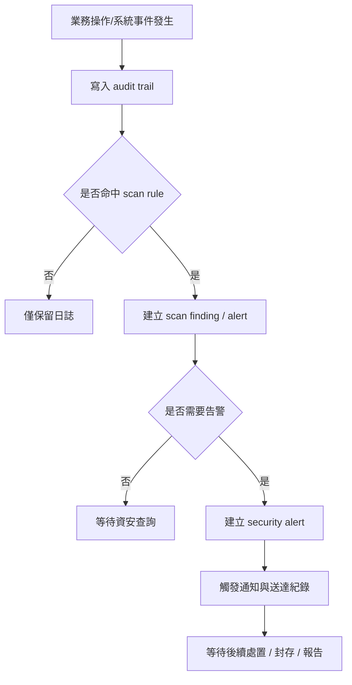
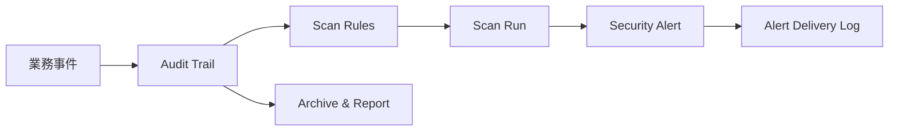
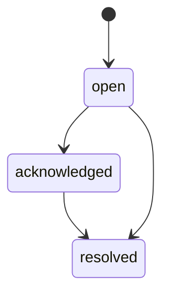
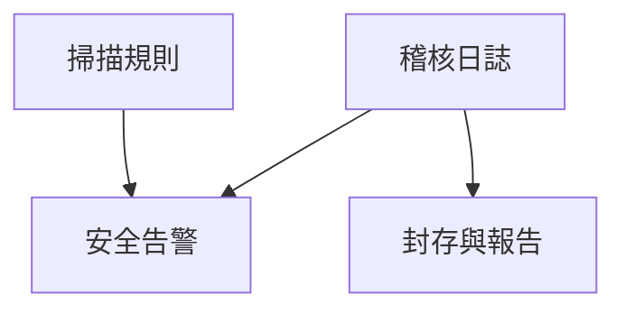

> 來源註記：本文件保留既有模塊拆分方式。凡文中未被客戶原始 PRD 明文定義的欄位、狀態碼、流程抽象或工程命名，均視為內部設計建議，不作為客戶權威需求表述。
>
> 對齊口徑：本文件已按主 PRD `v1.1` 與 `sql/tra_welfare_platform.sql` `v3.0-full` 收斂；原始硬限制與當前五級嚴重度、封存包、規則分類需分層表述，不應混寫為同一層需求。

# M23《SEC－稽核日誌、告警與掃描規則》子 PRD

## 1. 模塊名稱

SEC－稽核日誌、告警與掃描規則

## 2. 模塊類型

底層能力模塊

## 3. 模塊定位

本模塊是整個福利平台的**安全治理底座**，負責把跨模塊的高風險操作、異常事件、資料完整性問題與權限異常，收斂成可查、可掃、可告警、可封存的安全事件體系。總體 PRD 已把 SEC 定義為「管理稽核日誌、安全掃描、告警與封存」的正式模塊，且平台目標之一就是讓所有高風險操作都可被稽核、封存與追溯。

如果前面的 M23 之前各模塊解決的是業務如何運作，那本模塊解決的就是：

- 哪些操作必須留稽核
- 哪些異常要靠掃描規則被發現
- 被發現後是否需要升級為安全告警
- 告警要通知誰、如何追蹤處理狀態
- 日誌要保留多久、怎麼封存、怎麼出報告

它不是單一頁面，而是一套跨 SYS / AUTH / ORG / EMP / BEN / PAY / WF / ANN / MCH 的共用治理能力。總體 PRD 的模組關係圖也明確顯示 SEC 與 SYS 直接相連，並作為獨立的資安後台存在。

## 4. 設計目標

1. 建立全平台統一的稽核日誌能力，確保重要操作、敏感資料存取與關鍵流程節點都有可追溯紀錄。總體 PRD 已明確高風險操作要同步寫入，且重要操作要可被稽核、封存與追溯。
2. 建立可配置的安全掃描規則體系，先以 `auth / data_integrity / permission / operation_anomaly` 四類規則為核心，支撐登入異常、資料完整性錯誤、權限越界與操作異常偵測。
3. 建立安全告警與告警送達閉環，讓被偵測的高風險事件不只寫進日誌，而是能真正通知相關角色並被後續處置追蹤。總體 PRD 的場景六直接要求必要時觸發安全告警，並能查看通知送達紀錄。
4. 建立可查詢、可封存、可出報告的安全證據鏈。原始需求強調「最近 30 天熱資料可快速查詢、至少 3 年封存保存」；當前系統實作則以熱/冷分層、封存批次與報告庫去承接這項治理要求。
5. 為後續資安後台、異常處置與封存報告模塊提供標準化事件輸入與安全字段體系。總體字段表已明確 `audit_id / actor_employee_id / action_code / target_type / target_id / severity_level / alert_status / rule_category` 等安全字段。

## 5. 業務場景

### 場景 A：異常登入觸發稽核與告警

當系統偵測到異常登入、連續失敗登入或高風險來源登入時，需寫入稽核日誌，必要時觸發安全告警。總體 PRD 的場景六已直接列出異常登入作為典型安全事件。

### 場景 B：敏感資料匯出或敏感檔案下載

若管理員或承辦下載敏感檔案、匯出高敏資料，系統需留下稽核紀錄；若符合規則，還要升級為安全告警。總體 PRD 已明確敏感檔案下載需記錄稽核，場景六也直接點名敏感資料匯出與敏感檔案下載。

### 場景 C：權限配置異常或越權操作

若出現角色權限異常變更、資料範圍誤配、越權查詢或停用角色仍可收到待辦等問題，系統需以 `permission` 類規則記錄與掃描。總體 PRD 已明確規則分類包含 `permission`，也有「已被停用的角色配置，不可繼續收到待辦」這條邊界。

### 場景 D：資料完整性異常

若出現快照與歷史不一致、待發款池與案件狀態不一致、公告或商店前台可見性錯誤、批次與明細總額不一致等問題，應由 `data_integrity` 規則掃出並形成治理事件。總體 PRD 已明確 `data_integrity` 是首批規則分類之一。

### 場景 E：操作異常需被追查

例如短時間內大量刪除、頻繁匯出、手工解除待發款鎖定、手工關閉爭議案件、強制變更公告/商店狀態等，都應落在 `operation_anomaly` 類規則下做異常追蹤。總體 PRD 已明確該規則分類存在，且平台整體要求重要操作有稽核日誌。

## 6. 業務流程解讀

### 6.1 安全事件主流程

SEC 不改變業務主流程，而是在業務流程上覆蓋一層安全觀測與追蹤能力。建議主流程如下：

這條流程直接對應總體 PRD 的 SEC 功能拆分與場景六：先有稽核日誌，再有掃描規則，必要時升級為安全告警與告警送達紀錄。

### 6.2 高風險同步寫入與一般非同步寫入

總體 PRD 已明確：

- 高風險操作要同步寫入
- 其他操作可非同步寫入

因此本模塊建議把事件分成兩層：

- **同步稽核事件**：登入異常、敏感檔案下載、權限變更、核准/駁回、手工解除鎖定、匯出高敏資料
- **非同步補齊事件**：一般查詢、瀏覽、背景同步、非高風險狀態更新

這樣才能兼顧性能與風險控制。

### 6.3 掃描規則四大類的分工

總體 PRD 已明確首批規則分類為：`auth / data_integrity / permission / operation_anomaly`。
建議進一步解讀為：

- **auth**：登入異常、失敗登入、異常來源、會話風險
- **data_integrity**：狀態不一致、快照不一致、引用斷裂、到期未下架
- **permission**：功能權限誤配、資料範圍越界、停用角色仍可操作
- **operation_anomaly**：批量操作異常、下載異常、手工覆寫異常、頻繁高風險操作

### 6.4 告警與日誌的分工

不是所有 audit 都要 alert。
建議原則：

- 日誌是全量留痕
- 規則是篩選器
- 告警是高優先事件
  總體 PRD 的設計其實就是這個三層結構：Audit Trail → Scan Rule / Scan Run → Security Alert / Alert Delivery Log。

### 6.5 封存與報告的角色

總體 PRD 直接把 `Archive & Report` 列為 SEC 一級功能；原始需求要求至少 3 年封存保存，當前系統實作則進一步以封存批次、封存檔案與報告輸出去落地。
因此 SEC 不能只做到查當前日誌，還要能：

- 將過期熱資料轉冷
- 提供封存查詢索引
- 輸出稽核報告 / 告警報告 / 期間報告

### 6.6 資安後台在整體資訊架構中的位置

總體資訊架構已明確資安後台有四個正式入口：

- 稽核日誌
- 安全告警
- 掃描規則
- 封存與報告

這說明 SEC 不是後台某個彈窗，而是一個完整的治理工作台；本份 M23 側重其底層能力與核心模塊設計。

## 7. 核心功能拆解

### 7.1 稽核日誌（Audit Trail）

負責記錄所有需要追溯的安全與關鍵操作事件。
總體字段表已明確：

- `audit_id`
- `actor_employee_id`
- `action_code`
- `target_type`
- `target_id`
- `severity_level`
- `alert_status`
- `rule_category`

建議子能力包括：

- 同步/非同步寫入
- 多模塊統一 action_code
- 查詢與篩選
- 關聯業務單號/流程/檔案/通知
- 熱資料與封存資料查詢分層

### 7.2 掃描規則（Security Scan Rule）

負責定義哪些條件算安全風險或治理異常。
建議子能力包括：

- 規則分類
- 規則啟停
- 閾值配置
- 命中級別配置
- 規則描述與處理建議
- 規則版本控制

### 7.3 掃描執行紀錄（Scan Run）

負責記錄每一輪規則掃描結果。
建議子能力包括：

- 執行批次記錄
- 成功/失敗統計
- 命中數統計
- 規則執行耗時
- 部分失敗明細
- 補掃/重跑

### 7.4 安全告警（Security Alert）

負責將高風險命中事件提升為需被關注的處置對象。
建議子能力包括：

- 建立告警
- `open / acknowledged / resolved` 狀態流轉
- 指派處理人
- 記錄處理意見
- 關聯來源 audit / scan run / business object

總體字段表已明確 `alert_status` 是安全字段。

### 7.5 告警送達紀錄（Alert Delivery Log）

負責記錄告警通知是否送達。
建議子能力包括：

- 告警通知渠道記錄
- 送達成功/失敗
- 收件對象記錄
- 重試紀錄
- 追蹤與查詢

總體 PRD 的場景六已明確資安人員可查看通知送達紀錄。

### 7.6 封存與報告（Archive & Report）

負責日誌生命周期治理。
建議子能力包括：

- 熱資料轉封存
- 封存批次記錄
- 稽核報告輸出
- 告警統計報告
- 掃描命中報告
- 期間查詢報表

### 7.7 安全字段標準化

建議全模塊統一使用安全字段語義，避免各模塊自造名詞。
總體 PRD 的字段表已為 SEC 提供標準字段骨架。

## 8. 與其他模塊的聯動關係

### 8.1 與 AUTH 的聯動

AUTH 是 `auth` 類規則的最核心來源，包括登入異常、失敗次數、會話異常與身份提供者相關風險。總體 PRD 的場景六直接把異常登入列為資安稽核人員追查的典型事件。

### 8.2 與 ORG 的聯動

ORG 的角色、權限、資料範圍與任職配置，是 `permission` 類規則的重要輸入。像停用角色仍收到待辦、資料範圍越界等，都應回流 SEC。总體 PRD 已明確這些邊界條件。

### 8.3 與 EMP 的聯動

EMP 的敏感身份資料、變更日誌與快照一致性，是 `data_integrity` 與敏感資料保護的重要來源。總體 PRD 也明確身分證號需加密與遮罩，眷屬身分資料不得明文顯示。

### 8.4 與 BEN / PAY / WF 的聯動

這些模塊是高風險審批與發款行為的主要來源，例如：

- approve / reject
- 批次送審 / 回填
- disputed 相關處理
- 超時與版本衝突阻斷
  總體 PRD 明確平台每張申請、每個審批節點、每次異議都要可查。

### 8.5 與 ANN / MCH 的聯動

ANN 的富文本風險、排程與窗口錯配，MCH 的合約到期未下架、合約狀態與前台展示不一致，都是 `data_integrity` 與 `operation_anomaly` 類規則的典型來源。總體 PRD 對公告與商店的前台邊界已有明確規定。

### 8.6 與 SYS 的聯動

SEC 與 SYS 直接相連。SYS 提供檔案、通知、外寄與字典等底層能力；SEC 消費其中的高風險事件，並依賴 SYS 完成部分告警通知與封存支撐。模組關係圖已直接畫出 SEC → SYS。

### 8.7 與 M09《通知中心》的聯動

安全告警可透過 M09 做站內通知或可選外寄；告警送達紀錄則屬 SEC 自身治理鏈的一部分。總體 PRD 的通知扇出時序圖正好支持這種分層。

## 9. 頁面規劃

本模塊屬底層能力模塊，但建議至少對應資安後台的 4 類正式工作台頁面。

### 9.1 頁面一：稽核日誌頁

**定位**：集中查詢安全與高風險操作事件。

**頁面區塊**

1. 查詢條件區
2. 稽核事件列表
3. 事件詳情抽屜
4. 關聯告警 / 關聯業務摘要區

**查詢條件建議**

- actor_employee_id
- action_code
- target_type
- target_id
- severity_level
- rule_category
- 時間區間

### 9.2 頁面二：掃描規則頁

**定位**：管理安全掃描規則。

**頁面區塊**

1. 規則分類導航
2. 規則列表
3. 規則編輯區
4. 啟停與版本區
5. 命中統計摘要

### 9.3 頁面三：安全告警頁

**定位**：查看與處理已提升的安全告警。

**頁面區塊**

1. 告警統計卡
2. 告警列表
3. 告警詳情區
4. 處理狀態區
5. 告警送達摘要區

### 9.4 頁面四：封存與報告頁

**定位**：查看封存批次與輸出報告。

**頁面區塊**

1. 封存統計
2. 封存批次列表
3. 報告輸出區
4. 期間統計區

這四類頁面與總體資訊架構中的資安後台完全對齊。

## 10. 底層能力說明

### 10.1 能力邊界

本模塊負責：

- 稽核日誌
- 掃描規則
- 掃描執行紀錄
- 安全告警
- 告警送達紀錄
- 封存與報告
- 安全字段標準化

本模塊不負責：

- 業務操作本身
- 流程模板與待辦執行
- 通知渠道底層發送
- 檔案實體存儲
- 權限規則本體定義
- 前台使用者流程交互

### 10.2 建議能力接口

- `writeAuditEvent(payload)`
- `evaluateSecurityRules(eventOrBatch)`
- `createSecurityAlert(payload)`
- `acknowledgeAlert(alertId, comment)`
- `resolveAlert(alertId, resolution)`
- `listAuditTrail(filters)`
- `listSecurityAlerts(filters)`
- `runSecurityScan(ruleCategory?, batchSize?)`
- `archiveAuditLogs(policy)`

### 10.3 能力實現原則

- 高風險同步寫入
- 規則與告警分層
- audit / alert / archive 分表
- 安全事件支持跨模塊關聯
- 熱資料與封存資料分層查詢
- 重要配置與主表加 `revision`

## 11. 角色權限與操作路徑

### 11.1 可操作角色

- 資安稽核人員：主使用者，查詢日誌、處理告警、管理掃描與封存報告
- 系統管理員：查看與協助治理部分高風險事件
- 一般承辦/主管：通常不是 SEC 主操作者，但其操作會成為被稽核對象

總體 PRD 的角色表已直接說明資安稽核人員的主要操作是查詢日誌、處理告警、管理安全掃描與封存報告。

### 11.2 操作路徑

資安後台 → 稽核日誌
資安後台 → 安全告警
資安後台 → 掃描規則
資安後台 → 封存與報告

### 11.3 權限建議

- 查看稽核日誌
- 查看安全告警
- 管理掃描規則
- 執行掃描
- 匯出稽核報告
- 匯出告警報告
- 封存查詢
- 標記告警已知悉 / 已解決

其中「管理掃描規則」「執行掃描」「匯出稽核報告」「匯出告警報告」建議視為高風險治理權限。

## 12. 關鍵字段/配置項說明

### 12.1 來自總體 PRD 的核心安全字段

總體字段表已明確安全字段如下：`audit_id`、`actor_employee_id`、`action_code`、`target_type`、`target_id`、`severity_level`、`alert_status`、`rule_category`。

### 12.2 建議的 audit_trail 字段

| 字段名            | 中文名稱      | 用途                                                   |
| ----------------- | ------------- | ------------------------------------------------------ |
| audit_id          | 稽核日誌 ID   | 主鍵                                                   |
| actor_employee_id | 操作人員工 ID | 執行人                                                 |
| action_code       | 操作代碼      | login_failed / approve / export / delete 等            |
| target_type       | 目標類型      | application / batch / file / role / announcement 等    |
| target_id         | 目標 ID       | 被操作主鍵                                             |
| severity_level    | 嚴重等級      | low / medium / high / critical                         |
| rule_category     | 規則分類      | auth / data_integrity / permission / operation_anomaly |
| event_result      | 事件結果      | success / failed / blocked                             |
| created_at        | 建立時間      | 稽核時間                                               |
| archive_status    | 封存狀態      | hot / archived                                         |

### 12.3 建議的 security_alert 字段

| 字段名          | 中文名稱        | 用途                           |
| --------------- | --------------- | ------------------------------ |
| alert_id        | 告警 ID         | 主鍵                           |
| audit_id        | 對應稽核事件 ID | 關聯來源事件                   |
| alert_title     | 告警標題        | 顯示名稱                       |
| alert_status    | 告警狀態        | open / acknowledged / resolved |
| severity_level  | 嚴重等級        | 與來源一致或升級               |
| assigned_to     | 指派處理人      | 可空                           |
| acknowledged_at | 已知悉時間      | 可空                           |
| resolved_at     | 解決時間        | 可空                           |
| resolution_note | 處理結果        | 可空                           |

### 12.4 建議的 scan_rule 字段

| 字段名                   | 中文名稱     | 用途                                                   |
| ------------------------ | ------------ | ------------------------------------------------------ |
| scan_rule_id             | 掃描規則 ID  | 主鍵                                                   |
| rule_name                | 規則名稱     | 顯示名稱                                               |
| rule_category            | 規則分類     | auth / data_integrity / permission / operation_anomaly |
| rule_expression_reserved | 規則表達式   | 可結構化表達                                           |
| severity_level           | 命中等級     | 觸發級別                                               |
| is_enabled               | 是否啟用     | 規則開關                                               |
| revision                 | 樂觀鎖版本號 | 併發防護                                               |

### 12.5 建議的 scan_run 字段

| 字段名        | 中文名稱    | 用途                              |
| ------------- | ----------- | --------------------------------- |
| scan_run_id   | 掃描批次 ID | 主鍵                              |
| started_at    | 開始時間    | 執行時間                          |
| finished_at   | 結束時間    | 執行時間                          |
| rule_category | 掃描分類    | 本輪掃描範圍                      |
| hit_count     | 命中數      | 統計                              |
| alert_count   | 告警數      | 統計                              |
| run_status    | 執行狀態    | success / partial_failed / failed |

### 12.6 建議配置項

- `sec.audit.sync_action_codes`
- `sec.audit.hot_retention_months`
- `sec.audit.online_query_months`
- `sec.audit.archive_years`
- `sec.scan.scheduler.cron`
- `sec.scan.rule.enabled_categories`
- `sec.alert.notify_enabled`
- `sec.alert.default_channels`

這些配置直接對應總體 PRD 對保留年限、掃描規則分類、告警與封存治理的要求。

## 13. 異常情況與邊界條件

### 13.1 高風險操作未寫入稽核

不允許。總體 PRD 已明確高風險操作要同步寫入。

### 13.2 敏感檔案下載未留痕

不允許。總體 PRD 已直接規定敏感檔案下載需記錄稽核。

### 13.3 規則命中但未建立告警

不一定錯，但若該規則設計要求升級為告警卻未告警，屬規則執行異常。

### 13.4 稽核資料超過留存要求仍未封存

不應長期存在。總體 PRD 已對熱資料、線上可查與長期封存時限給出明確要求。

### 13.5 告警送達失敗無紀錄

不允許。總體 PRD 已將 `Alert Delivery Log` 列為正式功能，且場景六要求可查看通知送達紀錄。

### 13.6 掃描規則分類混亂

規則最少先落在 `auth / data_integrity / permission / operation_anomaly` 四大類，否則治理口徑會失焦。這是總體 PRD 的直接規定。

### 13.7 封存後無法查詢

不應等於不可追索；即使封存，也應保留索引、報告或封存查詢能力，否則不符合「可被封存與追溯」的產品目標。

## 14. Mermaid 圖

### 14.1 SEC 核心能力關係圖

### 14.2 告警生命周期圖

### 14.3 資安後台資訊架構圖

## 15. 研發落地建議

### 15.1 架構分層建議

- audit trail 作為底層共用事件表
- scan rule / scan run 作為規則引擎層
- security alert 作為處置層
- archive/report 作為長期治理層
  這種四層分工與總體 PRD 的 SEC 功能清單完全對齊。

### 15.2 事件標準化建議

- 全模塊統一 action_code 命名
- 全模塊統一 severity_level 與 rule_category
- 重要 target_type 使用字典化枚舉
- audit payload 保留摘要，不濫存敏感明文

### 15.3 效能與存儲建議

- 高風險同步寫入，其他採佇列或異步批寫
- 稽核表與告警表分開，避免熱查詢受影響
- 掃描批次分段執行
- 封存資料與熱資料分存，保留查詢索引

### 15.4 治理與安全建議

- 對規則變更本身也納入稽核
- 對長期未處理告警建立升級機制
- 對封存失敗建立補償機制
- 對高風險同步寫入失敗設阻斷或降級方案，避免靜默丟失

## 16. 測試驗收要點

### 16.1 功能驗收

1. 系統可寫入稽核日誌。
2. 可建立與管理掃描規則。
3. 可執行掃描並產生掃描執行紀錄。
4. 命中高風險規則時可建立安全告警。
5. 可查看告警送達紀錄與封存報告。
   以上 1～5 點都直接對應總體 PRD 的 SEC 功能清單。

### 16.2 邊界驗收

1. 高風險操作同步寫入稽核。
2. 敏感檔案下載一定留下稽核。
3. 規則分類能正確落在四大類之一。
4. 日誌保留策略已透過熱/冷分層、封存批次與報告輸出滿足近 30 天熱查、至少 3 年封存的治理要求。
   以上 1～4 點都直接對應總體 PRD 的需求說明與當前系統實作邊界。

### 16.3 聯動驗收

1. AUTH 的登入異常可進 audit 與 alert。
2. ORG 的權限異常可被 `permission` 規則命中。
3. BEN / PAY / WF / ANN / MCH 的高風險操作可回流 SEC。
4. M09 可承接安全告警通知事件並保留送達紀錄。
   其中第 1、3、4 點都能由總體 PRD 的場景六、模組關係與通知時序支撐。

### 16.4 治理與安全驗收

1. 規則變更、告警處理、報告匯出都可被追蹤。
2. revision 可阻止高風險配置靜默覆蓋。
3. 封存後仍可透過索引或報表追索。
4. SEC 能支撐 MVP 的「稽核日誌與基本安全掃描」範圍。
