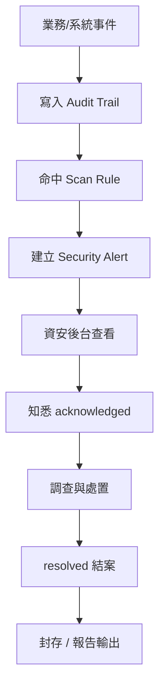
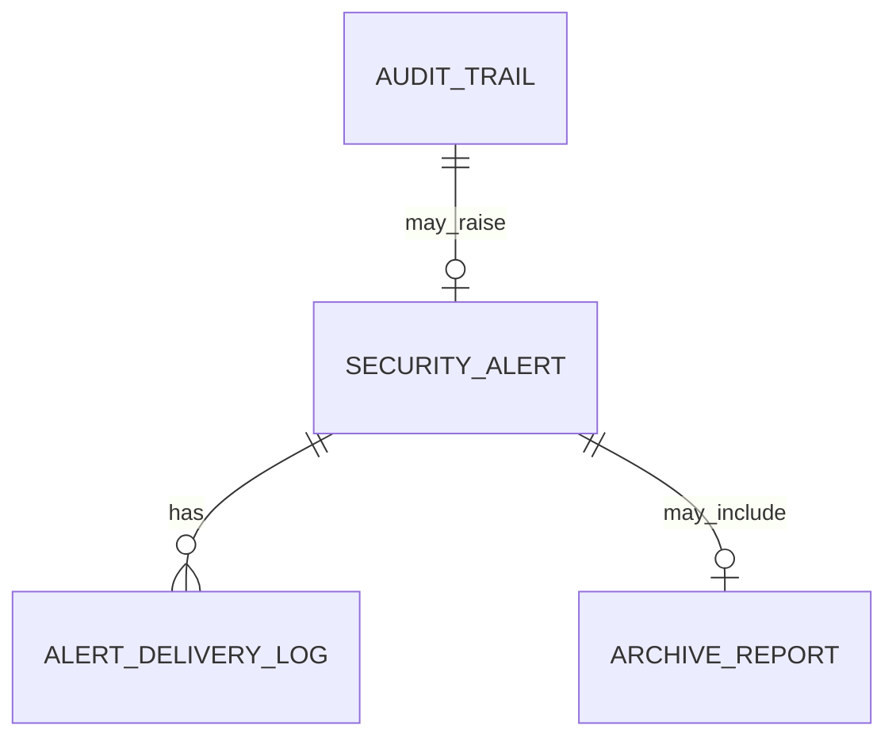
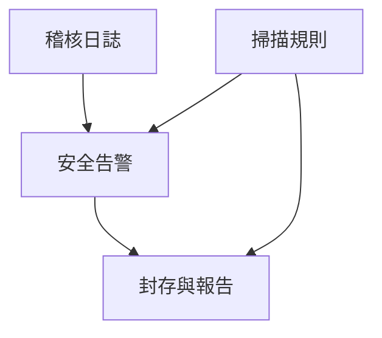

> 來源註記：本文件保留既有模塊拆分方式。凡文中未被客戶原始 PRD 明文定義的欄位、狀態碼、流程抽象或工程命名，均視為內部設計建議，不作為客戶權威需求表述。
>
> 對齊口徑：本文件已按主 PRD `v1.1` 與 `sql/tra_welfare_platform.sql` `v3.0-full` 收斂；資安後台以事件查詢、告警處置、封存包與報表庫為當前操作基線。

# M24《SEC－資安後台、告警處置與封存報告》子 PRD

## 1. 模塊名稱

SEC－資安後台、告警處置與封存報告

## 2. 模塊類型

後台頁面模塊

## 3. 模塊定位

本模塊是 SEC 的操作工作台，是資安稽核人員真正日常使用的後台界面。
如果 M23 解決的是「安全事件如何被寫入、掃描、升級與封存」，那 M24 解決的就是：

- 資安人員如何查詢與追蹤 audit trail
- 告警發生後如何知悉、認領、處理、結案
- 如何查看告警送達是否成功
- 如何用封存與報告能力回看歷史高風險事件
- 如何把跨模塊的風險訊號，轉為可執行的後台處置流程

總體 PRD 已把「資安後台 Security Console」作為獨立資訊架構區塊，且直接列出四個正式入口：稽核日誌、安全告警、掃描規則、封存與報告。這說明 SEC 不是只有資料表與服務，還必須有一套面向資安人員的可操作工作台。

## 4. 設計目標

1. 建立一套可用於日常資安追查的後台工作台，讓資安稽核人員不需透過資料庫或工程介面，便能完成查詢、處置與報告輸出。總體 PRD 已明確資安人員的主要操作是查詢日誌、處理告警、管理安全掃描與封存報告。
2. 將 audit、alert、delivery log、archive/report 四類資料在操作層串成閉環，避免安全事件只記錄不處置、只告警不追蹤、只封存不可查。這與總體 PRD 的平台目標「所有高風險操作都可被稽核、封存與追溯」一致。
3. 建立清晰的告警處置流程，讓新告警、已知悉、已結案等語義真正對應人員責任，而不是只有狀態碼。若系統採 `open / acknowledged / resolved`，屬內部字段設計。
4. 建立封存報告輸出機制，支撐合規、稽核、管理盤點與異常事件回溯，並對齊原始 PRD 的最近 30 天熱查與至少 3 年封存要求。
5. 與 M23 的底層安全能力、M09 的通知中台、各業務模塊的高風險事件輸出形成清晰分層。

## 5. 業務場景

### 場景 A：資安人員追查異常登入事件

系統命中 `auth` 類規則後，建立 audit 與告警；資安人員進入資安後台，按時間、操作人、action_code 搜尋事件，查看來源、操作結果與送達紀錄，判斷是否為真正風險。總體 PRD 的場景六直接把異常登入列為典型安全追查情境。

### 場景 B：敏感檔案下載後需要追蹤處置

當承辦或管理員下載敏感檔案時，系統留下 audit；若規則命中，升級為告警。資安人員不只要看到事件，還要能在告警頁做知悉、標記、處置備註與結案。總體 PRD 已明確敏感檔案下載需記錄稽核，且高風險事件必要時觸發告警。

### 場景 C：權限異常變更需要輸出安全報告

若短期內發生多次權限調整、資料範圍異常或越權痕跡，資安人員需要從稽核日誌與告警列表匯出報告，供內部治理或管理層盤點使用。總體 PRD 已把 `permission` 規則分類與 `Archive & Report` 正式列入 SEC 功能。

### 場景 D：封存資料仍需被追索

某次事件距今已超過熱資料查詢範圍，但仍落在至少 3 年封存期內。資安人員需透過封存與報告頁查詢摘要或封存索引，而不是完全無法取得。這直接來自總體 PRD 的留存治理要求。

### 場景 E：告警送達失敗後需判斷風險

若某高風險事件已建立 alert，但送達通知失敗，資安人員在後台需看見送達狀態、失敗原因與重試紀錄，判斷是否需要改用人工通知。總體 PRD 已把 `Alert Delivery Log` 列為正式功能，並在場景六中明確要求查看通知送達紀錄。

## 6. 業務流程解讀

### 6.1 資安後台操作主流程

資安後台的實際主流程可理解為：
事件發生 → audit 寫入 → rule 命中 → alert 建立 → 資安人員進後台查看 → 知悉/指派/處置 → 留存處理結果 → 進封存與報告。
這是把 M23 的底層能力轉換成實際操作鏈。

### 6.2 稽核查詢與告警處置的分工

建議資安後台明確分成兩類工作流：

- **Audit 查詢流**：偏調查、比對、追索、溯源
- **Alert 處置流**：偏待辦、知悉、跟進、結案、追蹤送達

也就是：

- audit 是證據流
- alert 是處置流

這與總體 PRD 對 Audit Trail 與 Security Alert 的雙層設計一致。

### 6.3 告警狀態流的操作語義

若系統採 `open / acknowledged / resolved` 三態，建議進一步定義操作語義：

- `open`：已建立，尚未被資安人員正式知悉
- `acknowledged`：已知悉，正在追查或處置
- `resolved`：已有結論並完成處理留痕

### 6.4 告警送達與處置的關係

送達成功不等於事件已處理，送達失敗也不等於事件不存在。
因此 M24 的告警詳情頁應同時展示：

- 告警本體
- 對應 audit 來源
- 送達狀態
- 處置狀態

這樣才能把「通知成功/失敗」和「事件是否已被處理」分開看。總體 PRD 的 `Security Alert` 與 `Alert Delivery Log` 正是兩條不同能力鏈。

### 6.5 封存與報告的後台語義

封存與報告不只是「匯出 Excel」，而是安全治理的一部分。
建議它至少解決三件事：

1. 日誌留存生命周期治理
2. 稽核/告警期間報告輸出
3. 封存資料仍可被索引追索

這直接對應總體 PRD 的 `Archive & Report` 功能定義與最近 30 天熱查、至少 3 年封存要求。

### 6.6 資安後台與系統管理後台的分工

總體資訊架構已把 `Security Console` 與 `Admin Console` 分開。
建議分工如下：

- **管理後台**：做業務與系統配置
- **資安後台**：做事件追查、告警處置、封存報告

這樣能避免把高風險治理能力混入一般營運操作頁。

## 7. 核心功能拆解

### 7.1 稽核日誌工作台

負責讓資安人員查詢與追索安全事件。
建議子能力包括：

- 多條件查詢
- 事件詳情
- 關聯目標物件跳轉
- 關聯告警查看
- 匯出查詢結果
- 時間區間聚合統計

總體 PRD 已明確 Audit Trail 是 SEC 一級功能，且場景六要求能查看事件來源、操作人、操作時間與事件結果。

### 7.2 安全告警工作台

負責集中查看與處理被升級的安全事件。
建議子能力包括：

- 告警列表
- 告警詳情
- 知悉 acknowledged
- 指派處理人
- 處置備註
- resolved 結案
- 關聯送達紀錄查看

### 7.3 告警送達查看

負責查看 alert 是否被通知成功。
建議子能力包括：

- 渠道類型
- 收件對象
- 發送時間
- 送達結果
- 失敗原因
- 重試紀錄

總體 PRD 已直接列出 `Alert Delivery Log`。

### 7.4 掃描規則工作台

M23 已定義規則引擎與規則分類；M24 則要提供後台管理頁。
建議子能力包括：

- 規則列表
- 分類導航
- 啟停開關
- 命中統計
- 最近掃描結果摘要
- 規則版本差異

### 7.5 掃描執行紀錄查看

負責查看每輪掃描狀況。
建議子能力包括：

- scan run 列表
- 執行狀態
- 命中數 / 告警數
- 部分失敗明細
- 重跑入口（若制度允許）

### 7.6 封存管理

負責管理 audit / alert 資料的封存批次與查詢。
建議子能力包括：

- 封存批次列表
- 封存數量摘要
- 封存期間篩選
- 封存任務狀態
- 封存失敗重試

### 7.7 報告輸出

負責把 audit 與 alert 資料轉成可交付報告。
建議子能力包括：

- 稽核報告
- 告警報告
- 掃描命中報告
- 期間風險趨勢報告
- 封存摘要報告

### 7.8 安全事件時間線

建議為單一 alert 或單一高風險事件提供時間線視圖，讓資安人員能一眼看到：

- audit 建立時間
- rule 命中時間
- alert 建立時間
- delivery 狀態
- acknowledged / resolved 時間

## 8. 與其他模塊的聯動關係

### 8.1 與 M23《稽核日誌、告警與掃描規則》的聯動

M23 是底層安全能力，M24 是它的操作工作台。
兩者邊界如下：

- M23：寫入、掃描、告警、封存能力本體
- M24：資安後台頁面、處置流程、報告輸出、查詢與操作入口

### 8.2 與 SYS 的聯動

SEC 與 SYS 在模組關係圖中直接相連。SYS 提供通知、檔案、字典與系統參數等底層能力；M24 則透過這些能力展示送達、檔案下載稽核與部分治理配置結果。

### 8.3 與 M09《通知中心》的聯動

安全告警的通知扇出可由 M09 承接，但告警送達結果與後續處置頁面應回到 M24 查看與管理。總體 PRD 的通知扇出時序圖支持這種分層。

### 8.4 與 AUTH / ORG / EMP 的聯動

這三個模塊是安全事件高頻來源：

- AUTH：登入異常、captcha、鎖定風險
- ORG：權限、角色、資料範圍異常
- EMP：敏感個資、快照與歷史不一致
  M24 作為後台工作台，需要能從 audit 詳情跳回來源目標摘要，而不一定直接允許編輯來源資料。

### 8.5 與 BEN / PAY / WF / ANN / MCH 的聯動

這些業務模塊的高風險操作都會進 audit，例如：

- approve / reject / return
- payment batch 回填
- disputed 處理
- 公告發布與下架
- 商店合約狀態變更
  M24 要能以 `target_type / target_id` 統一查看這些來源事件。總體字段表已明確這兩個安全字段。

### 8.6 與封存報告外部需求的聯動

雖總體 PRD 未細列外部合規報表格式，但既然明確要求封存與報告，本模塊就應預留對接內部稽核、管理盤點或法遵調閱的輸出能力。

## 9. 頁面規劃

本模塊作為後台頁面模塊，直接對應資安後台 4 類正式工作台，並在其中補足操作細節。

### 9.1 頁面一：稽核日誌頁

**定位**：安全事件證據查詢主頁。

**頁面區塊**

1. 查詢條件區
2. 稽核事件列表區
3. 事件詳情抽屜
4. 關聯告警與來源摘要區

**查詢條件建議**

- `actor_employee_id`
- `action_code`
- `target_type`
- `target_id`
- `severity_level`
- `rule_category`
- 時間區間
- `event_result`

### 9.2 頁面二：安全告警頁

**定位**：告警處置主頁。

**頁面區塊**

1. 告警統計卡
2. 告警列表區
3. 告警詳情區
4. 處置操作區
5. 告警送達摘要區

**列表欄位建議**

- alert_id
- alert_title
- severity_level
- alert_status
- rule_category
- created_at
- assigned_to
- latest_delivery_status

### 9.3 頁面三：掃描規則與執行紀錄頁

**定位**：規則治理與掃描追蹤頁。

**頁面區塊**

1. 規則分類導航
2. 規則列表
3. 規則詳情編輯區
4. 最近 scan run 列表
5. 命中統計摘要

### 9.4 頁面四：封存與報告頁

**定位**：資料留存治理與報告輸出頁。

**頁面區塊**

1. 封存政策摘要
2. 封存批次列表
3. 封存查詢區
4. 報告輸出區
5. 報表下載紀錄區

## 10. 底層能力說明

### 10.1 能力邊界

本模塊負責：

- 資安後台工作台
- 稽核查詢
- 告警知悉與結案
- 送達紀錄查看
- 規則工作台
- 封存查詢
- 報告輸出

本模塊不負責：

- audit 寫入本體
- scan 引擎本體
- 通知底層發送
- 檔案實體存儲
- 業務模塊資料本身編輯
- 權限體系定義本身

### 10.2 建議能力接口

- `searchAuditTrail(filters)`
- `getAuditDetail(auditId)`
- `searchSecurityAlerts(filters)`
- `acknowledgeAlert(alertId, comment)`
- `resolveAlert(alertId, resolutionNote)`
- `getAlertDeliveryLogs(alertId)`
- `listScanRules(category?)`
- `listScanRuns(filters)`
- `listArchiveBatches(filters)`
- `exportSecurityReport(reportType, filters)`

### 10.3 能力實現原則

- 稽核查詢與告警處置分層
- 告警詳情可反查來源 audit
- 報告輸出需留下載與匯出紀錄
- 所有高風險配置與處置操作帶 `revision`
- 後台顯示充分，但避免向非資安角色暴露不必要敏感細節

## 11. 角色權限與操作路徑

### 11.1 可操作角色

- 資安稽核人員：主使用者
- 系統管理員：可查看部分治理頁與異常摘要，但不應替代資安處置主責
- 其他角色：一般不直接操作 M24，只可能成為被稽核對象

總體 PRD 已明確資安稽核人員的主要操作就是查詢日誌、處理告警、管理安全掃描與封存報告。

### 11.2 操作路徑

資安後台 → 稽核日誌
資安後台 → 安全告警
資安後台 → 掃描規則
資安後台 → 封存與報告

### 11.3 權限建議

- 查看稽核日誌
- 查看告警
- 知悉告警
- 結案告警
- 查看送達紀錄
- 管理掃描規則
- 查看掃描執行紀錄
- 查看封存批次
- 匯出安全報告

其中「結案告警」「管理掃描規則」「匯出安全報告」建議視為高風險治理權限。

## 12. 關鍵字段/配置項說明

### 12.1 來自總體 PRD 的核心安全字段

總體字段表已明確：

- `audit_id`
- `actor_employee_id`
- `action_code`
- `target_type`
- `target_id`
- `severity_level`
- `alert_status`
- `rule_category`

### 12.2 建議的告警處置補充字段

| 字段名                   | 中文名稱     | 用途           |
| ------------------------ | ------------ | -------------- |
| assigned_to              | 指派處理人   | 告警責任人     |
| acknowledged_at          | 已知悉時間   | 處置開始時間   |
| resolution_note          | 處理結果說明 | 結案說明       |
| latest_delivery_status   | 最新送達狀態 | 告警通知摘要   |
| resolution_code_reserved | 處置結果碼   | 後續分析與報表 |
| archive_batch_id         | 封存批次 ID  | 對應封存資料   |

### 12.3 建議的報告輸出字段

| 字段名           | 中文名稱     | 用途                           |
| ---------------- | ------------ | ------------------------------ |
| report_id        | 報告 ID      | 主鍵                           |
| report_type      | 報告類型     | audit / alert / scan / archive |
| generated_by     | 產生人       | 匯出人                         |
| generated_at     | 產生時間     | 匯出時間                       |
| time_range_start | 起始時間     | 報表期間                       |
| time_range_end   | 結束時間     | 報表期間                       |
| report_file_id   | 報告檔案 ID  | 指向 `file_resource`           |
| revision         | 樂觀鎖版本號 | 併發防護                       |

### 12.4 建議配置項

- `sec.console.default_page_size`
- `sec.alert.assignment_enabled`
- `sec.alert.require_resolution_note_on_close`
- `sec.report.export_enabled`
- `sec.archive.search_index_retention_years`
- `sec.delivery_log.show_retry_detail`

這些配置都屬 M24 的操作層治理，與總體 PRD 的封存、告警與報告方向一致。

## 13. 異常情況與邊界條件

### 13.1 告警已 resolved 但無處理說明

不建議允許。若沒有 resolution note，後續稽核與管理報告難以成立。

### 13.2 匯出安全報告未留痕

不允許。報告匯出本身屬重要治理操作，應進 audit。

### 13.3 封存後查不到索引

不應發生。封存不等於不可追索，至少要保留索引或報告級摘要。

### 13.4 告警送達失敗但後台無法看到

不允許。總體 PRD 已明確 Alert Delivery Log 是正式功能。

### 13.5 非資安角色可直接結案高風險告警

不建議允許，除非有明確授權與審批流程。

### 13.6 稽核查詢因無資料範圍報錯

資安後台更應遵守權限與資料範圍設計，但總體 PRD 也明確：有功能權限但無資料範圍時，應顯示空列表而非系統錯誤。這條原則同樣適用於資安後台查詢體驗。

## 14. Mermaid 圖

### 14.1 資安後台工作流圖

### 14.2 告警詳情關聯圖

### 14.3 資安後台資訊架構圖

## 15. 研發落地建議

### 15.1 架構分層建議

- M23 負責安全能力本體
- M24 負責後台工作台與處置操作
- 報表輸出與封存檢索做獨立服務或清晰 service layer
- 告警處置與 audit 查詢分 query model，避免互相拖慢

### 15.2 查詢與展示建議

- 稽核列表支援高維度條件檢索
- 告警詳情頁要把來源事件、送達紀錄、處置結果放在同頁
- 封存查詢與熱資料查詢在 UI 上要明確區隔
- 報告輸出後保留下載歷程

### 15.3 併發與安全建議

- 告警 acknowledged / resolved 動作帶 revision
- 規則編輯帶 revision
- 報告匯出與封存查詢受權限與稽核控制
- 對高風險匯出可加二次確認

### 15.4 治理建議

- 長期 open 告警做超時提醒
- 規則變更前後差異在後台可視化
- 封存策略與保留年限在後台清晰展示
- 對告警處置效率建立週/月報表

## 16. 測試驗收要點

### 16.1 功能驗收

1. 資安人員可在後台查詢稽核日誌。
2. 可查看與處理安全告警。
3. 可查看告警送達紀錄。
4. 可查看掃描規則與掃描執行紀錄。
5. 可查詢封存批次並輸出報告。
   以上 1～5 點都直接對應總體 PRD 的資安後台資訊架構與 SEC 功能清單。

### 16.2 邊界驗收

1. 高風險操作同步寫入後，資安後台能即時查到。
2. 告警 resolved 前需要留下處理結論。
3. 封存後仍可透過索引或報告追索。
4. 無資料範圍時顯示空列表而不是系統錯誤。
   其中第 1、4 點直接對應總體 PRD 原則。

### 16.3 聯動驗收

1. M23 建立的 audit / alert 能被 M24 正確顯示。
2. M09 的告警通知結果能在 M24 看到 delivery log。
3. AUTH / ORG / PAY / ANN / MCH 等高風險事件可在 M24 被統一追查。
4. 封存報告可關聯來源 audit 與 alert。
   其中第 2、3 點都由總體 PRD 的場景六、模組關係與通知/告警設計支撐。

### 16.4 治理與安全驗收

1. 結案告警、規則調整、報告匯出都可被再次稽核。
2. revision 可阻止高風險治理操作靜默覆蓋。
3. 資安後台能力符合 MVP「稽核日誌與基本安全掃描」範圍。
4. 平台所有高風險操作都能被稽核追蹤的目標，可在 M24 操作層真正落地。
