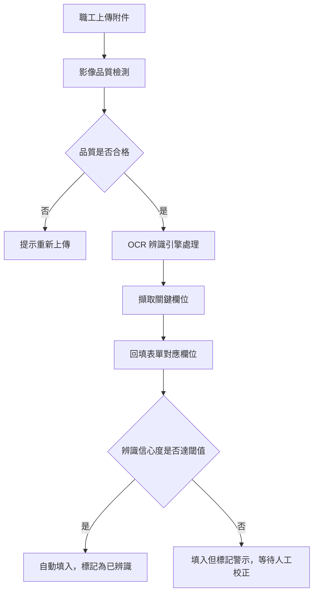
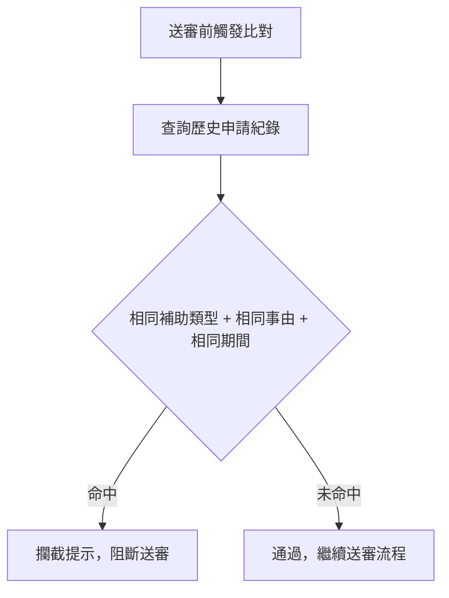
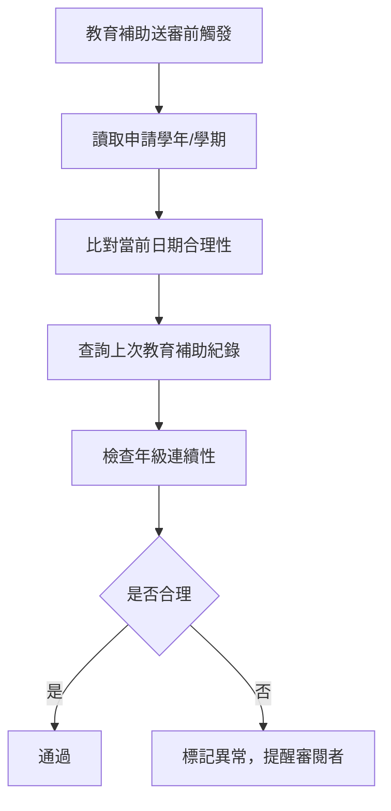
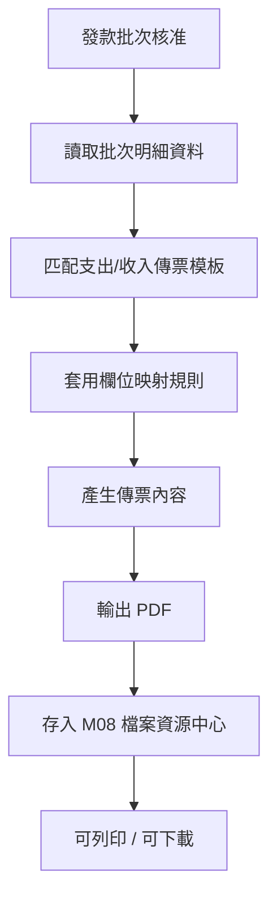
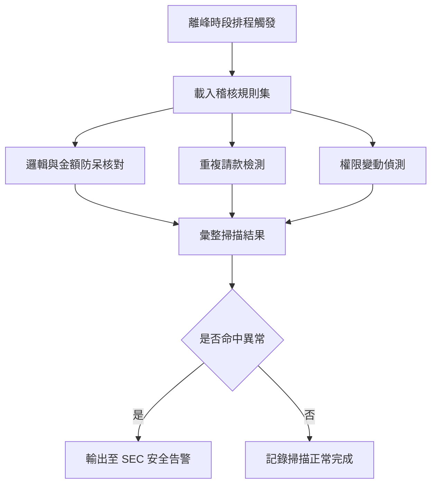
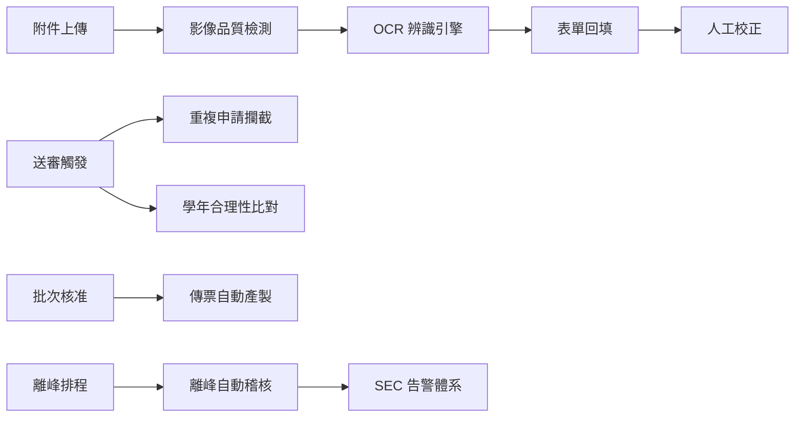
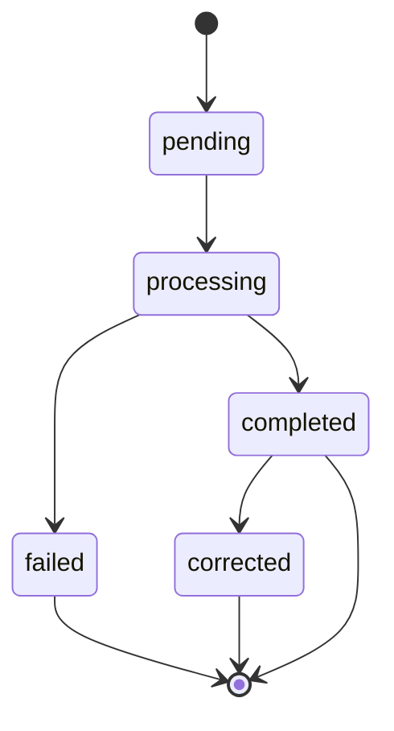
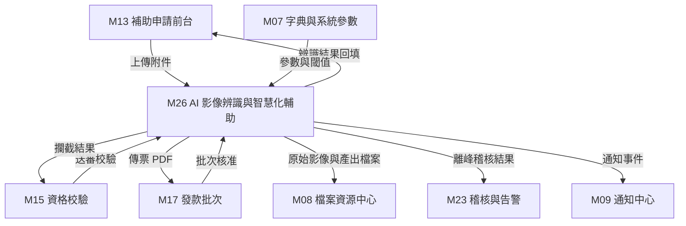

> 來源註記：本文件保留既有模塊拆分方式。凡文中未被客戶原始 PRD 明文定義的欄位、狀態碼、流程抽象或工程命名，均視為內部設計建議，不作為客戶權威需求表述。
>
> 對齊口徑：本文件已按主 PRD `v1.1` 與 `sql/tra_welfare_platform.sql` `v3.0-full` 收斂；AI 任務以 `文件辨識 / 影像品質 / 重複攔截 / 傳票產製 / 離峰掃描` 五張主表為當前系統基線。

# M26《AI－影像辨識與智慧化輔助》子 PRD

## 1. 模塊名稱

AI－影像辨識與智慧化輔助

## 2. 模塊類型

底層能力模塊

## 3. 模塊定位

本模塊是整個福利平台的**智慧化能力底座**，負責把原始需求第四章所定義的 AI 第五層能力，收斂成可被補助申請、發款批次、稽核掃描等業務主鏈調用的共用服務。

如果前面 M01～M24 解決的是業務如何流轉與治理，那本模塊解決的就是：

- 職工上傳附件時，系統能否自動辨識關鍵欄位並回填
- 上傳的影像品質是否達到辨識門檻
- 同一人是否在相同補助類型、相同事由、相同期間重複申請
- 教育補助的學年/學期與申請時間是否合理
- 批次撥款時是否能自動產製支出/收入傳票
- 離峰時段是否能自動進行邏輯與金額防呆核對

原始需求已明確 AI 層包含排序調度、辨識模型、離峰資料檢測與資料比對四大子層；本模塊將這些能力從業務頁面與流程中抽出，形成統一、可配置、可追蹤的智慧化服務層。

## 4. 設計目標

1. 建立 OCR 影像辨識能力，支援戶口名簿、學生證、診斷證明書、收據等常見附件的關鍵欄位自動擷取與表單回填。原始需求已明確辨識對象與回填場景。
2. 建立影像品質檢測能力，在辨識前攔截模糊、傾斜、裁切不全或解析度過低的影像，避免無效辨識浪費資源。原始需求已要求影像品質不合格時自動提示並拒絕。
3. 建立重複申請攔截能力，基於歷史申請紀錄比對「相同補助類型＋相同事由＋相同期間」，攔截疑似重複申請。
4. 建立學年進度合理性比對能力，檢查教育補助的學年/學期與申請時間的合理性及就讀年級的連續性。
5. 建立財務傳票自動產製能力，根據批次資料自動套用支出/收入傳票模板，格式與財會單位紙本憑證 1:1 對齊，支援 PDF 輸出與列印。原始需求已明確此為預期效益之一。
6. 建立離峰自動稽核能力，利用離峰時段進行邏輯與金額防呆核對、重複請款檢測與權限變動偵測，與 SEC 模塊形成協同。
7. 為所有 AI 辨識與比對結果提供人工校正機制與可追溯紀錄，確保自動化不脫離人工治理。

## 5. 業務場景

### 場景 A：職工上傳戶口名簿觸發 OCR 辨識

職工申請結婚、生育/育兒或慰問金類補助時上傳戶口名簿等影像，系統自動觸發 OCR 辨識，擷取姓名、身分證號、出生日期、戶籍地址等欄位，將結果回填至申請表單對應欄位。若辨識結果有誤，系統跳出警示，審閱者可執行人工校正。原始需求已直接列出戶口名簿作為 OCR 對象，並要求辨識錯誤時跳出警示、支援人工校正。

### 場景 B：上傳模糊影像被自動攔截

職工上傳一張嚴重模糊的學生證照片，系統在 OCR 辨識前先執行品質檢測，判定影像不合格後自動提示「影像模糊，請重新拍攝上傳」，不進入辨識流程。原始需求已要求影像模糊、傾斜、裁切不全時自動提示，並拒絕品質過低的影像。

### 場景 C：重複申請被攔截提示

某職工已在本年度申請過子女教育補助（112 學年度上學期），再次以相同事由與期間送出申請時，系統比對歷史紀錄後攔截並提示「同一補助類型、同一事由、同一期間已有申請紀錄」。原始需求已明確此比對規則。

### 場景 D：學年進度不合理被標記

某職工為子女申請教育補助，填寫的學年/學期與當前日期明顯不符（例如 3 月份申請下學期補助但學期尚未開始），或就讀年級與上次申請不連續（例如從國小三年級跳到國小五年級），系統標記為異常並提醒審閱者複核。

### 場景 E：承辦觸發傳票自動產製

發款批次核准後，承辦點擊「產製傳票」，系統根據批次內案件明細自動套用支出傳票模板，產生與財會單位紙本憑證格式 1:1 對齊的 PDF 檔案，供列印與歸檔。原始需求已明確傳票自動產製為系統預期效益。

### 場景 F：離峰時段自動稽核掃描

每日凌晨離峰時段，系統自動執行批次稽核掃描，包含邏輯與金額防呆核對（如批次總額與明細加總不符）、重複請款檢測（同一案件出現在多筆已撥款批次）、權限變動偵測（近期有高風險權限異動的帳號操作了敏感資料）。掃描結果輸出至 SEC 模塊的安全告警體系。

## 6. 業務流程解讀

### 6.1 OCR 辨識主流程

此流程直接對應原始需求的 OCR 影像辨識說明：自動擷取關鍵欄位、結果回填至表單、如有錯誤跳出警示、支援人工校正。

### 6.2 影像品質檢測判定層次

原始需求已要求對模糊、傾斜、裁切不全的影像自動提示並拒絕品質過低者。建議品質檢測分三層：

- **硬性拒絕**：解析度低於最低門檻、檔案損壞、非影像格式
- **警告提示**：輕微模糊、輕微傾斜但仍可辨識
- **通過**：品質符合辨識要求

### 6.3 重複申請攔截流程

原始需求已明確比對規則為「相同補助類型＋相同事由＋相同期間」。

### 6.4 學年進度合理性比對流程

### 6.5 傳票自動產製流程

原始需求已要求格式需與財會單位紙本憑證 1:1 對齊，支援 PDF 輸出與列印。

### 6.6 離峰自動稽核流程

此流程與 M23/SEC 的掃描規則體系形成協同，原始需求已明確離峰資料檢測為 AI 層四大子層之一。

### 6.7 AI 任務排序調度

原始需求將排序調度列為 AI 層第一子層。建議實作為任務佇列管理機制：

- OCR 辨識任務依上傳時間排序
- 離峰稽核任務按規則優先級排序
- 傳票產製任務按批次核准時間排序
- 佇列支持優先級調整與失敗重試

## 7. 核心功能拆解

### 7.1 OCR 影像辨識引擎

負責從上傳影像中自動擷取關鍵欄位。
建議子能力包括：

- 支援文件類型：戶口名簿、學生證、診斷證明書、收據
- 欄位擷取：姓名、日期、金額、學校名稱、身分證號、地址等
- 辨識結果結構化輸出
- 信心度分數輸出
- 辨識失敗降級處理

### 7.2 影像品質檢測

負責在 OCR 辨識前判定影像品質是否達標。
建議子能力包括：

- 解析度檢測
- 模糊度檢測
- 傾斜角度檢測
- 裁切完整性檢測
- 品質等級判定與提示訊息輸出

### 7.3 辨識結果回填與人工校正

負責將 OCR 辨識結果對應至表單欄位，並支援人工修正。
建議子能力包括：

- 欄位映射規則（文件類型→表單欄位）
- 自動回填
- 低信心度警示標記
- 審閱者人工校正介面
- 校正前後差異記錄

### 7.4 重複申請攔截

負責比對歷史申請紀錄，攔截疑似重複申請。
建議子能力包括：

- 比對維度：補助類型＋事由＋期間
- 比對範圍：同一申請人
- 命中時阻斷送審並提示
- 攔截紀錄留存
- 支援人工放行（需審閱者確認）

### 7.5 學年進度合理性比對

負責檢查教育補助申請的時間與學年合理性。
建議子能力包括：

- 學年/學期與申請日期的合理區間比對
- 就讀年級連續性檢查
- 異常標記與提醒
- 比對結果供審閱者參考

### 7.6 財務傳票自動產製

負責根據批次資料自動生成傳票文件。
建議子能力包括：

- 支出傳票模板
- 收入傳票模板
- 欄位自動映射（批次→傳票）
- 格式與紙本憑證 1:1 對齊
- PDF 輸出
- 列印支援
- 傳票檔案存入 M08 檔案資源中心

### 7.7 離峰自動稽核

負責在離峰時段執行批次稽核掃描。
建議子能力包括：

- 邏輯與金額防呆核對
- 重複請款檢測
- 權限變動偵測
- 排程配置
- 掃描結果輸出至 SEC

### 7.8 AI 任務排序調度

負責管理所有 AI 任務的執行順序與資源分配。
建議子能力包括：

- 任務佇列管理
- 優先級排序
- 失敗重試
- 執行狀態追蹤
- 佇列深度監控

## 8. 與其他模塊的聯動關係

### 8.1 與 M13/M15《BEN 補助申請與校驗》的聯動

補助申請時上傳附件即觸發 OCR 辨識與品質檢測；送審前觸發重複申請攔截與學年合理性比對。M15 的送審校驗流程中可嵌入本模塊的比對結果作為額外校驗維度。原始需求已明確使用者上傳附件時自動觸發 AI 辨識。

### 8.2 與 M17《PAY 發款批次》的聯動

發款批次核准後可調用傳票自動產製能力，生成支出傳票 PDF。傳票檔案通過 `voucher_file_id` 綁定至批次主檔。原始需求已明確系統自動產製支出傳票與報銷單為預期效益。

### 8.3 與 M08《SYS 檔案資源中心》的聯動

OCR 辨識的原始影像存儲在 M08，辨識結果與原始影像走檔案資源中心。產製的傳票 PDF 也存入 M08。所有 AI 處理的輸入檔案與輸出檔案均通過 `file_id` 統一管理。

### 8.4 與 M23/M24《SEC 稽核與資安》的聯動

離峰自動稽核的掃描規則與 SEC 的掃描規則體系對齊；稽核結果輸出至 SEC 安全告警體系。AI 辨識的異常事件（如大量辨識失敗、異常上傳行為）也應回流 SEC。原始需求已明確離峰資料檢測與 SEC 模塊協同。

### 8.5 與 M07《SYS 字典與系統參數》的聯動

AI 模型參數、辨識信心度閾值、品質檢測門檻、離峰排程時段、傳票模板版本等配置項由 M07 統一治理。原始需求已提及 AI 模型參數和閾值配置歸 SYS 管理。

### 8.6 與 M06《EMP 資格歷史》的聯動

學年進度合理性比對需讀取歷史教育補助紀錄與眷屬就學資訊；重複申請攔截需查詢申請人歷史申請紀錄，間接依賴 EMP 資料體系。

### 8.7 與 M09《SYS 通知中心》的聯動

辨識完成、校正提醒、攔截通知、傳票產製完成等事件可透過 M09 通知中心推送站內通知或郵件。

## 9. 頁面規劃

本模塊屬底層能力模塊，但為了治理與監控，建議提供以下視圖。

### 9.1 視圖一：AI 辨識結果校正頁

**定位**：審閱者查看 OCR 辨識結果並執行人工校正。

**頁面區塊**

1. 原始影像預覽區
2. 辨識結果欄位列表（含信心度分數）
3. 表單回填對照區
4. 人工校正編輯區
5. 校正提交與歷程紀錄區

**交互建議**

- 低信心度欄位以醒目色標示
- 支援逐欄位校正與批次確認
- 校正前後差異可回溯

### 9.2 視圖二：AI 辨識統計儀表板

**定位**：管理者查看 AI 辨識整體運行狀況與品質指標。

**頁面區塊**

1. 辨識總量統計卡（日/週/月）
2. 辨識成功率趨勢圖
3. 品質檢測攔截率統計
4. 按文件類型分布統計
5. 人工校正率統計
6. 平均辨識耗時統計

### 9.3 視圖三：傳票產製管理頁

**定位**：承辦查看與管理傳票自動產製結果。

**頁面區塊**

1. 傳票產製任務列表
2. 任務狀態篩選區
3. 傳票預覽與下載區
4. 產製失敗重試區
5. 批次與傳票關聯摘要

### 9.4 視圖四：離峰稽核掃描結果頁

**定位**：與 SEC 資安後台整合，查看離峰自動稽核結果。

**頁面區塊**

1. 掃描批次列表
2. 命中異常摘要
3. 金額防呆核對結果
4. 重複請款檢測結果
5. 權限變動偵測結果

此視圖可作為 M24 資安後台的子頁面呈現，不必獨立入口。

### 9.5 視圖五：AI 模型參數配置頁

**定位**：管理者配置 AI 相關閾值與參數。

**頁面區塊**

1. OCR 信心度閾值配置
2. 影像品質門檻配置
3. 離峰排程時段配置
4. 傳票模板版本管理
5. 任務佇列監控

此視圖可併入 M07 系統參數後台，以 AI 分類呈現。

## 10. 底層能力說明

### 10.1 能力邊界

本模塊負責：

- OCR 影像辨識
- 影像品質檢測
- 辨識結果回填與人工校正
- 重複申請攔截
- 學年進度合理性比對
- 財務傳票自動產製
- 離峰自動稽核
- AI 任務排序調度

本模塊不負責：

- 補助申請表單頁面交互（歸 M13）
- 送審前資格/附件/年度上限校驗（歸 M15）
- 檔案實體存儲（歸 M08）
- 發款批次建立與送審（歸 M17）
- 安全告警建立與處置（歸 M23/M24）
- 流程模板與待辦執行（歸 WF）
- 通知實際發送（歸 M09）

### 10.2 建議能力接口

- `checkImageQuality(fileId)` — 影像品質檢測
- `recognizeDocument(fileId, documentType)` — OCR 辨識
- `getRecognitionResult(recognitionId)` — 取得辨識結果
- `correctRecognitionField(recognitionId, fieldCode, correctedValue)` — 人工校正
- `checkDuplicateApplication(applicantId, applicationType, reason, period)` — 重複申請攔截
- `validateAcademicProgress(applicantId, applicationId, schoolYear, semester, grade)` — 學年合理性比對
- `generateVoucher(paymentBatchId, voucherTemplateCode)` — 傳票產製
- `runOffPeakAudit(ruleSetCode)` — 離峰稽核
- `getAiTaskStatus(taskId)` — 任務狀態查詢
- `getRecognitionStatistics(filters)` — 辨識統計

### 10.3 能力實現原則

- OCR 辨識採非同步任務模式，避免阻塞使用者上傳流程
- 影像品質檢測採同步模式，即時回饋使用者
- 所有辨識與比對結果保留完整紀錄，供稽核追溯
- 離峰稽核與 SEC 掃描規則共用排程基礎設施
- 傳票模板與業務資料嚴格分離，模板可獨立版本管理
- AI 模型參數與閾值可透過 M07 配置，不硬編碼

## 11. 角色權限與操作路徑

### 11.1 可操作角色

- 一般職工：上傳附件時自動觸發 AI 辨識與品質檢測，為間接使用者
- 審閱者（福利社承辦人/審核主管）：查看 AI 辨識結果，執行人工校正，確認或放行攔截
- 管理者（系統管理員）：查看 AI 辨識統計、管理傳票模板、配置 AI 參數與閾值
- 資安稽核人員：查看離峰稽核結果、追蹤 AI 異常事件

原始需求已明確上述角色映射：使用者上傳附件時自動觸發、審閱者查看結果並校正、管理者查看統計與傳票產製。

### 11.2 操作路徑

前台 Portal → 補助申請 → 上傳附件 → 自動觸發品質檢測與 OCR
管理後台 → 補助業務 → 案件詳情 → AI 辨識結果與校正
管理後台 → 發款管理 → 批次詳情 → 產製傳票
管理後台 → AI 管理 → 辨識統計儀表板
管理後台 → 系統設定 → AI 參數配置
資安後台 → 離峰稽核掃描結果

### 11.3 權限建議

- 觸發 OCR 辨識（隨附件上傳自動觸發）
- 查看辨識結果
- 執行人工校正
- 放行重複申請攔截
- 查看辨識統計
- 觸發傳票產製
- 下載傳票 PDF
- 管理傳票模板
- 配置 AI 參數與閾值
- 查看離峰稽核結果

其中「放行重複申請攔截」「管理傳票模板」「配置 AI 參數與閾值」建議視為高風險治理權限。

## 12. 關鍵字段/配置項說明

### 12.1 OCR 辨識紀錄字段

| 字段名              | 中文名稱     | 用途                                      |
| ------------------- | ------------ | ----------------------------------------- |
| recognition_id      | 辨識紀錄 ID  | 主鍵                                      |
| file_id             | 原始檔案 ID  | 關聯 M08                                  |
| document_type       | 文件類型     | household_register / student_id / medical_certificate / receipt |
| application_id      | 關聯申請 ID  | 回填目標                                  |
| recognition_status  | 辨識狀態     | pending / processing / completed / failed |
| confidence_score    | 整體信心度   | 0～1                                      |
| recognized_fields   | 辨識欄位集合 | JSON 結構化存儲                            |
| corrected_fields    | 校正欄位集合 | 人工校正後的值                             |
| corrected_by        | 校正人       | 審閱者員工 ID                              |
| corrected_at        | 校正時間     | 追蹤用                                    |
| created_at          | 建立時間     | 任務建立時間                               |
| completed_at        | 完成時間     | 辨識完成時間                               |

### 12.2 影像品質檢測紀錄字段

| 字段名              | 中文名稱     | 用途                              |
| ------------------- | ------------ | --------------------------------- |
| quality_check_id    | 品質檢測 ID  | 主鍵                              |
| file_id             | 檔案 ID      | 關聯 M08                          |
| resolution_score    | 解析度分數   | 像素密度評分                       |
| blur_score          | 模糊度分數   | 清晰度評分                         |
| skew_angle          | 傾斜角度     | 度數                              |
| crop_completeness   | 裁切完整度   | 百分比                            |
| overall_quality     | 綜合品質等級 | pass / warning / reject           |
| check_message       | 提示訊息     | 回饋使用者                         |
| checked_at          | 檢測時間     | 執行時間                           |

### 12.3 重複申請攔截紀錄字段

| 字段名              | 中文名稱     | 用途                                  |
| ------------------- | ------------ | ------------------------------------- |
| intercept_id        | 攔截紀錄 ID  | 主鍵                                  |
| application_id      | 當前申請 ID  | 被攔截申請                            |
| matched_application_id | 命中申請 ID | 歷史重複申請                          |
| match_type          | 比對類型     | same_type_reason_period               |
| intercept_result    | 攔截結果     | blocked / overridden                  |
| overridden_by       | 放行人       | 審閱者員工 ID，可空                    |
| overridden_at       | 放行時間     | 可空                                  |
| created_at          | 建立時間     | 比對執行時間                           |

### 12.4 傳票產製紀錄字段

| 字段名              | 中文名稱     | 用途                              |
| ------------------- | ------------ | --------------------------------- |
| voucher_gen_id      | 傳票產製 ID  | 主鍵                              |
| payment_batch_id    | 發款批次 ID  | 關聯 M17                          |
| voucher_template_code | 傳票模板代碼 | 套用模板                          |
| voucher_type        | 傳票類型     | expenditure / revenue             |
| generated_file_id   | 產出檔案 ID  | PDF 檔案，關聯 M08                |
| gen_status          | 產製狀態     | pending / completed / failed      |
| generated_at        | 產製時間     | 完成時間                           |
| generated_by        | 觸發人       | 承辦員工 ID                        |

### 12.5 離峰稽核掃描紀錄字段

| 字段名              | 中文名稱     | 用途                              |
| ------------------- | ------------ | --------------------------------- |
| offpeak_scan_id     | 離峰掃描 ID  | 主鍵                              |
| scan_type           | 掃描類型     | logic_check / duplicate_payment / permission_change |
| started_at          | 開始時間     | 執行時間                           |
| finished_at         | 結束時間     | 執行時間                           |
| hit_count           | 命中數       | 異常數量                           |
| alert_count         | 告警數       | 升級至 SEC 告警數                  |
| scan_status         | 執行狀態     | success / partial_failed / failed |
| linked_scan_run_id  | 關聯 SEC 掃描 ID | 與 M23 掃描批次關聯              |

### 12.6 建議配置項

- `ai.ocr.confidence_threshold` — OCR 信心度閾值，低於此值標記警示
- `ai.ocr.supported_document_types` — 支援辨識的文件類型清單
- `ai.quality.min_resolution` — 影像最低解析度門檻
- `ai.quality.max_blur_score` — 模糊度上限
- `ai.quality.max_skew_angle` — 傾斜角度上限
- `ai.duplicate.match_dimensions` — 重複比對維度
- `ai.academic.valid_period_rules` — 學年合理性區間規則
- `ai.voucher.template_version` — 傳票模板當前版本
- `ai.voucher.output_format` — 傳票輸出格式
- `ai.offpeak.schedule_cron` — 離峰稽核排程
- `ai.offpeak.enabled_scan_types` — 啟用的離峰掃描類型
- `ai.task.queue_max_size` — 任務佇列上限
- `ai.task.retry_max_count` — 任務失敗重試上限

這些配置與原始需求中 AI 模型參數和閾值配置歸 SYS 管理的要求一致。

## 13. 異常情況與邊界條件

### 13.1 OCR 辨識完全失敗

若影像通過品質檢測但 OCR 引擎無法辨識任何欄位，應將辨識狀態標記為 `failed`，通知使用者手動填寫。不可因辨識失敗而阻斷申請流程本身。

### 13.2 辨識結果與表單已填內容衝突

若職工已手動填寫部分欄位，而 OCR 辨識結果與之不一致，應提示衝突欄位供使用者選擇，不可靜默覆蓋。

### 13.3 品質檢測誤判

品質檢測閾值可能導致誤判（合格影像被拒或不合格影像通過），應提供閾值可調整機制，並在統計儀表板中追蹤攔截率異常。

### 13.4 重複申請攔截被人工放行

放行必須由具備權限的審閱者執行，並留下完整放行紀錄（放行人、時間、原因）。放行紀錄應可被 SEC 追查。

### 13.5 傳票產製格式與紙本不對齊

若模板更新後與財會單位紙本憑證格式不一致，應由管理者及時更新模板。建議傳票產製前可預覽，確認格式無誤後再正式輸出。

### 13.6 離峰稽核與 SEC 掃描規則衝突

本模塊的離峰稽核與 M23 的掃描規則應有明確分工：本模塊側重業務邏輯層面（金額防呆、重複請款），M23 側重安全治理層面（權限異常、操作異常）。兩者輸出可合併進入同一告警體系，但規則定義不應重複。

### 13.7 AI 任務佇列積壓

若短時間內大量附件上傳導致佇列積壓，應有佇列深度告警機制，必要時啟用降級策略（如暫緩低優先級任務）。

### 13.8 模型版本更新後辨識結果不一致

AI 模型更新後，歷史辨識結果不應被覆蓋。新模型只應用於新任務，歷史紀錄保留原始辨識版本。

## 14. Mermaid 圖

### 14.1 AI 能力總覽關係圖

### 14.2 OCR 辨識狀態圖

### 14.3 AI 模塊與上下游關係圖

## 15. 研發落地建議

### 15.1 架構分層建議

- 影像品質檢測作為前置閘門，同步返回結果
- OCR 辨識作為非同步任務服務，透過佇列管理
- 重複申請攔截與學年比對作為送審前的同步校驗擴展
- 傳票產製作為批次後處理的非同步任務
- 離峰稽核作為排程驅動的批次掃描
- 任務調度作為統一的佇列與排程基礎設施

這種分層讓同步與非同步能力各司其職，避免 AI 處理拖慢業務主流程。

### 15.2 模型部署建議

- OCR 引擎建議採用可替換架構，支援未來更換或升級辨識模型
- 品質檢測可先用輕量規則（解析度、模糊度閾值），後續可升級為 AI 模型
- 辨識模型版本與辨識紀錄綁定，確保歷史可追溯
- 建議預留模型 A/B 測試能力，新模型可先灰度驗證

### 15.3 傳票模板治理建議

- 傳票模板應獨立於程式碼，存放在可配置的模板庫中
- 模板變更需版本管理，舊版模板不可刪除
- 每次產製紀錄關聯模板版本，確保可回溯
- 與財會單位建立模板校對機制，定期確認格式一致性

### 15.4 效能與資源建議

- OCR 辨識為計算密集型任務，建議獨立部署服務
- 離峰稽核佔用資源較大，嚴格限制在離峰時段執行
- 任務佇列設上限與告警，防止資源耗盡
- 大批量傳票產製建議分段執行，避免記憶體溢出

### 15.5 治理與安全建議

- 所有辨識紀錄、校正紀錄、攔截紀錄、放行紀錄均應保留完整審計軌跡
- 辨識結果中如包含身分證號等敏感資料，需遵循平台敏感資料保護原則（加密與遮罩）
- AI 參數變更本身應納入稽核
- 離峰稽核規則變更需保留 before/after 差異

## 16. 測試驗收要點

### 16.1 功能驗收

1. 上傳戶口名簿、學生證、診斷證明書、收據可觸發 OCR 辨識並回填對應欄位。
2. 模糊、傾斜、裁切不全的影像可被品質檢測攔截並提示使用者。
3. 相同補助類型＋相同事由＋相同期間的重複申請可被攔截。
4. 教育補助的學年/學期不合理或年級不連續可被標記。
5. 發款批次核准後可自動產製傳票 PDF，格式與紙本憑證一致。
6. 離峰時段可自動執行稽核掃描並輸出結果。
以上 1～6 點都直接對應原始需求的 AI 功能描述。

### 16.2 邊界驗收

1. OCR 辨識失敗時不阻斷申請流程。
2. 辨識結果與已填欄位衝突時提示而非靜默覆蓋。
3. 重複申請攔截可被有權限的審閱者人工放行。
4. 品質檢測閾值可由管理者調整。
5. 傳票模板更新後舊版紀錄仍可追溯。
6. AI 任務佇列積壓時有告警機制。

### 16.3 聯動驗收

1. M13 上傳附件時可正確觸發品質檢測與 OCR 辨識。
2. M15 送審校驗可整合重複申請攔截與學年合理性結果。
3. M17 批次核准後可調用傳票產製並綁定 `voucher_file_id`。
4. 離峰稽核結果可正確輸出至 M23/SEC 告警體系。
5. 產製的傳票 PDF 可正確存入 M08 檔案資源中心。
6. AI 參數可透過 M07 系統參數配置生效。

### 16.4 治理與安全驗收

1. 所有辨識、校正、攔截、放行紀錄可被追蹤。
2. 辨識結果中的敏感資料遵循加密與遮罩原則。
3. AI 參數變更可被稽核追查。
4. 離峰稽核規則與 SEC 掃描規則無重複定義。
5. 辨識統計儀表板可正確反映運行指標。

### 16.5 效能驗收

1. 影像品質檢測可在 2 秒內同步返回結果。
2. OCR 辨識任務在佇列正常時可在 30 秒內完成。
3. 傳票產製可在合理時間內完成批次處理。
4. 離峰稽核可在設定時段內完成全量掃描。
