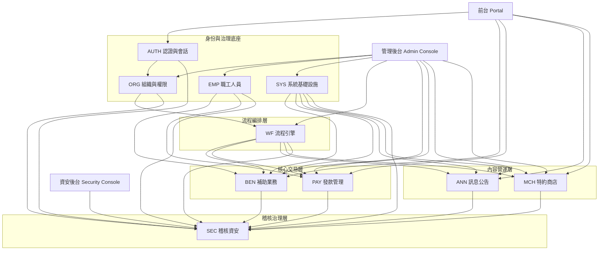

# 第一階段：模塊拆分總覽

---

[toc]

---

## 一、拆分原則與策略

這次不建議直接沿用總體 PRD 的 10 個一級模組做「一模塊一文件」，而是改用「**領域模塊 + 頁面模塊 + 共用能力模塊**」的方式拆成子 PRD。原因是總體 PRD 中有不少模塊本身同時包含頁面、流程、規則與排程能力，如果不再往下拆，後續設計、研發與測試仍然會面臨邊界不清的問題。像 BEN、PAY、ANN、MCH、SYS、WF 都屬於這種情況。

本次拆分採 4 個原則：

1. **按工程可落地邊界拆**：凡是可獨立開發、獨立測試、獨立驗收的功能域，都拆成單獨子 PRD。
2. **頁面與能力分離**：後台頁面是操作承載；流程、通知、排程、校驗、快照、稽核是共用能力，要單獨成文。
3. **以主鏈路優先**：先保證「身份/權限 → 申請 → 審批 → 發款 → 領款確認/異議」主線清晰，再展開公告、商店與資安治理。
4. **按聯動關係分層輸出**：先底座，再流程，再業務，再營運內容，再稽核安全。這樣工程理解路徑最順。

------

## 二、系統模塊拆分清單

下面是建議的 **24 份子 PRD** 清單。
其中分類說明如下：

- **後台頁面模塊**：以後台/資安後台操作頁為主體
- **底層能力模塊**：以規則、引擎、服務、排程、校驗、會話等能力為主
- **業務支撐模塊**：以實際業務閉環、前台業務承載或業務結果輸出為主

> 說明：前台頁面模塊此次歸入「業務支撐模塊」，但在後續子 PRD 中仍會完整補充頁面規劃與交互邏輯。

### 2.1 模塊拆分表

| 編號 | 子 PRD 模塊名稱                                      | 所屬一級域 | 模塊分類     | 簡要職責                                             |
| ---- | ---------------------------------------------------- | ---------- | ------------ | ---------------------------------------------------- |
| M01  | AUTH-登入與帳號安全                                  | AUTH       | 底層能力模塊 | 管理登入、失敗次數、Captcha 觸發、鎖定與風險判斷     |
| M02  | AUTH-帳號啟活、重設密碼與 SSO 綁定                   | AUTH       | 底層能力模塊 | 管理帳號啟活、忘記密碼、身份綁定與後續 SSO 預留      |
| M03  | ORG-組織樹與任職配置                                 | ORG        | 後台頁面模塊 | 管理委員會/小組/分處/角色節點與固定職位任職人        |
| M04  | ORG-角色、功能權限與資料範圍                         | ORG        | 後台頁面模塊 | 管理角色授權、功能點、資料範圍聯集與 deny 規則       |
| M05  | EMP-員工主檔與眷屬管理                               | EMP        | 後台頁面模塊 | 管理員工基本資料、眷屬資料與關聯資訊                 |
| M06  | EMP-資格歷史、扣繳歷史、快照與變更日誌               | EMP        | 底層能力模塊 | 維護資格/扣繳歷史、快照回寫與夜間校正、變更可追溯    |
| M07  | SYS-字典與系統參數                                   | SYS        | 後台頁面模塊 | 治理狀態、類型、分類、參數與系統行為配置             |
| M08  | SYS-檔案資源中心                                     | SYS        | 後台頁面模塊 | 統一檔案上傳、存儲、引用、下載與 file_id 管理        |
| M09  | SYS-通知中心、模板與外寄任務                         | SYS        | 底層能力模塊 | 管理站內通知、模板變數、Outbox、Email 發送與送達記錄 |
| M10  | WF-流程模板與節點配置                                | WF         | 後台頁面模塊 | 管理流程模板、節點、退回策略、角色映射               |
| M11  | WF-待辦中心與審批執行                                | WF         | 後台頁面模塊 | 管理待辦列表、核准、退回、駁回與流程實例執行         |
| M12  | WF-超時掃描與流程事件                                | WF         | 底層能力模塊 | 提供 5 分鐘掃描、超時通知、事件記錄與自動動作邊界    |
| M13  | BEN-補助申請前台                                     | BEN        | 業務支撐模塊 | 員工建立申請、草稿保存、送審、補件、查詢與列印       |
| M14  | BEN-補助案件後台                                     | BEN        | 後台頁面模塊 | 承辦/主管查看案件、審批、退回、駁回、重送管理        |
| M15  | BEN-資格校驗、附件校驗、年度上限、表單版本與列印模板 | BEN        | 底層能力模塊 | 承擔送審前校驗、版本對應、列印模板映射等規則能力     |
| M16  | PAY-待發款池與案件入池規則                           | PAY        | 業務支撐模塊 | 將已核准案件納入可發款池並防止重複入批               |
| M17  | PAY-發款批次、送審與撥款回填                         | PAY        | 後台頁面模塊 | 建立批次、上傳傳票、送審、核准後回填人工撥款結果     |
| M18  | PAY-領款確認與異議處理                               | PAY        | 業務支撐模塊 | 員工確認領款或提出異議，承辦進入爭議處理閉環         |
| M19  | ANN-公告草稿與內容管理                               | ANN        | 後台頁面模塊 | 公告/規章內容建立、富文本編輯、草稿保存              |
| M20  | ANN-投放範圍、可見窗口、排程與發布                   | ANN        | 底層能力模塊 | 控制 audience、visibility、schedule 與實際發布邏輯   |
| M21  | MCH-商店主檔、優惠規則、適用對象、據點與權益保障     | MCH        | 後台頁面模塊 | 管理商店展示資料、優惠內容、適用規則、據點與保護說明 |
| M22  | MCH-合約管理與到期自動下架                           | MCH        | 底層能力模塊 | 管理合約版本鏈、審批生效、每日到期掃描與狀態同步     |
| M23  | SEC-稽核日誌                                         | SEC        | 後台頁面模塊 | 查詢高風險操作、登入異常、敏感下載與權限變更軌跡     |
| M24  | SEC-安全掃描、告警與封存報告                         | SEC        | 後台頁面模塊 | 管理掃描規則、掃描執行、告警流轉、封存與報表輸出     |

這 24 個子模塊，基本覆蓋了總體 PRD 中的前台承載、管理後台、資安後台、共用能力、排程任務與跨模塊治理要求。

------

## 三、每個模塊的分類與定位補充

### 3.1 後台頁面模塊

這類模塊的核心是「給某個角色操作」。
它們通常具備列表、查詢、詳情、表單、審批、配置、歷程等頁面形態，直接支撐福利承辦人、主管、管理員、資安稽核人員在後台完成作業。

包含：
M03、M04、M05、M07、M08、M10、M11、M14、M17、M19、M21、M23、M24。

### 3.2 底層能力模塊

這類模塊的核心不是頁面，而是「規則與共用服務」。
例如登入安全、身份綁定、通知扇出、流程超時、校驗、排程、合約到期掃描，這些能力會被多個頁面或多條業務流程共同依賴，因此必須獨立成文，說清楚觸發條件、輸入輸出、依賴關係與異常處理。

包含：
M01、M02、M06、M09、M12、M15、M20、M22。

### 3.3 業務支撐模塊

這類模塊直接承接業務閉環，通常是前台業務頁面或業務結果節點。
它們既要說頁面，也要說業務狀態、流程流轉、與後台承辦/審批的協同關係。

包含：
M13、M16、M18。
這三個模塊分別對應申請起點、發款承接點與結案/爭議分叉點，是整個福利平台的主交易鏈路。

------

## 四、子 PRD 輸出順序建議

我建議按下面順序逐份輸出，不建議按總體 PRD 章節順序直接寫。
原因是子 PRD 的最佳閱讀順序，應該更貼近工程建構順序與業務理解順序。

### 第一批：系統底座與治理規則

1. M01 AUTH-登入與帳號安全
2. M02 AUTH-帳號啟活、重設密碼與 SSO 綁定
3. M03 ORG-組織樹與任職配置
4. M04 ORG-角色、功能權限與資料範圍
5. M05 EMP-員工主檔與眷屬管理
6. M06 EMP-資格歷史、扣繳歷史、快照與變更日誌
7. M07 SYS-字典與系統參數
8. M08 SYS-檔案資源中心
9. M09 SYS-通知中心、模板與外寄任務

**原因**：這一批決定身份、權限、基礎資料、參數、檔案、通知等平台底座，不先定清楚，後續所有業務模塊都會反覆改。

### 第二批：流程編排能力

1. M10 WF-流程模板與節點配置
2. M11 WF-待辦中心與審批執行
3. M12 WF-超時掃描與流程事件

**原因**：補助、公告、商店、發款批次都依賴同一套送審/待辦/退回/超時能力，流程引擎必須早於具體業務 PRD 定義。

### 第三批：核心交易主鏈路

1. M13 BEN-補助申請前台
2. M15 BEN-資格校驗、附件校驗、年度上限、表單版本與列印模板
3. M14 BEN-補助案件後台
4. M16 PAY-待發款池與案件入池規則
5. M17 PAY-發款批次、送審與撥款回填
6. M18 PAY-領款確認與異議處理

**原因**：這一批組成平台最核心的業務主鏈：
申請 → 校驗 → 送審 → 核准 → 待發款 → 發款批次 → 撥款 → 領款確認 / 異議。
這也是 MVP 驗收最核心的一組模塊。

### 第四批：內容與營運模塊

1. M19 ANN-公告草稿與內容管理
2. M20 ANN-投放範圍、可見窗口、排程與發布
3. M21 MCH-商店主檔、優惠規則、適用對象、據點與權益保障
4. M22 MCH-合約管理與到期自動下架

**原因**：公告與商店屬於營運內容域，對平台很重要，但不壓在 MVP 主交易閉環之前。它們同樣依賴流程、通知與排程。

### 第五批：稽核與資安治理

1. M23 SEC-稽核日誌
2. M24 SEC-安全掃描、告警與封存報告

**原因**：資安模塊是跨域治理結果層，需要建立在前面所有高風險操作、通知、排程、權限與下載行為都已定義的前提上，這樣子 PRD 才能寫得具體。

------

## 五、模塊之間的整體關聯說明

整個系統可以理解成 5 層結構：

### 5.1 身份與治理底座

AUTH、ORG、EMP、SYS 構成平台底座。
AUTH 解決「你是誰、能不能進來」；ORG 解決「你能做什麼、能看什麼」；EMP 提供所有福利資格與人員主資料；SYS 提供字典、參數、檔案與通知等共用能力。沒有這一層，所有業務模塊都無法穩定運作。

### 5.2 流程編排中台

WF 是整個平台的共用流程中台。
BEN 的申請送審、PAY 的批次送審、ANN 的公告送審、MCH 的合約審批都依賴 WF。它不是單一業務頁，而是所有需要「提交—待辦—審批—退回—超時」能力的共用中樞。

### 5.3 主交易鏈路

BEN + PAY 是平台最核心的交易閉環。
BEN 負責申請與審批前半段，PAY 負責核准後的發款與確認後半段。
其中「待發款池」是 BEN 與 PAY 的銜接點；「異議處理」則是 PAY 對主鏈路的逆向分支。

### 5.4 內容營運鏈路

ANN 與 MCH 共同構成福利資訊觸達層。
ANN 側重制度、公告、規章的發布；MCH 側重特約商店優惠的展示與合約治理。
兩者都依賴 audience scope、時間窗口/有效期、流程審批與排程任務。

### 5.5 稽核與安全閉環

SEC 不是孤立模塊，而是所有模塊的「觀測與治理出口」。
登入失敗、敏感資料下載、權限變更、核准/退回、檔案下載、批量匯出、告警通知都會回流到 SEC，形成稽核、掃描、告警與封存鏈路。

------

## 六、總體 Mermaid 架構圖

下面這張圖是我建議作為後續所有子 PRD 的總體參照圖。

這張圖的核心含義是：
**所有前台/後台業務都建立在治理底座之上；所有審批型業務都穿過流程引擎；所有高風險與關鍵操作最終都回流到稽核資安。**

------

## 七、後續子 PRD 的統一寫法建議

為了讓後面 24 份子 PRD 保持風格一致，我建議統一遵循這套寫法：

1. 先寫模塊定位與邊界
2. 再寫業務場景與角色
3. 再寫流程與聯動
4. 再寫功能拆解
5. 再寫字段/配置項
6. 再寫頁面規劃或能力邊界
7. 再寫異常條件
8. 最後寫研發落地建議與測試驗收要點

也就是說，後續每一份子 PRD 都要同時回答三件事：

- 這個模塊 **做什麼**
- 它和別的模塊 **怎麼配合**
- 工程上 **要怎麼落地與驗收**

------

## 八、建議的下一步

下一輪我建議直接從 **M01《AUTH-登入與帳號安全》** 開始輸出第一份詳細子 PRD，然後按上面順序逐份展開。