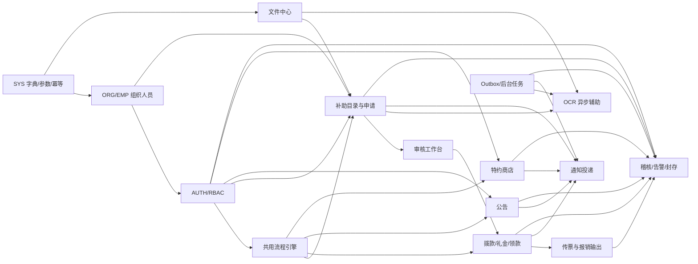

# 臺鐵職福會職工補助申請系統：模組依賴與資料庫優化報告

## 一、结论摘要

工作说明书定义的是一套以补助案件全生命周期为核心的云端系统，包含职工端 PWA、管理端、稽核／系统后台三类入口。主业务闭环为：

> 申请 → 多阶审核 → 拨款／礼金三阶段 → 领款确认／异议 → 财务传票 → 结案 → 稽核留痕

技术基线为前后端分离、RESTful API、PostgreSQL、对象存储、Web Push、WAF／CDN、监控、每日备份及异地灾备。管理端强制 MFA，授权采用 RBAC 加数据范围，敏感字段需加密，操作日志至少保存 3 年并具防篡改能力。

现有数据库草案 `sql/tra_welfare_platform.sql` 虽已扩展到 90 张表，但它是 MySQL 8.0 方言，与说明书指定的 PostgreSQL 不一致，不能直接部署。此次另行提供 PostgreSQL 原生版本：

- `sql/tra_welfare_platform_postgresql.sql`
- 76 张表
- 140 个外键引用
- 111 个普通／唯一／部分／GIN／BRIN／GiST 索引
- 统一 `timestamptz`、`bigint GENERATED ALWAYS AS IDENTITY`、`jsonb`
- 主数据采用 `created_at`、`updated_at`、`deleted_at`、`row_version`
- 事件和历史表采用追加写入，不使用软删除
- 关键业务关系使用真实外键，避免以 `business_type + business_id` 代替完整性约束

## 二、文档关键信息

### 2.1 系统范围

| 入口 | 主要能力 |
| --- | --- |
| 职工端 PWA | 登录、补助申请、附件上传、进度／历史查询、补件、领款确认、公告、特约商店、个人资料 |
| 管理端 | 组织人事、权限、补助配置、案件审核、代填、礼金／拨款、传票、公告、商店、报表、数据导入 |
| 稽核／系统后台 | 操作轨迹、登录与权限异动、告警、历史封存、离峰扫描、合规文件库 |

### 2.2 角色

说明书暂定六类角色：职工、承办、审核主管、财务、系统管理员、稽核者。实际授权不能只绑定角色，还需同时考虑组织范围、组织子树、补助类别和代理期间。

### 2.3 核心业务规则

- 补助类别采用动态表单、附件清单、资格规则、年度上限及重复申请校验。
- 申请状态采用状态机管理，所有状态转换均需保留历史。
- 签核层级依补助类别、金额级距和组织层级动态决定。
- OCR 只提供质量检查、字段提取和异常提示，失败时不能阻断人工主流程。
- 代填案件必须同时记录实际申请人和系统填表人。
- 礼金流程需保留三个阶段的时间、操作者和状态。
- 拨款批次、核定名册、案件和传票金额必须可双向追溯并对账。
- 公告和通知需分离：公告管理内容与发布生命周期，通知负责渠道投递和送达结果。
- 特约商店需支持合约效期、30／14／7 天提醒、分类、据点坐标及移动端查询。
- 日志需遮罩敏感值、记录日志查询行为、保存至少 3 年，并通过哈希／签章支持完整性验证。

### 2.4 文档内需要尽快冻结的矛盾

1. 登录说明同时出现“员工编号＋身份证首次登录”和“输入 Email 获取验证码”两套入口。建议统一为“员工编号识别账号＋已验证 Email OTP 激活／MFA”，不得将完整身份证号作为初始密码。
2. 工作说明书写“八大补助”，仓库的总控 PRD 又写“六大项十三种”。数据库已改为表驱动目录，不写死数量，但 SRS、测试案例和验收口径必须采用同一份补助目录。
3. 对外接口清单未列 Outlook／Email，但登录、通知和验收均依赖该接口，应补入正式接口清单和失败降级策略。
4. 说明书风险表仍保留 Single-AZ／Multi-AZ 未决项，部署、RTO ≤ 4 小时和 RPO ≤ 15 分钟无法在该项冻结前形成可验收设计。
5. “PWA 离线保留草稿”涉及个人资料与附件，不应默认写入长期浏览器缓存。应限制离线字段、加密本地数据并设置短期过期／主动清除机制。

## 三、模块识别与边界优化

### 3.1 说明书明示的十个核心模块

1. 登录与身份验证
2. 补助申请（职工端 PWA）
3. 补助审核（多阶签核）
4. 礼金与申请管理（礼金三阶段／代发）
5. 财务传票管理
6. AI OCR 智慧识别
7. 特约商店管理
8. 公告与消息推播
9. 组织与人员权限管理
10. 稽核与日志管理

### 3.2 应提升为正式模块的共享能力

| 新边界 | 原因 |
| --- | --- |
| SYS 字典／参数 | 状态、类别、渠道和系统阈值不能散落在业务代码中 |
| 文件资源中心 | 对象存储元数据、病毒扫描、保留期限、下载审计是全模块共用能力 |
| 流程引擎 WF | 补助、拨款、公告和商店合约共用签核，不能各自实现一套 |
| 通知投递中心 | Portal、Email、Web Push 的模板、重试、送达结果应独立于公告内容 |
| 数据导入 | 组织、人事、资格和扣缴资料都有批次校验、错误清单和重跑需求 |
| 后台任务／Outbox | OCR、通知、到期提醒、离峰扫描需可靠异步执行，不能绑在前台请求事务中 |
| 报表导出 | 报表要冻结请求参数和数据范围，并以异步文件交付避免长事务 |

### 3.3 模块依赖关系



### 3.4 关键数据流

1. 组织、人事和资格资料经导入批次校验后写入主档，错误行独立保存，不允许“部分错误但无明细”。
2. 用户激活账号后取得角色和数据范围；业务查询必须将功能权限与数据范围同时纳入授权判断。
3. 创建申请时冻结表单版本、申请人快照和资格快照；每次补件生成新的申请版本，旧版本不可覆盖。
4. 附件只将对象键、摘要和安全扫描状态写入数据库，二进制内容存对象存储；下载行为另写访问事件。
5. 送审时运行资格、上限、附件和重复申请规则；通过后建立流程实例和待办。
6. OCR 由 Outbox／后台任务异步启动，结果写回字段、信心度、人工修正和异常表。OCR 失败只转人工，不回滚申请。
7. 审批通过后生成待发款项目；建批后冻结收款人与收款账号快照，防止后续主档修改破坏历史对账。
8. 传票由拨款批次生成，传票行、案件分摊和输出文件分别留存；草稿、校对版和最终版不得互相覆盖。
9. 业务事务在同一数据库事务内写入 Outbox，通知、OCR、扫描和外部投递由异步工作者重试处理。
10. 所有关键操作写入追加式稽核事件，敏感数据只记录遮罩值；周期封存包记录摘要、签章和保留期限。

## 四、推荐开发顺序

| 阶段 | 模块 | 原因与完成标准 |
| --- | --- | --- |
| Phase 0 | 数据规范、SYS、Outbox、后台任务、最小稽核事件 | 先冻结命名、状态、时区、加密、幂等和事件契约，避免各模块自行造轮子 |
| Phase 1 | ORG、EMP、数据导入 | 三个入口、授权、分案、签核和报表都依赖可靠的人事组织主档 |
| Phase 2 | AUTH、RBAC、数据范围、代理 | 完成激活、OTP／MFA、会话、锁定、六角色和组织范围授权；管理端才可安全开放 |
| Phase 3 | 文件中心、补助目录、表单版本、资格规则 | 先建立附件治理与可配置规则，申请页面才有稳定契约 |
| Phase 4 | WF 流程定义、待办、动作、超时 | 在补助审核前打通共用签核，后续拨款、公告、商店复用同一模型 |
| Phase 5 | BEN 申请 PWA＋审核工作台＋通知最小链路 | 先走通“草稿→送审→补件／退回→核准”的首个端到端纵切 |
| Phase 6 | OCR | 在真实附件与申请版本契约稳定后接入；通过异步事件集成，不作为送审硬依赖 |
| Phase 7 | PAY 礼金／拨款／领款异议＋FIN 传票 | 核准案件稳定后再实现资金链；每阶段都以金额对账和不可变快照为验收标准 |
| Phase 8 | ANN 公告、MCH 商店、完整通知 | 两者共用权限、流程、文件和通知底座，可并行开发但需分别端到端验收 |
| Phase 9 | SEC 完整告警／封存、报表导出、性能与灾备 | 稽核写入从 Phase 0 已存在，本阶段补齐扫描、处置、封存、三年查询和运维验证 |

该顺序不同于说明书原 Sprint 将 OCR、财务、资安集中在最后两周的安排。资安事件模型、文件安全和异步可靠性属于底座，若后补会迫使所有模块返工；OCR 的业务能力则应后置，因为它是可降级的辅助能力。

## 五、模块设计问题与优化建议

### 5.1 高优先级问题

| 问题 | 风险 | 优化 |
| --- | --- | --- |
| AI 与 BEN／PAY／SEC 在现有依赖矩阵中形成循环依赖 | 核心流程被模型服务可用性绑架 | BEN 只发布附件事件；AI 异步消费并回写建议，任何失败都转人工 |
| 补助、公告、商店、拨款各自描述审核 | 四套流程状态与权限会漂移 | 共用版本化流程定义、步骤、任务、动作和代理表，业务表只保存流程实例 FK |
| 公告与通知混在同一模块 | 内容审批和渠道重试生命周期不同 | 公告负责内容／受众／发布窗口，通知负责收件箱、Email、Push、重试和送达 |
| 礼金、拨款、领款、传票边界混杂 | 状态跳跃、金额重复和责任不清 | 明确 `approved application → payment item → batch → voucher → acknowledgement/dispute` |
| 稽核、资安扫描、后台排程混在同一模块 | 高流量日志和任务调度互相影响 | 稽核事件、资安规则／告警、后台任务分表并独立扩容 |
| 文件只是附件字段 | 无法统一做病毒扫描、保留、下载审计 | 文件中心管理对象元数据；业务表使用明确 FK 关联文件 |
| 报表仅写“统计报表” | 查询口径、数据范围和大查询风险不明 | 建立报表代码、参数快照、数据范围快照、异步导出和过期文件 |

### 5.2 状态与一致性建议

- 状态转换由服务层状态机控制，数据库 `CHECK` 只限制合法状态集合。
- 金额汇总不能只信任 `payment_batch.total_amount` 或 `voucher.total_*`；确认／导出前必须用明细重算并在同一事务锁定版本。
- 使用 `row_version` 做乐观锁，避免两名承办同时审核、建批或校对时后写覆盖前写。
- 外部写操作要求 `Idempotency-Key`，Email／Push／OCR 使用 Outbox，解决重试导致的重复发送或重复建批。
- 主档可软删除；申请、审批动作、拨款、传票、通知投递和稽核事件不得软删除，应通过取消／作废状态保留证据。

## 六、现有 SQL 问题清单与改进

### 6.1 方言与基础类型

| 现有问题 | 改进 |
| --- | --- |
| 文件声明 MySQL 8.0，但说明书选型 PostgreSQL | 新脚本使用 PostgreSQL 16+ 原生语法 |
| `AUTO_INCREMENT`、`UNSIGNED` | 改为 `bigint GENERATED ALWAYS AS IDENTITY`；金额／计数另加非负 `CHECK` |
| `DATETIME` 无时区语义 | 业务时间统一 `timestamptz`，纯业务日期才使用 `date` |
| MySQL `ENUM` 难以演进 | 稳定的小集合用 `CHECK`，可配置业务代码用 `code_value`／主档表 |
| `TINYINT(1)` 表示布尔 | 改为 `boolean` |
| `JSON` 无针对性索引 | 改为 `jsonb`；仅对确有包含查询的申请表单建立 GIN 索引 |
| `VARCHAR` 普遍偏长或未体现用途 | 代码 32～64、名称 128～256、说明 `text`；IP 使用 `inet`，Email 使用 `citext` |

### 6.2 缺失或不完整字段

| 对象 | 需要补充的字段／机制 |
| --- | --- |
| 可维护主档 | `created_at`、`updated_at`、`deleted_at`、`row_version` |
| 外部 API 资源 | 内部 `bigint` 主键外另设不可枚举的 `public_id uuid` |
| 员工／眷属 | 身份证密文、不可逆盲索引 hash、在职区间、资料状态；不得存明文身份证 |
| 会话／OTP／Push | 只存 token／secret／endpoint 的 hash 或密文、失败次数、过期／撤销时间 |
| 申请 | 实际申请人、代填账号、组织快照、申请人快照、资格快照、表单版本、补件期限、申请／核定金额、状态历史 |
| 附件 | 对象键、SHA-256、媒体类型、大小、敏感等级、病毒扫描、保留期限、下载记录 |
| 审批 | 流程定义版本、步骤、待办、代理人、期限、动作、意见、关联 ID |
| OCR | 提供者、模型版本、质量分数、字段信心度、坐标、人工修正、异常证据、重试状态 |
| 拨款 | 批号、明细状态、收款人与账号快照、外部回执、三阶段历史、领款确认、异议处置 |
| 传票 | 模板版本、借贷明细、案件分摊、草稿／最终文件、校对人和输出时间 |
| 通知 | 模板、渠道、排程、重试次数、服务商消息 ID、发送／送达时间、最后错误 |
| 商店 | 合约区间、据点坐标、优惠有效期、适用对象、30／14／7 天提醒记录 |
| 稽核 | correlation／trace ID、角色快照、遮罩明细、前序 hash、事件 hash、数字签章、封存清单 |

### 6.3 索引优化

索引按实际查询路径设计，不对所有外键或所有单列状态机械建索引：

- 职工查询个人案件：`(applicant_employee_id, status, created_at DESC)`。
- 承办工作台：`(applicant_org_unit_id, status, submitted_at)`。
- 补助类型统计：`(benefit_type_id, status, submitted_at)`。
- 待办中心：按账号／角色的 `(assignee, status, due_at)` 部分索引，只包含未完成任务。
- OCR／后台任务／通知投递：按优先级与排程时间建立“待处理”部分索引。
- 未读通知：`recipient_account_id + created_at DESC WHERE read_at IS NULL`。
- 公告：`status + publish_from + publish_until`。
- 商店到期提醒：`ends_on + status` 以及未发送提醒部分索引。
- 稽核／登录／文件访问大表：时间使用 BRIN，操作者、模块动作、对象使用 B-tree 组合索引。
- JSONB 只在申请表单检索场景使用 `GIN (... jsonb_path_ops)`，避免为 OCR 原始响应等大 JSON 增加高写入成本。
- 软删除主档采用 `WHERE deleted_at IS NULL` 的部分唯一索引，使历史删除记录不阻止代码重新启用。

### 6.4 外键与数据完整性

- 主档被历史业务引用时使用 `ON DELETE RESTRICT`，防止删除员工、补助类别、文件或案件导致证据链断裂。
- 纯从属数据如角色权限、通知投递、公告受众使用 `ON DELETE CASCADE`。
- 操作者账号停用后历史仍需保留，使用 `ON DELETE SET NULL` 并在稽核表保留人员编号／角色快照。
- 申请、拨款、传票、公告和商店合约直接保存 `workflow_instance_id` 外键，不以多态 ID 代替。
- 表单版本、流程版本、传票模板版本和申请版本均不可覆盖。
- 任职期间、补助规则期间、代理期间、商店合约期间使用 PostgreSQL range＋GiST 排他约束防止重叠。
- 礼金、拨款与传票不做物理删除；取消和作废必须保留状态与历史动作。

### 6.5 需要新增的关联／中间表

| 表 | 用途 |
| --- | --- |
| `role_permission`、`account_role`、`role_data_scope` | 功能权限、人员角色和数据范围拆分 |
| `employee_assignment` | 员工与组织／职位的有效期关系 |
| `benefit_application_version` | 保存补件前后的完整表单快照 |
| `benefit_application_attachment` | 申请与文件的明确关联及附件版本 |
| `workflow_task`、`workflow_action` | 待办与每次审批动作分离 |
| `payment_batch_item`、`payment_stage_history` | 批次与案件、多阶段状态分离 |
| `voucher_line`、`voucher_application` | 传票借贷明细及传票到案件的分摊追溯 |
| `announcement_audience`、`announcement_view` | 多种分众条件及已读／浏览追踪 |
| `merchant_location`、`merchant_offer_audience` | 一个商家多个据点及优惠适用对象 |
| `notification_delivery` | 一个站内通知对应多个外送渠道和重试状态 |
| `outbox_event` | 业务事务与异步副作用之间的可靠桥接 |
| `import_row_error` | 批次导入逐行错误回馈 |

## 七、PostgreSQL DDL 设计说明

完整脚本位于 `sql/tra_welfare_platform_postgresql.sql`。表分组如下：

| 领域 | 主要表 |
| --- | --- |
| SYS | `code_value`、`system_setting`、`idempotency_key`、`outbox_event`、`background_job` |
| ORG／EMP | `org_unit`、`employee`、`employee_dependent`、`employee_assignment`、`employee_payment_account` |
| AUTH／RBAC | `account`、`auth_challenge`、`auth_session`、`login_event`、`role`、`permission`、`account_role`、`role_data_scope`、`approval_delegation` |
| 文件／导入 | `file_object`、`file_access_event`、`import_batch`、`import_row_error` |
| BEN／WF | `benefit_type`、`benefit_form_version`、`benefit_rule`、`workflow_definition`、`workflow_task`、`benefit_application`、版本／附件／校验／状态历史 |
| AI OCR | `ocr_job`、`ocr_quality_result`、`ocr_field_result`、`ocr_anomaly`、`duplicate_application_match` |
| PAY／FIN | `payment_batch`、`payment_batch_item`、阶段／领款／异议、`voucher_template`、`voucher`、`voucher_line`、`voucher_application` |
| ANN／通知 | `announcement`、受众／浏览、`notification`、模板／投递／Push／偏好 |
| MCH | `merchant`、分类／据点／合约／优惠／受众／到期提醒 |
| SEC／报表 | `audit_event`、`audit_archive`、`security_rule`、扫描／告警／文件、`report_export` |

执行方式：

```bash
psql --set ON_ERROR_STOP=1 --dbname <database_name> \
  --file sql/tra_welfare_platform_postgresql.sql
```

执行账号需具备建立 schema 和扩展的权限；脚本会启用 `pgcrypto`、`citext`、`btree_gist`。生产环境应由 DBA 预建扩展和数据库角色，再以最小权限执行 schema migration。

## 八、上线前必须补齐的非 DDL 决策

1. 冻结补助目录、每类表单字段、资格／年度上限和重复申请规则。
2. 冻结登录标识、账号激活、管理端 MFA 和 Outlook 接口方式。
3. 提供现行传票、报销单、核定名册样本及科目映射。
4. 明确组织、人事、扣缴和资格导入文件格式、主键及增量策略。
5. 明确各类数据保存期限、删除／匿名化流程及法务依据；“全部至少三年”不应替代分类保存政策。
6. 冻结 PostgreSQL 主版本、AWS 区域、Single-AZ／Multi-AZ、备份与 PITR 配置。
7. 为金额汇总、状态转换、Outbox、OTP／会话、稽核 hash 链编写事务级集成测试。
8. 以端到端案例验证正常、补件、退回、代填、礼金三阶段、部分拨款失败、领款异议和传票作废路径。
